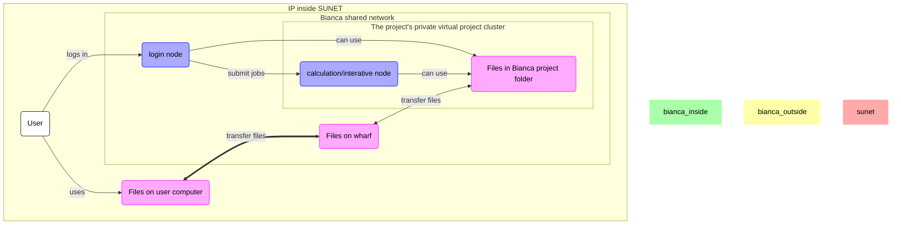
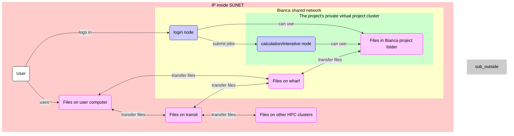

# File transfer using a graphical tool

> FileZilla connected to Bianca

## Overview

As a user, we need to transfer files
between our local computer and Bianca.
The many ways to transfer files to/from Bianca 
are discussed [here](transfer_bianca.md).
On this page, we learn how to transfer files
to Bianca using a graphical tool/program.

There are constraints on which programs
we can use, due to Bianca being an HPC cluster
for sensitive data.
Details are described in 'Bianca's constraints'.

When using such a graphical tool, 
one needs to be inside of SUNET.
FileZilla is a tool that is easy to setup.
The full procedure is described in 'Using FileZilla'.

The files you transfer will end up in your so-called `wharf` folder.
Where to find this folder is shown in the section 'Where do my files end up?'.

## Bianca's constraints

> Overview of file transfer on Bianca, when using a graphical tool.
> The purple nodes are about file transfer,
> the blue nodes are about 'doing other things'.
> In this session, we will transfer files between
> 'Files on user computer' and 'Files on wharf'
> using a graphical tool, e.g. FileZilla

Bianca is an HPC cluster for sensitive data.
To protect that sensitive data,
Bianca has no direct internet connection.
This means that files cannot be downloaded directly.

???- tip "What is an HPC cluster again?"

    What an HPC cluster is, is described in general terms [here](overview.md).

Instead, one needs to learn one of the many ways to do **secure** file transfer.

Here, we show how to transfer files using a graphical tool called FileZilla.

In general, one can pick any graphical tools with these constraints:

- the tool must support SFTP
- the tool must not store a password

Whatever tool one picks, it must do secure file transfer.
For secure file transfer, Bianca supports the SFTP protocol.
So, for secure file transfer to Bianca, one needs a tool
that supports SFTP.

???- warning "Use SFTP ... and why SCP will never work"

    You must use SFTP. 

    However, some users find tools that support
    another protocol called 'SCP'. 
    We understand the confusion, due
    to the many technical and abbreviated terms. 

    Only SFTP will work.

Whatever tool one picks, additionally, the tool must **not** store a password.
Due to security reasons, one needs to connect to Bianca using a password
**and** a two-factor authentication number (e.g. `VerySecret123456`).
If a tool stores a password, that password will be valid for only one session.

One tool that can be used for file transfer to Bianca
is FileZilla, which is described in detail below.
The extra materials at the bottom of this page contain
other tools.

## Using FileZilla

> The FileZilla logo

FileZilla is a secure file transfer tool that works under Linux, Mac and Windows.

To transfer files to/from Bianca using FileZilla, do:

- Get inside SUNET

???- tip "Forgot how to get inside SUNET?"

    It is discussed [at the 'login to Bianca' page](login_bianca.md). 

- Start FileZilla
- From the menu, select 'File | Site manager'

???- tip "Where is that?"

    It is here:

    
    
    > The FileZilla 'File' menu contains the item 'Site manager'

- Click 'New site'

???- tip "Where is that?"

    It is here:

    

- Create a name for the site, e.g. `bianca-sens123456`.
- For that site, use all standards, except:
    - Set protocol to 'SFTP - SSH File Transfer Protocol'
    - Set host to `bianca-sftp.uppmax.uu.se`
    - Set user to `[username]-[project]`, e.g. `richel-sens123456`

???- tip "How does that look like?"

    It looks similar to these:

    

    

!!! tip "Storing a password is useless"

    Because Bianca holds sensitive data, 
    there is need to use the UPPMAX two-factor authentication
    code every time you login.
    Due to this, storing a password is hence useless

- Click 'Connect'
- You will be asked for your password with two-factor identification, hence
  type `[your password][2FA code]`, e.g. `VerySecret123456`

Now you can transfer files between your local computer and Bianca.

???- tip "How does that look like?"

    It looks like this:

    

## Where do my files end up?

They end up in your personal `wharf` folder.

Its location is at `/home/[user_name]/[project_name]/nobackup/wharf/[user_name]/[user_name]-[project_name]`,
for example, at `/home/sven/sens123456/nobackup/wharf/sven/sven-sens123456`.

???- tip "How does that look like?"

    It looks like this:

    

## Extra material

### WinSCP

WinSCP is a secure file transfer tool that works under Windows.

To transfer files to/from Bianca using WinSCP, do:

- Get inside SUNET

???- tip "Forgot how to get inside SUNET?"

    It is discussed [at the 'login to Bianca' page](login_bianca.md). 

- Start WinSCP
- Create a new site
- For that site, use all standards, except:
    - Set file protocol to 'SFTP'
    - Set host name to `bianca-sftp.uppmax.uu.se`
    - Set user name to `[username]-[project]`, e.g. `richel-sens123456`

???- tip "How does that look like?"

    It looks like this:

    

### File transfer overview

> Overview of file transfer on Bianca
> The purple nodes are about file transfer,
> the blue nodes are about 'doing other things'.
