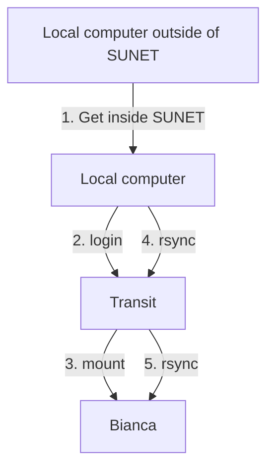

# File transfer to/from Bianca using rsync

[rsync](../software/rsync.md) is a tool [to do file transfer to/from Bianca](bianca_file_transfer.md),
that works under Linux, Mac and Windows.

To transfer files to/from Bianca using [rsync](../software/rsync.md), do the following steps:



## 1. Get inside SUNET

Get inside SUNET.

???- question "Forgot how to get within SUNET?"

    See the 'get inside the university networks' page [here](../getting_started/get_inside_sunet.md)

## 2. Log in to Transit

On your local computer, start a terminal and use [`ssh`](../software/ssh.md) to login to Transit:

```bash
ssh [username]@transit.uppmax.uu.se
```

where `[username]` is your UPPMAX username, for example:

```bash
ssh sven@transit.uppmax.uu.se
```

See [Log in to transit](login_transit.md) for more details 
on how to log in to [Transit](transit.md).

## 3. Mount Bianca

On transit, mount the wharf of your Bianca project:

```
mount_wharf [project_id] [path]
```

where

- `[project_id]` is the ID of your [NAISS project](../getting_started/project.md)
- `[path]` is the path of your mount

for example:

```
mount_wharf richel-sens2016001
mount_wharf richel-sens2016001 .
mount_wharf richel-sens2016001 my_mount_to_sens2016001
```

## 4. Tranfer files to transit

?Directly to Bianca:

```
rsync --recursive my_folder richel@transit.uppmax.uu.se:sens2016001/my_mount_to_sens2016001
```

To Transit:

```
rsync -avh [my_local_folder] richel@transit.uppmax.uu.se:sens2016001/
rsync --recursive [folder_name] [user_name]@rackham.uppmax.uu.se:/home/[user_name]/
rsync --recursive my_folder richel@transit.uppmax.uu.se:sens2016001/

rsync --recursive my_folder richel@transit.uppmax.uu.se:sens2016001/my_mount_to_sens2016001
```

To Bianca:

```
rsync --recursive my_folder my_mount_to_sens2016001

```


