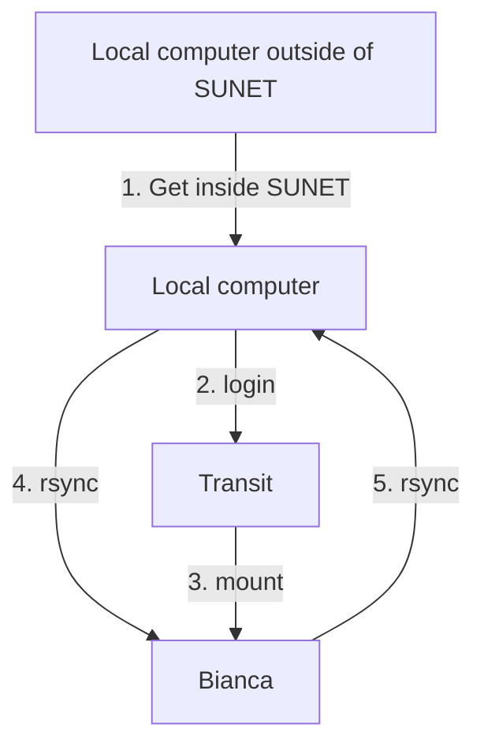

# File transfer to/from Bianca using rsync

[rsync](../software/rsync.md) is a tool [to do file transfer to/from Bianca](bianca_file_transfer.md),
that works under Linux, Mac and Windows.

To transfer files to/from Bianca using [rsync](../software/rsync.md), do the following steps:



## 1. Get inside SUNET

Get inside SUNET.

???- question "Forgot how to get within SUNET?"

    See the 'get inside the university networks' page [here](../getting_started/get_inside_sunet.md)

## 2. Log in to Transit

On your local computer, start a terminal and use [`ssh`](../software/ssh.md) to login to Transit:

```bash
ssh [username]@transit.uppmax.uu.se
```

where `[username]` is your UPPMAX username, for example:

```bash
ssh richel@transit.uppmax.uu.se
```

See [Log in to transit](login_transit.md) for more details
on how to log in to [Transit](transit.md).

## 3. Mount Bianca

On transit, mount the wharf of your Bianca project:

```bash
mount_wharf [project_id] [path]
```

where

- `[project_id]` is the ID of your [NAISS project](../getting_started/project.md)
- `[path]` is the path of your mount

for example:

```bash
mount_wharf sens2016001
```

The password here is your UPPMAX password and your UPPMAX 2FA.

Now a folder called `sens2016001` is created.

## 4. Tranfer files to Bianca

On local computer:

```bash
rsync --recursive my_folder richel@transit.uppmax.uu.se:sens2016001
```

No need to specify the path to the mounted folder, if defaults are used.

The files can now be found in [your wharf folder](wharf.md).

## 5. Tranfer files from Bianca to you local computer

On local computer, do:

```bash
rsync --recursive richel@transit.uppmax.uu.se:sens2016001 .
```

To copy all folders in wharf to your local computer.

