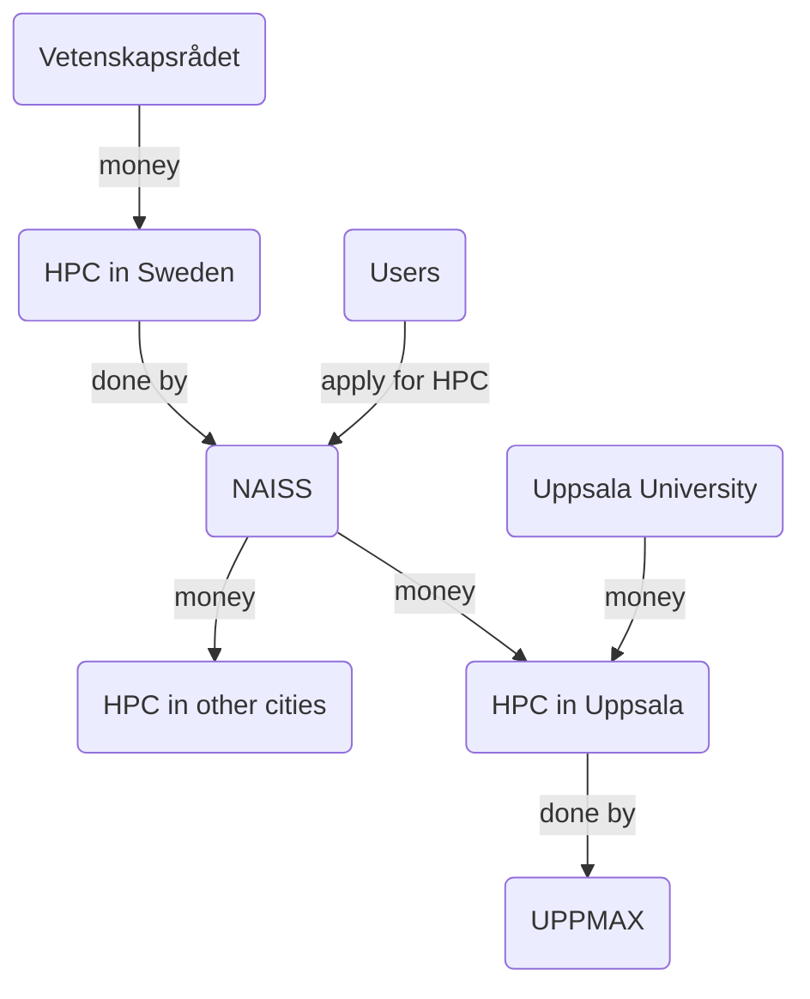
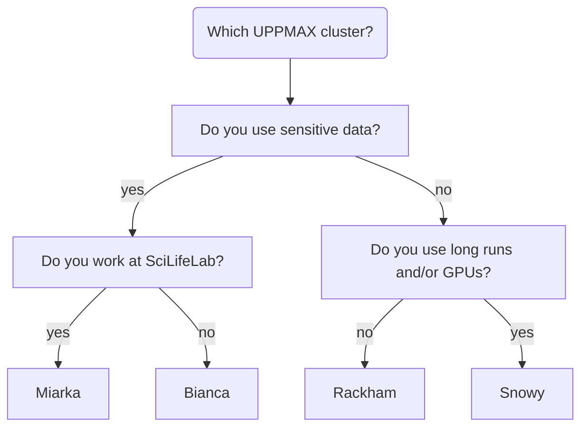
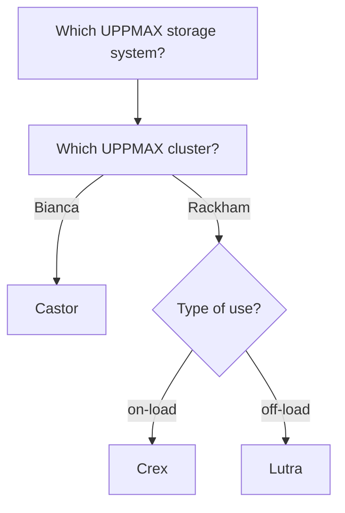
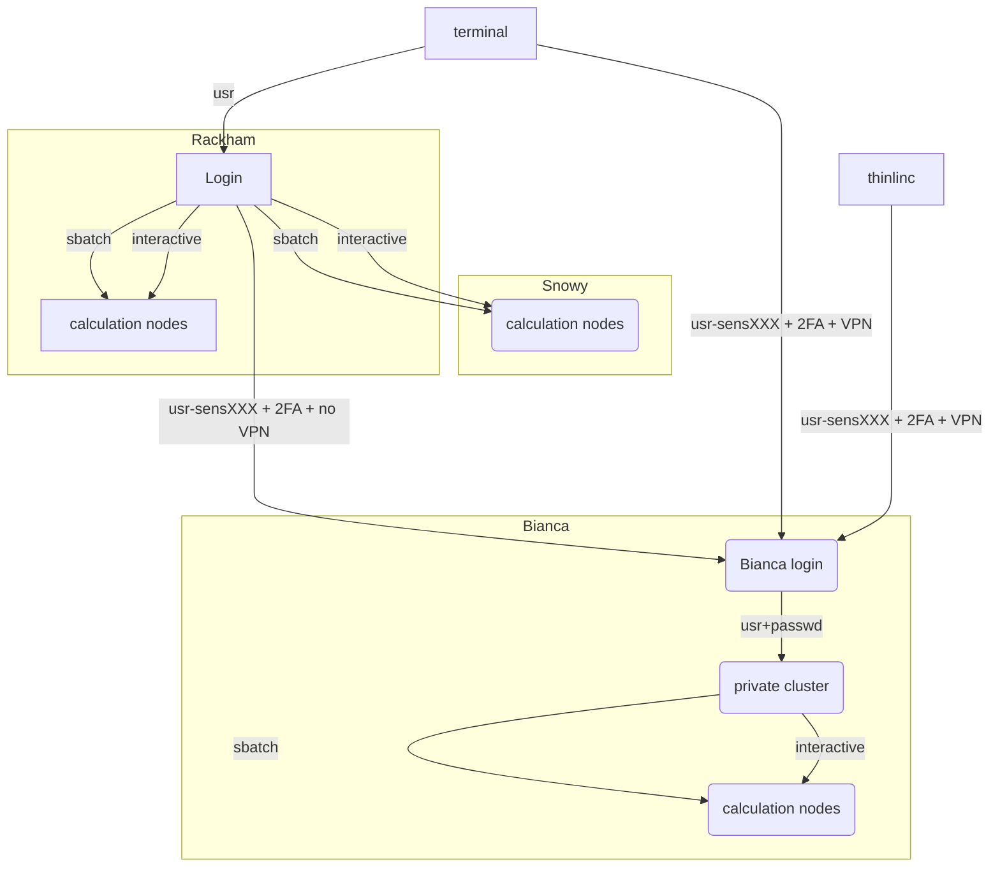

# Overview

## The bigger picture

Here we place UPPMAX within the bigger, national, picture,
starting from the biggest source of money for research in Sweden.

[Vetenskapsrådet](https://www.vr.se) ('Science counsel', VR) is biggest funder
of research in Sweden and funds the national HPC infrastructure. 

The [National Academic Infrastructure for Supercomputing in Sweden](https://www.naiss.se/) (NAISS) provides such HPC infrastructure: computing power, storage and data services. Applications for these resources starts at
[this NAISS page](https://www.naiss.se//#application-rounds-for-compute-and-storage-resources). These resources are physically located in multiple places in Sweden,
among other Uppsala.

[Uppsala Multidisciplinary Center for Advanced Computational Science](https://www.uppmax.uu.se/) (**UPPMAX = UppMACS**) 
provides the HPC infrastructure that is physically located in Uppsala. 
Part of this is to provide training and [support](https://www.uppmax.uu.se/support).

## UPPMAX systems

Here we place Bianca between the other UPPMAX systems.

There are three types of UPPMAX systems:

- Computing systems
- Storage systems
- Cloud services

### UPPMAX computing systems

Computing systems allow a user to do heavier computational calculations.

[UPPMAX has, among others, the following clusters](https://www.uppmax.uu.se/resources/systems/):

- Rackham: regular data, general purpose
- Snowy: regular data, long runs and GPU:s
- **Bianca: for sensitive data, general use**
- Miarka: for sensitive data, SciLifeLab-only

A technical summary can be found below.

### UPPMAX storage systems

Storage systems allow a user to storage (big amounts of) data,
for either active use (i.e. in calculations) or to archive it.
Storage for active use is also called 'on-load' storage,
where archived data is called 'off-load' storage.

The [UPPMAX storage systems](https://www.uppmax.uu.se/resources/systems/storage-systems/) are:

- On-load: Castor for Bianca, Crex for Rackham
- Off-load: Lutra for Rackham

### UPPMAX Cloud services

Cloud services allow a user to have something active (typically a website)
that can be accessed by the internet.

For this, the [UPPMAX cloud](https://www.uppmax.uu.se/resources/systems/the-uppmax-cloud/)
has a service called 'Dis' (the Swedish word for 'haze') and is part of
the `EAST-1` region of the SNIC science cloud. 

## Bianca

Here we describe what Bianca is, 
where her name comes from,
and the ideas behind her design.

### Bianca's name

Bianca, like all clusters at UPPMAX, 
is named after a Tintin character,
in this case after Bianca Castafiore.

### Bianca's design

Bianca is an high-performance computing (HPC) cluster for sensitive data.

Or: Bianca is a group of computers that can effectively run many calculations, 
as requested by multiple people, at the same time.
As the data is sensitive, it is protected to remain only on Bianca.

Bianca is designed to

- Protect the sensitive data: 
    - (1a) Accidental data leaks should be difficult
    - (1b) Law: if data is leaked, the person doing so should be possibly identified
- Emulate a standard HPC cluster environment:
    - (2a) Use the hardware as efficient as possible
    - (2b) Distributes shared resources (CPU, memory) in a fair way
    - (2c) make correct data management as easy as possible

Bianca runs the Linux operating system and all users need some
basic Linux knowledge to use her.

???- tip "Using Linux"

    Using Linux (and especially the so-called command-line/terminal) is essential
    to use Bianca. Learning the essential Linux commands 
    is part of this course and is described [here](linux.md).

### Difference between supercomputer and (high-performing) computer cluster

A supercomputer is a machine that is optimized for doing calculations
quickly. For example, to predict the weather for tomorrow, the calculation
may not take a week. The image above is a supercomputer.

A computer cluster is a machine that is optimized for doing a lot of calculations.
The image above shows a home-made computer cluster.
This home-made computer cluster may not be suitable for high-performance.

The image above shows Rackham, another UPPMAX 
computer cluster, suitable for high-performance computing.
This makes Rackham an high-performance computing (HPC) cluster.
Bianca and Rackham are HPC clusters.

### Restrictions on a computer cluster

A computer cluster is a group of computers that can run
many calculations, as requested by multiple people, at the same time.

To ensure fair use of this shared resource, regular users
are restricted in some ways:

- Users cannot run calculations directly. 
  Instead, users need to request either (1) a calculation to be run,
  or (2) an interactive node

???- tip "Requesting a calculation to run"

    Requesting a calculation to run is part of this course 
    and is described [here](slurm-intro.md).
    This is done by using the SLURM scheduler.

???- tip "Requesting an interactive node"

    Requesting an interactive node is part of this course 
    and is described [here](login_bianca.md).
    This is done by requesting an interactive node 
    from the SLURM scheduler.

- Users cannot install software directly. 
  Instead, users need to use pre-installed software or learn
  techniques how to run custom software anyway

???- tip "Using pre-installed software"

    Using pre-installed software is part of this course 
    and is described [here](modules1.md).
    This is done by using the module system.

???- tip "How to run custom software"

    Techniques how to run custom software is *not* part of this course.
    Instead, one technique is part of the intermediate Bianca course 
    and can be found described [here](extra/containers/),
    which is about using containers

These restrictions apply to most general-purpose clusters. 
However, Bianca is a **sensitive data** cluster, to which
more restrictions apply.

### Restrictions on a sensitive data computer cluster

Next to the general restrictions above, 
Bianca also is a **sensitive data** cluster.
This sensitive data must be protected to remain only on Bianca,
due to which there are these additional restrictions to users:

- Users have no direct access to internet.
  Instead, users can up/download files from/to a special folder.

???- tip "File transfer"

    Transferring file is part of this course and is described [here](transfer_basic.md).
    This is done using

The goal is *not* to prevent the up/download of sensitive data,
instead it is to prevent the *accidental* up/download of sensitive data.
As these up/downloads are monitored, in case of an accident, 
the extent of the leak and the person (accidentally) causing it
is known. Identifying a responsible person in case of such an
accident is required by law.

## What is a computer cluster technically?

A computer cluster is a machine that consists out of many computers.
These computers work together.

Each computer of a cluster is called a **node**.

There are three types of nodes:

- **login nodes**: nodes where a user enters and interacts with the system

???- tip "Logging in"

    Logging in is part of this course and is described [here](login_bianca.md).

- **calculation nodes**: nodes that do the calculations

???- tip "Requesting a calculation to run"

    Requesting a calculation to run is part of this course 
    and is described [here](slurm-intro.md).
    This is done by using the SLURM scheduler.

- **interactive nodes**: a type of calculation node, where a user can do calculations directly

???- tip "Requesting an interactive node"

    Requesting an interactive node is part of this course 
    and is described [here](login_bianca.md).
    This is done by requesting an interactive node 
    from the SLURM scheduler.

Each node contains several CPU/GPU cores, RAM and local storage space.

A user logs in to a login node via the Internet.

## Summary

!!! abstract "keypoints"

    - NAISS provides HPC resources for Swedish research. 
    - UPPMAX takes care of the Uppsala HPC facilities
    - Bianca is an HPC cluster for sensitive data
    - The restrictions on Bianca follow from Bianca being a shared resource
      that uses sensitive data

## Extra material

### UPPMAX clusters technical summary

|                        |Rackham        |Snowy                     |Bianca                                      |
|------------------------|---------------|--------------------------|--------------------------------------------|
|**Purpose**             |General-purpose|General-purpose           |Sensitive                                   |
|**# Intel CPU Nodes**   |486+144        |228                       |288                                         |
|**# GPU Nodes**         |-              |50, Nvidia T4             |10, 2x Nvidia A100 each                     |
|**Cores per node**      |20/16          |16                        |16/64                                       |
|**Memory per node**     |128 GB         |128 GB                    |128 GB                                      |
|**Fat nodes**           |256 GB & 1 TB  |256, 512 GB & 4 TB        |256 & 512 GB                                |
|**Local disk (scratch)**|2/3 TB         |4 TB                      |4 TB                                        |
|**Login nodes**         |Yes            |No (reached from Rackham) |Yes (2 cores and 15 GB)                     |
|**"Home" storage**      |Domus          |Domus                     |Castor                                      |
|**"Project" Storage**   |Crex, Lutra    |Crex, Lutra               |Castor                                      |

## Detailed overview of the UPPMAX systems

