# Dardel migration


This page describes how to transfer files to Dardel,
the HPC cluster at PDC in Stockholm.

???- question "Why do I need this?"

    The Rackham cluster will be decommissioned at the end of 2024 
    so all projects have to migrate their data and calculations to other resources. 
    The plan from NAISS is that all Rackham users 
    will move to the Dardel cluster at PDC.

    To facilitate this move, 
    we have created a tool that makes the transfer easier.

## Procedure

???- question "Prefer a video?"

    This procedure is also shown in [this YouTube video](https://youtu.be/rivtgTnulNA).

First, we are here to help.
Please [contact support](../support.md) if you run into problems
when trying the guide below.

This migration consists of a couple of steps summarized below. 
Press the links to get more detailed explanation of each step.
Note that step 1 requires some hours of waiting
and step 2 requires an overnight wait.

```mermaid
flowchart TD
  get_supr_project[1. Access to a SUPR project with Dardel]
  get_pdc_account[2. Access to a PDC account]
  create_ssh_key[3. Create temporary SSH keys]
  add_ssh_key[4. Add the SSH keys to the PDC Login Portal]
  run_darsync[5. Run Darsync]
  slurm[6. Submit the script created by Darsync]
  check_logs[7. Check logs]
  delete_ssh_keys[8. Delete the temporary SSH keys]

  get_supr_project --> |needed for| get_pdc_account

  create_ssh_key --> |needed for| add_ssh_key
  get_pdc_account --> |needed for| add_ssh_key
  add_ssh_key --> |needed for| run_darsync
  run_darsync --> |needed for| slurm
  slurm --> |needed for| check_logs
  check_logs --> |needed for| delete_ssh_keys
```



> Overview of the migration process.
> Note that step 1 requires some hours of waiting
> and step 2 requires an overnight wait.

After those steps, the procedure will take around 20 minutes,
as shown in [the YouTube video that shows this procedure](https://youtu.be/rivtgTnulNA).

### 1. Get access to a SUPR project with Dardel

First step is to get get access to a SUPR project with Dardel.
This is described at [PDC's page on getting access to Dardel](https://www.pdc.kth.se/support/documents/getting_access/get_access.html).
You will get an email when you are added to a project,
this can take some hours.

???- question "How do I know I have access to a Dardel project?"

    Login to [https://supr.naiss.se/](https://supr.naiss.se/).
    If there is a PDC project,
    you may have access to a project with Dardel.

    

    > Example user that has access to a PDC project

    If you may a PDC project that does not use Dardel,
    click on the project to go the the project overview.

    

    > Example PDC project overview

    From there, scroll down to 'Resources'.
    If you see 'Dardel' among the compute resources, 
    you have confirmed you have access to a Dardel project.

    

    > Resources from an example PDC project

### 2. Get a PDC account via SUPR

Get a PDC account via SUPR.
This is described at [the PDC page on getting access](https://www.pdc.kth.se/support/documents/getting_access/get_access.html#supr-account).
You will get a PDC account overnight.

???- question "How do I know I have a PDC account?"

    Login to [https://supr.naiss.se/](https://supr.naiss.se/).
    and click on 'Accounts' in the main menu bar at the left.

    If you see 'Dardel' among the resources, and status 'Enabled'
    in the same row, you have a PDC account!

    

    > Example of a user having an account at PDC's Dardel HPC cluster

### 3. Create SSH key pair

First we will create SSH keys to be able to connect to Dardel. Special for Darsync is that the SSH keys must be created without passwords for them to be able to be used when running the transfer in a SLURM job. Once the transfer is complete we recommend that you delete these keys and recreate new ones **with** password, following [the general guide on how to create SSH keys for Dardel.](../software/ssh_key_use_dardel.md).

We have made a small tool to create the keys for Darsync for you, so just run these commands on UPPMAX:

```bash
module load darsync
darsync sshkey
```

### 4. Add the public key to the PDC Login Portal

See [create and use an SSH key pair for Dardel, step 2](../software/ssh_key_use_dardel.md/#2-how-to-add-an-ssh-key-to-the-pdc-login-portal), 
to see how to upload the public SSH key to the PDC Login Portal.

### 5. Run the migration tool Darsync

#### 5.1 Load the module

```bash
module load darsync
```

#### 5.2 Check for problems

This step is optional, yet may help against possible problems.

Running `darsync check` will make Darsync prompt for questions:


```bash
darsync check
```

???- question "Can I also give the arguments on the command line?"

    If you prefer to specify everything from the command-line, do:

    ```bash
    darsync check --local-dir [foldername]
    ```

    where `[foldername]` is the name to a folder, 
    for example `darsync check --local-dir ~/my_folder`.

    There are some more optional arguments, see these by doing:

    ```bash
    darsync check --help
    ```

If there are problems reported, [contact support](../support.md)
or try to fix them yourself.

???- question "What is the file `darsync_[dirname].ownership.gz`?"

    This is a file containing file ownership information. It is created in
    the root of the folder you told Darsync to transfer to Dardel.
    
    When a user transfer all the files in a project to a project at Dardel, 
    all the files at Dardel will be owned by the user who did the transfer. 
    By saving the ownership information of the files at UPPMAX,
    we can map the file ownership information to the corresponding users at Dardel.

???- question "Can I delete the file `darsync_[dirname].ownership.gz`?"

    No, keep it until you feel at home at Dardel and have worked in your
    new project a couple of months. By that time you should have encountered
    any problems with file permissions that you might have.

    If you discover that you get problems because of wrong owner of files 
    (write permissions etc), this file contains the information needed to 
    recreate the file ownerships as they were before you transfered the files, 
    even if your UPPMAX project has already been deleted.
    
#### 5.3 Generate script

In this third step, the [Slurm](slurm.md) script is created.

!!! info "A lot of questions"

    The script will ask multiple questions. 
    Below it is described how to get the answers :-)

Running `darsync gen` will make Darsync prompt for questions:


```bash
darsync gen
```

After answering all the questions a new file will be created. By default it will 
be created in your home directory, named `darsync_foldername.sh`, 
where `foldername` is the name of the folder you told it to transfer,
e.g. `~/darsync_nais2024-23-9999.sh`

In case of a typo, you can also modify the transfer script created by Darsync,
which is a regular [Slurm](slurm.md) script.

???- question "Can I also give the arguments on the command line?"

    If you prefer to specify everything from the command-line, do:

    ```bash
    darsync gen \
      --local-dir [foldername on UPPMAX] \
      --remote-dir [foldername on Dardel] \
      --slurm-account [slurm_account] \
      --cluster [slurm_cluster] \
      --username [pdc_username] \
      --ssh-key [private_ssh_key_path] \
      --outfile [output_filename]
    ```

    where 

    - `[foldername]` is the name to a folder, e.g. `~/my_folder`
    - `[slurm_account]` is the UPPMAX project ID, e.g. `uppmax2023-2-25`
    - `[slurm_cluster]` is the cluster on UPPMAX where the job will run, e.g. `rackham` or `snowy`
    - `[pdc_username]` is your PDC username, e.g `svenan`
    - `[private_ssh_key_path]` is the path the private SSH key, e.g. `~/id_ed25519_pdc`
    - `[output_filename]` is the name of the Slurm output file, e.g. `~/dardel_naiss2024-23-9999.sh`

    resulting in:

    ```bash
    darsync gen \
      --local-dir ~/my_folder \
o     --remote-dir /cfs/klemming/projects/nais2024-23-9999
      --slurm-account uppmax2023-2-25 \
      --username svenan \
      --ssh-key ~/id_ed25519_pdc \
      --outfile ~/dardel_naiss2024-23-9999.sh
    ```

    There are some more optional arguments, see these by doing:

    ```bash
    darsync gen --help
    ```

???- question "How to find out my UPPMAX project ID?"

    The UPPMAX project ID is used in your [Slurm](slurm.md) scripts,
    with the `-A` flag.

    Your UPPMAX project IDs can be found at [https://supr.naiss.se/](https://supr.naiss.se/).
    UPPMAX projects for Rackham usually start with `NAISS` or `UPPMAX`
    and have '(UPPMAX)' after the project name.

    Here is how to convert the UPPMAX project name to UPPMAX project ID:

    UPPMAX project name|UPPMAX project ID
    -------------------|-----------------
    NAISS 2024/22-49   |`naiss2024-22-49`
    UPPMAX 2023/2-25   |`uppmax2023-2-25`

    

    > Example [https://supr.naiss.se/](https://supr.naiss.se/) page.
    > Eligible candidates seem 'NAISS 2024/22-49' and 'UPPMAX 2023/2-25'.

???- question "How to find out my PDC username?"

    Login to [https://supr.naiss.se/](https://supr.naiss.se/).
    and click on 'Accounts' in the main menu bar at the left.

    If you see 'Dardel' among the resources, and status 'Enabled'
    in the same row, you have a PDC account.
    In the first column of such a row, you will see your username

    

    > Example of a user having an account at PDC's Dardel HPC cluster.
    > In this case, the username is `richelbi`

???- question "How to find out where on Dardel I will transfer your data to?"

    * Your home folder: `/cfs/klemming/home/r/[username]`,
      where `[username]` is your PDC username,
      for example `/cfs/klemming/home/r/sven`
    * Your project folder: `/cfs/klemming/projects/[project_storage]`,
      where `[project_storage]` is your PDC project storage folder,
      for example `/cfs/klemming/projects/snic/naiss2023-22-1027`

    

    > Composite image of a PDC project and its associated storage folder 
    > at the bottom. 
    > In this case, the full folder name is `/cfs/klemming/projects/snic/naiss2023-22-10271`

### 6. Submit the script created by Darsync

You submit the transfer script the same way you submit any jobs at UPPMAX:
Replace `nais2024-23-9999` with the name of the folder you told Darsync to transfer.

```bash
sbatch dardel_naiss2024-23-9999.sh
```

???- question "I get an error 'sbatch: error: Batch job submission failed'. What do I do?"

    It means that the script created for you has a mistake.

    See [Slurm troubleshooting](slurm_troubleshooting.md) for guidance
    on how to troubleshoot this.

### 7. Check logs

Once the submitted job has finished, have a look at the log file produced by the job and make sure it did not end in a error message.
Replace `nais2024-23-9999` with the name of the folder you told Darsync to transfer.

```bash
tail ~/dardel_naiss2024-23-9999.out
tail ~/dardel_naiss2024-23-9999.err
```

### 8. Delete the SSH key

After the migration, these temporary SSH keys can and should be deleted:

```bash
rm ~/id_ed25519_pdc*
```

## Troubleshooting


???- question "I get the error: `ssh: connect to host dardel.pdc.kth.se port 22: No route to host`. How do I fix this?"

    ```
    [richel@rackham1 ~]$ bash /domus/h1/richel/dardel_transfer_script.sh
    ssh: connect to host dardel.pdc.kth.se port 22: No route to host
    rsync: connection unexpectedly closed (0 bytes received so far) [sender]
    rsync error: unexplained error (code 255) at io.c(226) [sender=3.1.2]
    ```

    This means that Dardel is down, probably due to maintenance.

    You can do nothing, except wait until Dardel is up again.


