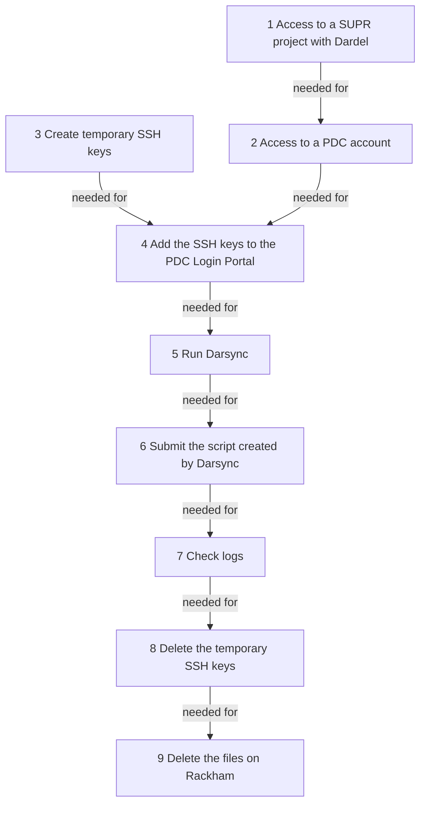

# Dardel migration


This page describes how to transfer files to Dardel,
the HPC cluster at PDC in Stockholm.

???- info "Visit the Rackham 2 Dardel Drop-in"

    Every Tuesday at 11:15 (except for the month of July)
    there is online Rackham 2 Dardel Drop-in at Zoom
    with meeting ID 64896912764

Please join us if you need assistance logging in to Dardel or migrating your data.

???- question "Why do I need this?"

    The Rackham cluster will be decommissioned at the end of 2024,
    hence all project directories will be deleted.
    The plan from NAISS is that all Rackham users can move to the Dardel cluster at PDC,
    and we encourage you to do so right away.

    Researchers at Uppsala University, should they so desire,
    can choose to keep data at UPPMAX.
    Projects with UU affiliation that remain on Rackham
    at the end of this year can be transferred to a new local system.

    To facilitate this move,
    we have created a tool that makes the transfer easier.

    [More details of Rackham end of life here](https://www.uu.se/centrum/uppmax/nyheter/nyheter/2024-02-16-rackham-end-of-life).

## Short version

The really short description is:

1. Become a member of a project with resources at Dardel in [SUPR](https://supr.naiss.se/).
1. Create a [passwordless SSH key](#3-create-ssh-key-pair).
1. Add the key to the [PDC login portal](https://loginportal.pdc.kth.se/).
1. Add `*.uppmax.uu.se` as allowed address for the key.
1. Load module `darsync` and run `darsync check` on the folder you want to transfer.
1. Create a Slurm script using `darsync gen` on the folder you want to transfer.
1. Submit the created Slurm script.

See the rest of this guide for more information about these steps.

## Long version

???- question "Prefer a video?"

    This procedure is also shown in [this YouTube video](https://youtu.be/rivtgTnulNA).

First, we are here to help.
Please [contact support](../support.md) if you run into problems
when trying the guide below.

This migration consists of a couple of steps summarized below.
Press the links to get more detailed explanation of each step.
Note that step 1 requires some hours of waiting
and step 2 requires an overnight wait.



> Overview of the migration process.
> Note that step 1 requires some hours of waiting
> and step 2 requires an overnight wait.

After those steps, the procedure will take around 20 minutes,
as shown in [the YouTube video that shows this procedure](https://youtu.be/rivtgTnulNA).

### 1. Get access to a SUPR project with Dardel

First step is to get get access to a SUPR project with Dardel.
This is described at [PDC's page on getting access to Dardel](https://www.pdc.kth.se/support/documents/getting_access/get_access.html).
You will get an email when you are added to a project,
this can take some hours.

???- question "How do I know I have access to a Dardel project?"

    Login to [https://supr.naiss.se/](https://supr.naiss.se/).
    If there is a PDC project,
    you may have access to a project with Dardel.

    

    > An example user that has access to a PDC project

    If you may a PDC project that does not use Dardel,
    click on the project to go the the project overview.

    

    > An example PDC project overview

    From there, scroll down to 'Resources'.
    If you see 'Dardel' among the compute resources,
    you have confirmed you have access to a Dardel project.

    

    > Resources from an example PDC project

### 2. Get a PDC account via SUPR

Get a PDC account via SUPR.
This is described at [the PDC page on how to apply for a SUPR account](https://www.pdc.kth.se/support/documents/getting_access/get_access.html#apply-via-a-supr-account).
You will get a PDC account overnight.

???- question "How do I know I have a PDC account?"

    Login to [https://supr.naiss.se/](https://supr.naiss.se/).
    and click on 'Accounts' in the main menu bar at the left.

    If you see 'Dardel' among the resources, and status 'Enabled'
    in the same row, you have a PDC account!

    

    > Example of a user having an account at PDC's Dardel HPC cluster

### 3. Create SSH key pair

First we will create SSH keys to be able to connect to Dardel.
We have made a small tool to create the keys for Darsync for you,
so just run these commands on UPPMAX:

Loading the needed [module](../cluster_guides/modules.md):

```bash
module load darsync
```

Then creating the key:

```bash
darsync sshkey
```

???- question "How does that look like?"

    The screen output will look similar to this:

    ```bash
    [richel@rackham1 ~]$ module load darsync
    [richel@rackham1 ~]$ darsync sshkey


      ____ ____  _   _ _  _________   __
     / ___/ ___|| | | | |/ / ____\ \ / /
     \___ \___ \| |_| | ' /|  _|  \ V /
      ___) |__) |  _  | . \| |___  | |
     |____/____/|_| |_|_|\_\_____| |_|
           
    The sshkey module of this script will generate a SSH key pair that you can use to login to Dardel.
    It will create two files, one with the private key and one with the public key.
    The private key should be kept secret and the public key should be added to your authorized_keys file on Dardel.


    
    Created SSH key: /home/richel/id_ed25519_pdc and /home/richel/id_ed25519_pdc.pub

    Content of the public key:

    ssh-ed25519 AAAAC3NzaC1lZDI1NTE5AAAAIAZkAoqlvm+YQrw26mCuH/4B/meG8O6aS8BB3kw1FDfl richel@rackham1.uppmax.uu.se


    You will now have to add the public key above to the Dardel Login Portal, https://loginportal.pdc.kth.se

    See the user guide for more info about this,
    https://docs.uppmax.uu.se/software/ssh_key_use_dardel/#2-how-to-add-an-ssh-key-to-the-pdc-login-portal
    ```

### 4. Add the public key to the PDC Login Portal

See [create and use an SSH key pair for Dardel, step 2](../software/ssh_key_use_dardel.md#2-how-to-add-an-ssh-key-to-the-pdc-login-portal),
to see how to upload the public SSH key to the PDC Login Portal.

### 5. Run the migration tool Darsync

#### 5.1 Load the module

```bash
module load darsync
```

#### 5.2 Check for problems

This step is optional, yet may help against possible problems.

Running `darsync check` will make Darsync prompt for questions:

```bash
darsync check
```

???- question "How does that look like?"

    Here is output similar to yours, for a user with username `sven`
    that wants to transfer his `Documents` folder:

    ```bash
    [sven@rackham1 ~]$ darsync check


       ____ _   _ _____ ____ _  __
      / ___| | | | ____/ ___| |/ /
     | |   | |_| |  _|| |   | ' /
     | |___|  _  | |__| |___| . \
      \____|_| |_|_____\____|_|\_\

    The check module of this script will recursively go through
    all the files in, and under, the folder you specify to see if there
    are any improvements you can to do save space and speed up the data transfer.

    It will look for file formats that are uncompressed, like .fasta and .vcf files
    (most uncompressed file formats have compressed variants of them that only
    take up 25% of the space of the uncompressed file).

    If you have many small files, e.g. folders with 100 000 or more files,
    it will slow down the data transfer since there is an overhead cost per file
    you want to transfer. Large folders like this can be archived/packed into
    a single file to speed things up.


    Specify which directory you want to copy.
    Make sure to use tab completion (press the tab key to complete directory names)
    to avoid spelling errors.
    Ex.
    /proj/naiss2099-22-999/
    or
    /proj/naiss2099-22-999/raw_data_only

    Specify local directory: Documents
    /domus/h1/sven/Documents/MATLAB


      ____   ___  _   _ _____
     |  _ \ / _ \| \ | | ____|
     | | | | | | |  \| |  _| 
     | |_| | |_| | |\  | |___
     |____/ \___/|_| \_|_____|

    Checking completed. Unless you got any warning messages above you
    should be good to go.

    Generate a SLURM script file to do the transfer by running this script again,
    but use the 'gen' option this time. See the help message for details,
    or continue reading the user guide for examples on how to run it.

    darsync gen -h

    A file containing file ownership information,
    /domus/h1/sven/Documents/darsync_Documents.ownership.gz,
    has been created. This file can be used to make sure that the
    file ownership (user/group) will look the same on Dardel as it does here.
    See ../cluster_guides/dardel_migration/#52-check-for-problems
    for more info about this.
       
    ```

???- question "Can I also give the arguments on the command line?"

    If you prefer to specify everything from the command-line, do:

    ```bash
    darsync check --local-dir [foldername]
    ```

    where `[foldername]` is the name to a folder,
    for example `darsync check --local-dir ~/my_folder`.

    There are some more optional arguments, see these by doing:

    ```bash
    darsync check --help
    ```

If there are problems reported, [contact support](../support.md)
or try to fix them yourself.

???- question "What is the file `darsync_[dirname].ownership.gz`?"

    This is a file containing file ownership information. It is created in
    the root of the folder you told Darsync to transfer to Dardel.

    When a user transfer all the files in a project to a project at Dardel,
    all the files at Dardel will be owned by the user who did the transfer.
    By saving the ownership information of the files at UPPMAX,
    we can map the file ownership information to the corresponding users at Dardel.

???- question "Can I delete the file `darsync_[dirname].ownership.gz`?"

    No, keep it until you feel at home at Dardel and have worked in your
    new project a couple of months. By that time you should have encountered
    any problems with file permissions that you might have.

    If you discover that you get problems because of wrong owner of files
    (write permissions etc), this file contains the information needed to
    recreate the file ownerships as they were before you transfered the files,
    even if your UPPMAX project has already been deleted.

???- question "How to fix `WARNING: files with uncompressed file extensions above the threshold detected`"

    It looks for files with file endings matching common uncompressed file formats, like `.fq`, `.sam`, `.vcf`, `.txt`.
    If the combined file size of these files are above a threshold it will trigger the warning. Most programs that uses these formats can also read the compressed version of them.

    Examples of how to compress common formats:

    ```bash
    # fastq/fq/fasta/txt
    gzip file.fq

    # vcf
    bgzip file.vcf

    # sam
    samtools view -b file.sam > file.bam
    # when the above command is completed successfully:
    # rm file.sam
    ```

    For examples on how to compress other file formats, use an internet search engine to look for

    ```text
    how to compress <insert file format name> file
    ```

???- question "How to fix `WARNING: Total number of files, or number of files in a single directory`"

    If a project consists of many small files it will decrease the data transfer speed,
    as there is an overhead cost to starting and stopping each file transfer.
    A way around this is to pack all the small files into a single `tar` archive,
    so that it only has to start and stop a single time.

    Example of how to pack a folder and all files in it into a single `tar` archive.

    ```bash
    ### on uppmax

    # pack it
    tar -czvf folder.tar.gz /path/to/folder

    # the the command above finished without error messages and you have a folder.tar.gz file that seems about right in size,
    rm -r /path/to/folder

#### 5.3 Generate script

In this third step, the [Slurm](slurm.md) script is created.

!!! info "A lot of questions"

    The script will ask multiple questions.
    Below it is described how to get the answers :-)

Running `darsync gen` will make Darsync prompt for questions:

```bash
darsync gen
```

???- question "How does that look like?"

    Here is output similar to yours, for a fictional user called Sven Svensson,
    with the UPPMAX username of `sven` and the PCD username
    of `svensv`:

    ```bash
    [sven@rackham1 ~]$ darsync gen


       ____ _____ _   _
      / ___| ____| \ | |
     | |  _|  _| |  \| |
     | |_| | |___| |\  |
      \____|_____|_| \_|

    The gen module of this script will collect the information needed
    and generate a script that can be submitted to SLURM to preform the
    data transfer.

    It will require you to know

        1) Which directory on UPPMAX you want to transfer (local directory).
        2) Which UPPMAX project id the SLURM job should be run under.
            ex. naiss2099-23-999
        3) Which cluster the SLURM job should be run on.
            ex. rackham, snowy
        4) Which username you have at Dardel.
        5) Where on Dardel it should transfer your data to.
            ex. /cfs/klemming/projects/snic/naiss2099-23-999/from_uppmax
        6) Which SSH key should be used when connecting to Dardel.
            ex. /home/user/id_ed25519_pdc
        7) Where you want to save the generated SLURM script.


    Specify which directory you want to copy.
    Make sure to use tab completion (press the tab key to complete directory names)
    to avoid spelling errors.
    Ex.
    /proj/naiss2099-22-999/
    or
    /proj/naiss2099-22-999/raw_data_only

    Specify local directory: Documents


    Specify which project id should be used to run the data transfer job in SLURM.
    Ex.
    naiss2099-23-999

    Specify project id: naiss2099-23-999


    Specify which cluster the SLURM job should be run on.
    Choose between rackham and snowy.
    Default is rackham

    Specify cluster: rackham


    Specify the username that should be used to login at Dardel.
    It is the username you have created at PDC and it is
    probably not the same as your UPPMAX username.

    Specify Dardel username: svensv


    Specify the directory on Dardel you want to transfer your data to.
    Ex.
    /cfs/klemming/projects/snic/naiss2099-23-999

    Specify Dardel path: /cfs/klemming/projects/snic/naiss2099-23-999


    Specify which SSH key should be used to login to Dardel.
    Create one by running `dardel_ssh-keygen` if you have not done so yet.
    If no path is given it will use the default key created by `dardel_ssh-keygen`,
    ~/id_ed25519_pdc
                       
    Specify SSH key:


    Specify where the SLURM script file should be saved.
    If not given it will save it here: ~/darsync_Documents.slurm
                       
    Specify SLURM script path:


      ____   ___  _   _ _____
     |  _ \ / _ \| \ | | ____|
     | | | | | | |  \| |  _| 
     | |_| | |_| | |\  | |___
     |____/ \___/|_| \_|_____|


    Created SLURM script: /home/sven/darsync_Documents.slurm

    containing the following command:

    rsync -e "ssh -i /home/sven/id_ed25519_pdc -o StrictHostKeyChecking=no" -acPuv /domus/h1/sven/Documents/ svensv@dardel.pdc.kth.se:/cfs/klemming/projects/snic/naiss2099-23-999


    To test if the generated file works, run

    bash /home/sven/darsync_Documents.slurm

    If the transfer starts you know the script is working, and you can terminate
    it by pressing ctrl+c and submit the script as a SLURM job.

    Run this command to submit it as a job:

    sbatch /home/sven/darsync_Documents.slurm
    ```

After answering all the questions a new file will be created. By default it will
be created in your home directory, named `darsync_foldername.sh`,
where `foldername` is the name of the folder you told it to transfer,
e.g. `~/darsync_nais2024-23-9999.sh`

In case of a typo, you can also modify the transfer script created by Darsync,
which is a regular [Slurm](slurm.md) script.

???- question "Can I also give the arguments on the command line?"

    If you prefer to specify everything from the command-line, do:

    ```bash
    darsync gen \
      --local-dir [foldername on UPPMAX] \
      --remote-dir [foldername on Dardel] \
      --slurm-account [slurm_account] \
      --cluster [slurm_cluster] \
      --username [pdc_username] \
      --ssh-key [private_ssh_key_path] \
      --outfile [output_filename]
    ```

    where

    - `[foldername]` is the name to a folder, e.g. `~/my_folder`
    - `[slurm_account]` is the UPPMAX project ID, e.g. `uppmax2023-2-25`
    - `[slurm_cluster]` is the cluster on UPPMAX where the job will run, e.g. `rackham` or `snowy`
    - `[pdc_username]` is your PDC username, e.g `svenan`
    - `[private_ssh_key_path]` is the path the private SSH key, e.g. `~/id_ed25519_pdc`
    - `[output_filename]` is the name of the Slurm output file, e.g. `~/dardel_naiss2024-23-9999.sh`

    resulting in:

    ```bash
    darsync gen \
      --local-dir ~/my_folder \
      --remote-dir /cfs/klemming/projects/nais2024-23-9999
      --slurm-account uppmax2023-2-25 \
      --username svenan \
      --ssh-key ~/id_ed25519_pdc \
      --outfile ~/dardel_naiss2024-23-9999.sh
    ```

    There are some more optional arguments, see these by doing:

    ```bash
    darsync gen --help
    ```

???- question "How to find out my UPPMAX project ID?"

    The UPPMAX project ID is used in your [Slurm](slurm.md) scripts,
    with the `-A` flag.

    Your UPPMAX project IDs can be found at [https://supr.naiss.se/](https://supr.naiss.se/).
    UPPMAX projects for Rackham usually start with `NAISS` or `UPPMAX`
    and have '(UPPMAX)' after the project name.

    Here is how to convert the UPPMAX project name to UPPMAX project ID:

    UPPMAX project name|UPPMAX project ID
    -------------------|-----------------
    NAISS 2024/22-49   |`naiss2024-22-49`
    UPPMAX 2023/2-25   |`uppmax2023-2-25`

    

    > An example [https://supr.naiss.se/](https://supr.naiss.se/) page.
    > Eligible candidates seem 'NAISS 2024/22-49' and 'UPPMAX 2023/2-25'.

???- question "How to find out my PDC username?"

    Login to [https://supr.naiss.se/](https://supr.naiss.se/).
    and click on 'Accounts' in the main menu bar at the left.

    If you see 'Dardel' among the resources, and status 'Enabled'
    in the same row, you have a PDC account.
    In the first column of such a row, you will see your username

    

    > An example of a user having an account at PDC's Dardel HPC cluster.
    > In this case, the username is `richelbi`

???- question "How to find out where on Dardel I will transfer your data to?"

    - Your home folder: `/cfs/klemming/home/[first letter of username]/[username]`,
      where `[first letter of username]` is the first letter of your PDC username, and `[username]` is your PDC username,
      for example `/cfs/klemming/home/s/sven`
    - Your project folder: `/cfs/klemming/projects/[project_storage]`,
      where `[project_storage]` is your PDC project storage folder,
      for example `/cfs/klemming/projects/snic/naiss2023-22-1027`

    

    > Composite image of a PDC project and its associated storage folder
    > at the bottom.
    > In this case, the full folder name is `/cfs/klemming/projects/snic/naiss2023-22-10271`

### 6. Run/submit the script created by Darsync

You can then start the transfer script the same way you let `bash` run
a script:

```bash
bash dardel_naiss2024-23-9999.sh
```

Replace `nais2024-23-9999` with the name of the folder you told Darsync to
transfer.

You terminal does needs to be running during the whole process.
If you do need to log out, use `sbatch` as show below.

???- question "Shouldn't I use sbatch?"

    No.

    Indeed, usually (and until September 17th) we recommend to use `sbatch`.

    However, in this case, the login node has a bigger
    file transfer bandwidth compared to the compute nodes.
    Hence, now the advice is to run the script on the login node.

???- question "Wouldn't I get complaints?"

    No.

    Normally, when you run CPU intensive tasks on a login node, we will
    either contact you or make your program use less CPU power.

    In this case, however, the login node is the superior node for
    file transfer and we at UPPMAX agreed on allowing our users
    to run the transfer from it.

???- question "Will this run when I close the terminal?"

    No.

    Normally, when you run CPU intensive tasks on a login node, we will
    either contact you or make your program use less CPU power.

    In this case, however, the login node is the superior node for
    file transfer and we at UPPMAX agreed on allowing our users
    to run the transfer from it.


???- question "My transfer job stopped. Is progress lost? Can I restart it?"

    No progress is lost. Yes, you can restart it: `rsync` will continue
    transferring files that have not been transferred or have not been
    transferred completely.

If you want to start the job by submitting it to the job queue,
use the following command:

```bash
sbatch ~/dardel_naiss2024-23-9999.sh
```

Replace `nais2024-23-9999` with the name of the folder you told Darsync to transfer.

???- question "How does that look like?"

    Similar to this:

    ```bash
    [richel@rackham1 ~]$ sbatch /home/richel/darsync_Documents.slurm
    Submitted batch job 49021945 on cluster rackham
    ```

???- question "I get an error 'sbatch: error: Batch job submission failed'. What do I do?"

    It means that the script created for you has a mistake.

    See [Slurm troubleshooting](slurm_troubleshooting.md) for guidance
    on how to troubleshoot this.

???- question "How do I know this job has finished?"

    One way is to see if your job queue is empty:

    ```bash
    [sven@rackham1 ~]$ squeue -u $USER
                 JOBID PARTITION     NAME     USER ST       TIME  NODES NODELIST(REASON)
    ```

    Here, an empty job queue is shown.
    If the job is still running, you can find it in this list.

### 7. Check logs

Once the submitted job has finished, have a look at the log file produced by the job and make sure it did not end in a error message.
Replace `nais2024-23-9999` with the name of the folder you told Darsync to transfer.

```bash
tail ~/dardel_naiss2024-23-9999.out
tail ~/dardel_naiss2024-23-9999.err
```

???- question "How does that look like?"

    If the job finished successfully, the output will look similar to this:

    ```bash
    [sven@rackham1 ~]$ tail darsync_Documents.out
    sending incremental file list
    [sven@rackham1 ~]$ tail darsync_Documents.err
    [sven@rackham1 ~]$
    ```

??? question "I have the warning `rsync: [generator] failed to set times on "...": Operation not permitted (1)`. Did something go wrong?"

    No.

    Here is the full warning:

    ```text
    rsync: [generator] failed to set times on "/cfs/klemming/projects/snic/my_project/.": Operation not permitted (1)
    ```


    This is a warning, indicating that the target folder on Dardel already exists.
    You can safely ignore it.


??? question "I have the warning `rsync error: some files/attrs were not transferred`. Did something go wrong?"

    No.

    Here is the full warning:

    ```text
    rsync error: some files/attrs were not transferred (see previous errors) (code 23) at main.c(1179) [sender=3.1.2]
    ```

    This is a warning, indicating that some file **attributes** were not
    transferred. An easy example is the file attribute for who is the
    file creator: this will differ between UPPMAX and PDC (the organisation that
    takes care of Dardel) because you have
    different usernames, for example `svesv` ('Sven Svensson') on UPPMAX
    and `svensv` on PDC. Hence, the file creator will differ between files.

### 8. Delete the SSH key

After the migration, these temporary SSH keys can and should be deleted:

```bash
rm ~/id_ed25519_pdc*
```

???- question "How does this look like?"

    You screen will show something similar to this:

    ```bash
    [sven@rackham1 ~]$ rm ~/id_ed25519_pdc*
    [sven@rackham1 ~]$
    ```

### 9. Delete the files on Rackham

Now that the files are transferred to Dardel,
you can delete the files on Rackham that you've just transferred to Dardel.

???- question "How does that look like?"

    If you transferred one folder, for example, `Documents`, here
    is how to delete it and how that looks like:

    ```bash
    [sven@rackham1 ~]$ rm -rf Documents/
    [sven@rackham1 ~]$
    ```

    The `rm` command (`rm` is short for 'remove') cannot be undone.
    Luckily, your files are on Dardel already :-)

## Questions

???- question "How long does the transfer take?"

    Estimates range from 23 to 360 to gigabyte per hour.
    This excludes the extremes of 7 and 3600 gigabyte per hour.

    However, for large numbers of small files the metric files/seconds
    would be better, yet requires a benchmark.

## T. Troubleshooting

### T1. `ssh: connect to host dardel.pdc.kth.se port 22: No route to host`

#### T1. Full error message

```text
[richel@rackham1 ~]$ bash /domus/h1/richel/dardel_transfer_script.sh
ssh: connect to host dardel.pdc.kth.se port 22: No route to host
rsync: connection unexpectedly closed (0 bytes received so far) [sender]
rsync error: unexplained error (code 255) at io.c(226) [sender=3.1.2]
```

#### T1. Likely cause

This probably means that Dardel is down, likely due to maintenance.

#### T1. Solution

You can do nothing, except wait until Dardel is up again.

You may check the PDC news at
[https://www.pdc.kth.se/about/pdc-news](https://www.pdc.kth.se/about/pdc-news)
to confirm that there is indeed a problem with Dardel.

### T2. `rsync: [generator] failed to set times on "/cfs/klemming/projects/snic/naiss2024-23-352/.": Operation not permitted (1)`

#### T2. Full error message

```bash
$ bash darsync_my_folder.slurm
sending incremental file list
rsync: [generator] failed to set times on "/cfs/klemming/projects/snic/naiss2024-23-352/.": Operation not permitted (1)
```

after which the script keeps running.

???- question "For UPPMAX staff"

    An example can be found at [https://github.com/UPPMAX/ticket_296149](https://github.com/UPPMAX/ticket_296149).

#### T2. Hypothesized cause

This darsync script is running for the second (or more) time,
hence it has already created the target folders on Dardel.
This hypothesis is backed by [this Stack Overflow post](https://stackoverflow.com/a/54861420)
where it is suggested to delete the folders; in this case: the target folders on Dardel.

#### T2. Solution

On Dardel, delete the target folders that are already there
and re-run the script.

### T3. `Permission denied (publickey,gssapi-keyex,gssapi-with-mic)`

#### T3. Full error message

```bash
[sven@rackham1 .ssh]$ bash /home/sven/darsync_my_script.slurm
Permission denied (publickey,gssapi-keyex,gssapi-with-mic).

rsync: connection unexpectedly closed (0 bytes received so far) [sender]

rsync error: unexplained error (code 255) at io.c(226) [sender=3.1.2]
```

Note that our fictional user runs the Slurm script via `bash`, instead of
via `squeue`.

#### T3. First possible fix

Run the script as such:

```bash
sbatch /home/sven/darsync_my_script.slurm
```

#### T3. Second possible fix

Another possible fix comes from [StackOverflow](https://stackoverflow.com/questions/36300446/ssh-permission-denied-publickey-gssapi-with-mic):

> Setting 700 to .ssh and 600 to authorized_keys solved the issue.
>
> ```bash
> chmod 700 /root/.ssh
> chmod 600 /root/.ssh/authorized_keys
> ```

Hence, try:

```bash
chmod 700 ~/.ssh
chmod 600 ~/.ssh/authorized_keys
```

Still does not work? Contact [support](../support.md)
