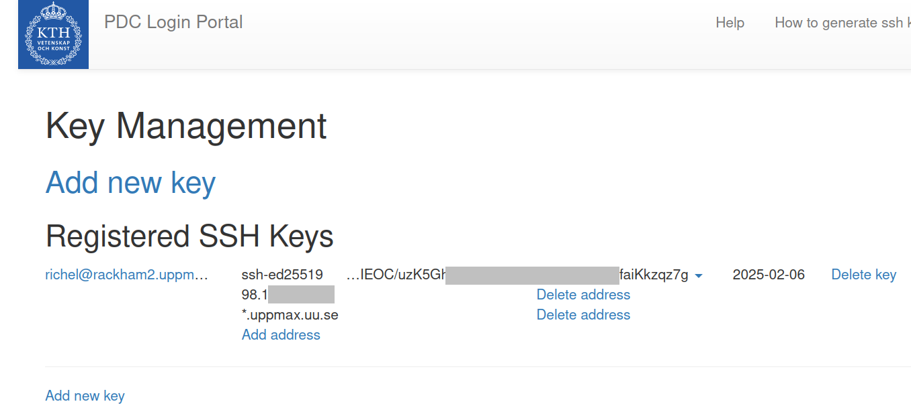

# Dardel SSH Key Guide

This guide will show you:

- [how to create SSH keys](#creating-ssh-keys)
- [how to add an SSH key to the PDC login port](#add-an-ssh-key-to-the-pdc-login-portal)

This makes it possible for you to login to Dardel.

PDC has [a more comprehensive guide on how to do this on various operating systems](https://www.pdc.kth.se/support/documents/login/ssh_keys.html) 
if you want a more in-depth guide.

## Creating SSH keys

To create a SSH key, run the following command:

```bash
ssh-keygen -t ed25519
```

This will start the creating of a SSH key using the `ed25519` algorithm. The program will ask you where to save the file,

```bash
user@rackham ~ $ ssh-keygen -t ed25519
Generating public/private ed25519 key pair.
Enter file in which to save the key (/home/user/.ssh/id_ed25519): 
```

If you just press enter it will save the new key using the suggested name, `/home/user/.ssh/id_ed25519`

If it asks you if you want to overwrite, you probably want to press `n` since you already have one created and might want to use that one instead. If you overwrite it you will lose access to wherever the old key file is used, so just run the `ssh-keygen` command above again and type in a new name for the file.

```
/home/user/.ssh/id_ed25519 already exists.
Overwrite (y/n)? 
```

The next step is to add a password to your key file. This makes sure that even if someone manages to copy your key they will not be able to use it without the password you set here. Type in a password you will remember, press enter, type it in again and press enter.

```
Enter passphrase (empty for no passphrase): 
Enter same passphrase again: 
```

The key will now be created and you can add it to the PDC Login Portal.

```
Your identification has been saved in /home/user/.ssh/id_ed25519
Your public key has been saved in /home/user/.ssh/id_ed25519.pub
The key fingerprint is:
SHA256:g+rvY4HoDNlim+Bj43L3pxr56hrlwC4hzPa/yE/2YqE user@rackham
The keys randomart image is:
+--[ED25519 256]--+
|.o               |
|o   .            |
| . = .           |
|    B ..         |
| + * B..S        |
|= + o =          |
|*+.oo=..         |
|+=oE+ B          |
| o +*X o         |
+----[SHA256]-----+
```

## Add an SSH key to the PDC Login Portal

### 1. Open the PDC login portal

Go to the [PDC Login Portal](https://loginportal.pdc.kth.se/)

???- question "How does that look like?"

    That will look like this:

    

    > Example PDC login portal without any SSH keys yet.
    > We will need to add an SSH key that allows 
    > access from UPPMAX to PDC

### 2. Add a new key

Click the `Add new key` link:

???- question "How does adding an SSH key pair look like?"

    That will look like this:

    

    > Example of the first step of adding an SSH key pair to the PDC portal.
    > The 'SSH public key' is copy-pasted 
    > from `cat ~/id_ed25519_pdc.pub` on Rackham.
    > The 'Key name' can be chosen freely.
    > Note that this SSH key cannot be used yet for UPPMAX,
    > as it only allows one IP address.

???- question "How does it look like when the key is added?"

    That will look like this:

    

    > Example PDC login portal with one key. 
    > Note that the second column only has one IP address
    > and is still missing `*.uppmax.uu.se`.

### 3. Actually adding the key

Here you can either upload the public part of the key file 
you created before, 
or you can enter the information manually. 

???- question "Forgot where the key was?"

    Here is a default location:

    ```bash
    cat ~/.ssh/id_ed25519.pub
    ```

Copy the text, e.g. `ssh-ed25519 AAmAC3Nz2C1lZDI4N4E5AAAAXEjxKoZ72x42eRd+A2h2GDxnAlD7deITZx7pK8TgEppE user@rackham`
Paste it into the field `SSH public key`, 
make up a name for the key so you know which computer it is on 
and fill it into the field `Key name`.

### 4. Use the key from UPPMAX

Once you have added you key you have to 
add UPPMAX as allowed to use the key.
Click on `Add address` for it and add `*.uppmax.uu.se`.

`Address` specifies which IP address(es) 
are allowed to use this key
and the field is prefilled with the IP of the computer you are on at the moment.

???- question "How does it look like to edit an SSH key so that can be used for UPPMAX?"

    That will look like this:

    

    > Example of the second step of adding an SSH key pair to the PDC portal.
    > Here the custom address `*.uppmax.uu.se` is added,
    > so that this SSH key can be used for UPPMAX.

???- question "How does it look like to have a key that can be used for UPPMAX?"

    That will look like this:

    

    > Example PDC login portal with one key. Note the `*.uppmax.uu.se`
    > at the bottom of the second column.
