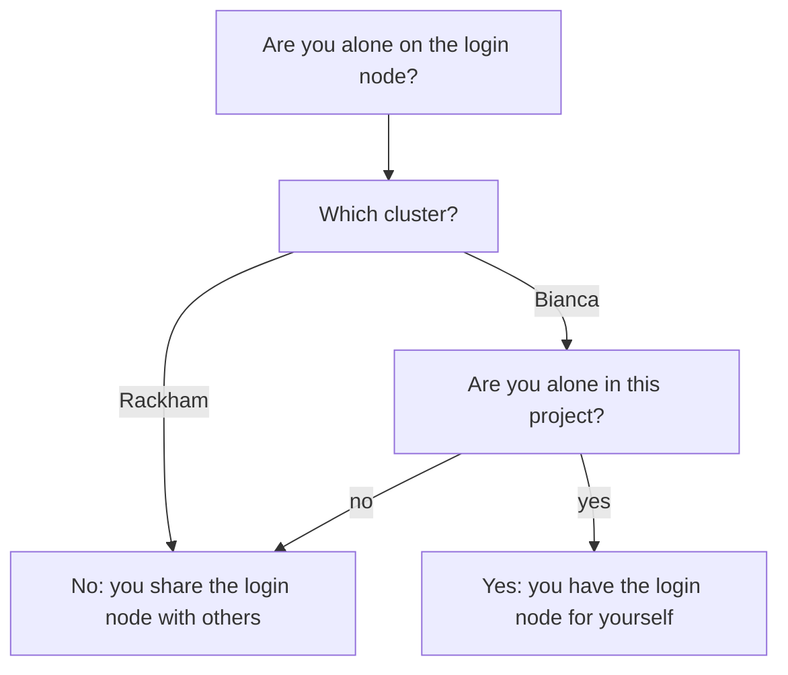
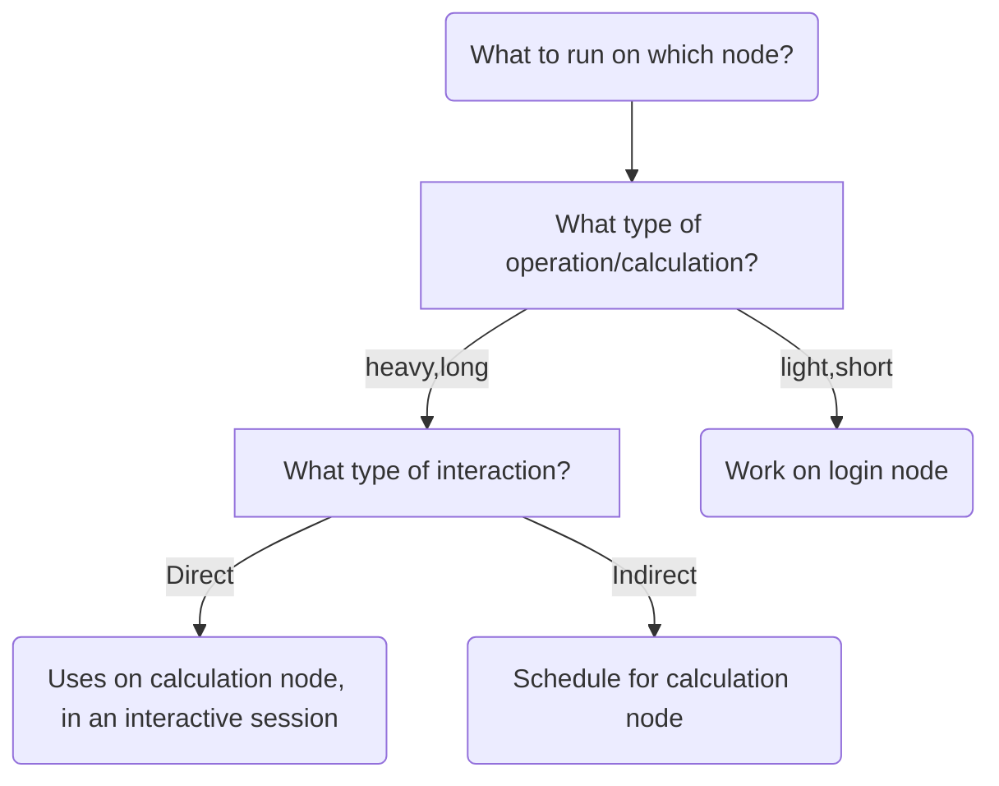

---
tags:
  - login node
  - node
  - login
---

# Login node

A login node is the computer where you arrive after logging in
to an [UPPMAX HPC cluster](../cluster_guides/uppmax_cluster.md).

???- question "How does that look like?"

    Here is how it looks like to be on a login node:

    

    > A user on a login node, in this case on a [Rackham](../cluster_guides/rackham.md) login node called `rackham4`.
    > The user used an [SSH client](../software/ssh_client.md) and is in
    > a console environment.

    

    > A user on a login node, in this case on the [Bianca](../cluster_guides/bianca.md) login node
    > of his/her virtual cluster.
    > This user [logged in to the Bianca remote desktop via the website](../getting_started/login_bianca_remote_desktop_website.md)

A login node is a shared resource.
With this diagram you can determine if you are alone on a login node:

> Decision tree to determine if you are alone on a login node

Because usually you share a login node with others,
this is the rule how to behave on a login node:

> Only do short and light things on the login node

Examples of short and light things are:

- Editing files
- Copying, deleting, moving files
- Scheduling jobs
- Starting an interactive session

Examples of heavy things are:

- Running code with big calculations,
  use [the job scheduler](../cluster_guides/slurm.md) instead
- Develop code with big calculations line-by-line,
  use [an interactive session](../cluster_guides/start_interactive_node.md) instead

> Decision tree to determine which type of node you should probably work on

???- question "I work alone on a Bianca project. Can I use the login node for heavy things?"

    Yes!

    Or, to be more precise: yes, if the login node is powerful enough for your
    calculations.

    For example, when
    [using RStudio on Bianca](../software/rstudio_on_bianca.md)
    it is recommended to use at least two cores (and login node has 2 cores only).

    So, if you can, use the login node. If you need more resources,
    either use [the job scheduler](../cluster_guides/slurm.md) or
    use [an interactive node](../cluster_guides/start_interactive_node.md)
    with more nodes than the login node has.
