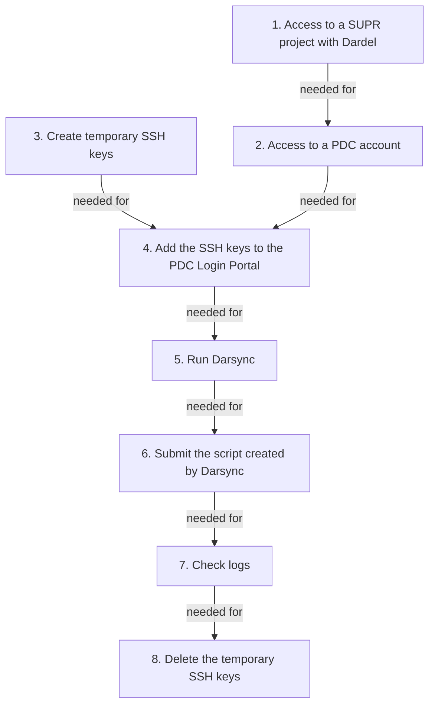

# Dardel Migration


This page describes how to transfer files to Dardel,
the HPC cluster at PDC in Stockholm.

## Why do I need this?

The Rackham cluster will be decommissioned at the end of 2024 
so all projects have to migrate their data and calculations to other resources. 
The plan from NAISS is that all Rackham users 
will move to the Dardel cluster at PDC. 

To facilitate this move we have created Darsync, 
a tool that can inspect your files 
and make suggestions to make the transfer easier, 
as well as generating a script file you can submit to [SLURM](slurm.md) 
to perform the actual file transfer. 
[Read more about how to use Darsync here]

## How do I do this?

First, we are here to help.
Please [contact support](../support.md) if you run into problems
when trying the guide below.

This migration consists of a couple of steps summarized below. 
Press the links to get more detailed explanation of each step.
Note that step 1 requires some hours of waiting
and step 2 requires an overnight wait.



> Overview of the migration process.
> Note that step 1 requires some hours of waiting
> and step 2 requires an overnight wait.

### 1. Get access to a SUPR project with Dardel

First step is to get get access to a SUPR project with Dardel.
This is described at [PDC's page on getting access to Dardel](https://www.pdc.kth.se/support/documents/getting_access/get_access.html).
You will get an email when you are added to a project,
this can take some hours.

???- question "How do I know I have access to a Dardel project?"

    Login to [https://supr.naiss.se/](https://supr.naiss.se/).
    If there is a PDC project,
    you may have access to a project with Dardel.

    

    > Example user that has access to a PDC project

    If you may a PDC project that does not use Dardel,
    click on the project to go the the project overview.

    

    > Example PDC project overview

    From there, scroll down to 'Resources'.
    If you see 'Dardel' among the compute resources, 
    you have confirmed you have access to a Dardel project.

    

    > Resources from an example PDC project

### 2. Get a PDC account via SUPR

Get a PDC account via SUPR.
This is described at [the PDC page on getting access](https://www.pdc.kth.se/support/documents/getting_access/get_access.html#supr-account).
You will get a PDC account overnight.

???- question "How do I know I have a PDC account?"

    Login to [https://supr.naiss.se/](https://supr.naiss.se/).
    and click on 'Accounts' in the main menu bar at the left.

    If you see 'Dardel' among the resources, and status 'Enabled'
    in the same row, you have a PDC account!

    

    > Example of a user having an account at PDC's Dardel HPC cluster

### 3. Create SSH key pair

Create SSH key and add it to the PDC Login Portal.

- Create the password less SSH key in a terminal logged into Rackham:

```bash
darsync sshkey
```

### 4. Add the public key to the PDC Login Portal

When creating the SSH key pair, `darsync` will already
display the public key.

If, however, you missed it,
you can view the public SSH key again; in a terminal logged into Rackham:

```
cat ~/id_ed25519_pdc.pub
```

???- question "How does that look like?"

    The text will look similar to this:

    ```
    ssh-ed25519 AAAA69Nz1C1lZkI1NdE5ABAAIA7RHe4jVBRTEvHVbEYxV8lnOQl22N+4QcUK+rDv1gPS user@rackham2.uppmax.uu.se
    ```

Open the [PDC Login Portal](https://loginportal.pdc.kth.se/).

Follow our [step-by-step instructions on how to add SSH keys](./cluster_guides/dardel_ssh-keys.md).


### 5. Run Darsync

Run the migration tool [Darsync](../cluster_guides/darsync.md). 
Below it is described how to find the answers to the questions
[Darsync](../cluster_guides/darsync.md) will ask.

```bash
module load darsync

darsync check --local-dir /path/to/dir
# fix any errors the check step found
darsync gen --local-dir /path/to/dir --outfile ~/dardel_transfer_script.sh
```

???- question "How to find out my UPPMAX project ID?"

    The UPPMAX project ID is used in your [Slurm](slurm.md) scripts,
    with the `-A` flag.

    Your UPPMAX project IDs can be found at [https://supr.naiss.se/](https://supr.naiss.se/).
    UPPMAX projects for Rackham usually start with `NAISS` or `UPPMAX`
    and have '(UPPMAX)' after the project name.

    Here is how to convert the UPPMAX project name to UPPMAX project ID:

    UPPMAX project name|UPPMAX project ID
    -------------------|-----------------
    NAISS 2024/22-49   |`naiss2024-22-49`
    UPPMAX 2023/2-25   |`uppmax2023-2-25`

    

    > Example [https://supr.naiss.se/](https://supr.naiss.se/) page.
    > Eligible candidates seem 'NAISS 2024/22-49' and 'UPPMAX 2023/2-25'.

???- question "How to find out my Dardel username?"

    Login to [https://supr.naiss.se/](https://supr.naiss.se/).
    and click on 'Accounts' in the main menu bar at the left.

    If you see 'Dardel' among the resources, and status 'Enabled'
    in the same row, you have a PDC account.
    In the first column of such a row, you will see your username

    

    > Example of a user having an account at PDC's Dardel HPC cluster.
    > In this case, the username is `richelbi`

???- question "How to find out where on Dardel I will transfer your data to?"

    * Your home folder: `/cfs/klemming/home/r/[username]`,
      where `[username]` is your PDC username,
      for example `/cfs/klemming/home/r/sven`
    * Your project folder: `/cfs/klemming/projects/[project_storage]`,
      where `[project_storage]` is your PDC project storage folder,
      for example `/cfs/klemming/projects/snic/naiss2023-22-1027`

    

    > Composite image of a PDC project and its associated storage folder 
    > at the bottom. 
    > In this case, the full folder name is `/cfs/klemming/projects/snic/naiss2023-22-10271`

### 6. Submit the script created by Darsync

Submit the transfer script created by Darsync to SLURM.

```bash
sbatch --output=~/dardel_transfer.out --error=~/dardel_transfer.err ~/dardel_transfer_script.sh
```

???- question "I get an error 'sbatch: error: Batch job submission failed'. What do I do?"

    It means that the script created for you, `dardel_transfer_script.sh`,
    has a mistake.

    See [Slurm troubleshooting](slurm_troubleshooting.md) for guidance
    on how to troubleshoot this.

### 7. Check logs

Once the submitted job has finished, have a look at the log file produced by the job and make sure it did not end in a error message.

```bash
tail ~/dardel_transfer.out
tail ~/dardel_transfer.err
```

### 8. Delete the SSH key

After the migration, these temporary SSH keys can and should be deleted:

```bash
rm ~/id_ed25519_pdc*
```

## Troubleshooting

### What is the `darsync_[folder_name].ownership.gz` file that is created?

?

### `ssh: connect to host dardel.pdc.kth.se port 22: No route to host`

```
[richel@rackham1 ~]$ bash /domus/h1/richel/dardel_transfer_script.sh
ssh: connect to host dardel.pdc.kth.se port 22: No route to host
rsync: connection unexpectedly closed (0 bytes received so far) [sender]
rsync error: unexplained error (code 255) at io.c(226) [sender=3.1.2]
```

?


