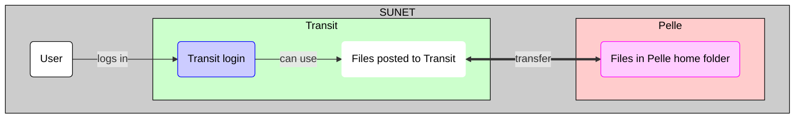

# Data transfer to/from Pelle using Transit

!!! warning "Does not work yet"

    [Pelle](../cluster_guides/pelle.md) is a new UPPMAX HPC cluster
    that is in the process of being deployed.

    The procedure as described on this page does not work yet or is untested.

    This page will be updated when this works.

Data transfer to/from Pelle using [Transit](../cluster_guides/transit.md)
is one of the ways ways to transfer files to/from Pelle

???- question "What is Transit?"

    See [the page about the UPPMAX Transit server](transit.md).

???- question "What are the other ways?"

    Other ways to transfer data to/from Pelle are described [here](transfer_pelle.md)

This page assumes your files are 'posted' to Transit.
[Transit is a service, not a file server](transit.md).

???- question "How to transfer files to/from Transit?"

    See [here](transfer_transit.md)

To transfer files between Pelle and Transit can be done in multiple ways too:

- [Using SCP](../software/pelle_file_transfer_using_transit_scp.md)
- [Using SFTP](../software/pelle_file_transfer_using_transit_sftp.md)

## Overview

> Overview of file transfer on Pelle
> The purple nodes are about file transfer,
> the blue nodes are about 'doing other things'.
> The user can be either inside or outside SUNET.
