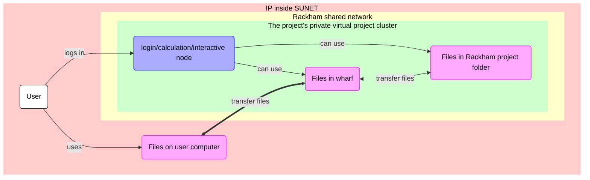
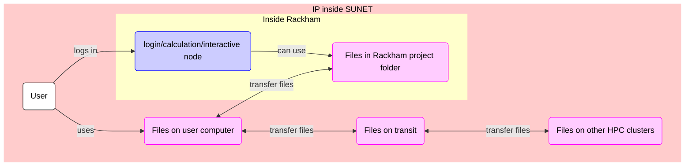

# File transfer using a graphical tool on Rackham

> FileZilla connected to Rackham

## Overview

As a user, we need to transfer files
between our local computer and Rackham.
The many ways to transfer files to/from Rackham 
are discussed [here](transfer_rackham.md).
On this page, we learn how to transfer files
to Rackham using a graphical tool/program.

The files you transfer will end up in your so-called `wharf` folder.
Where to find this folder is shown in the section 'Where do my files end up?'.

## Rackham's constraints

> Overview of file transfer on Rackham, when using a graphical tool.
> The purple nodes are about file transfer,
> the blue nodes are about 'doing other things'.
> In this session, we will transfer files between
> 'Files on user computer' and 'Files in wharf'
> using a graphical tool, e.g. FileZilla

Here, we show how to transfer files using a graphical tool called FileZilla.

## Using FileZilla

> The FileZilla logo

???- question "Would you like a video?"

    If you like to see how to do file tranfer from/to Rackham
    using FileZilla, watch the video 
    [here](https://youtu.be/V-iPQLjvByc?si=OMyH3REu-SoFQeI9)

FileZilla is a secure file transfer tool that works under Linux, Mac and Windows.

To transfer files to/from Rackham using FileZilla, do:

- Start FileZilla
- From the menu, select 'File | Site manager'

???- tip "Where is that?"

    It is here:

    
    
    > The FileZilla 'File' menu contains the item 'Site manager'

- Click 'New site'

???- tip "Where is that?"

    It is here:

    

- Create a name for the site, e.g. `rackham`.
- For that site, use all standards, except:
    - Set protocol to 'SFTP - SSH File Transfer Protocol'
    - Set host to `rackham-sftp.uppmax.uu.se`
    - Set user to `[username]`, e.g. `richel`

???- tip "How does that look like?"

    It looks similar to this:

    

- Click 'Connect'
- You will be asked for your password, hence
  type `[your password]`, e.g. `VerySecret`.
  You can save the password.

???- tip "How does that look like?"

    It looks similar to this:

    

Now you can transfer files between your local computer and Rackham.

???- tip "How does that look like?"

    It looks like this:

    

## Where do my files end up?

They end up in your personal home folder.

Its location is at `/home/[user_name]`,
for example, at `/home/sven`.

???- tip "How does that look like?"

    It looks like this:

    

## Extra material

### WinSCP

WinSCP is a secure file transfer tool that works under Windows.

To transfer files to/from Rackham using WinSCP, do:

- Start WinSCP
- Create a new site
- For that site, use all standards, except:
    - Set file protocol to 'SFTP'
    - Set host name to `rackham-sftp.uppmax.uu.se`
    - Set user name to `[username]`, e.g. `richel`

### File transfer overview

> Overview of file transfer on Rackham
> The purple nodes are about file transfer,
> the blue nodes are about 'doing other things'.
