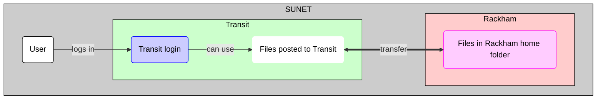

# Data transfer to/from Rackham using Transit

Data transfer to/from Rackham using [Transit](../cluster_guides/transit.md)
is one of the ways ways to transfer files to/from Rackham

???- question "What is Transit?"

    See [the page about the UPPMAX Transit server](transit.md).

???- question "What are the other ways?"

    Other ways to transfer data to/from Rackham are described [here](transfer_rackham.md)

This page assumes your files are 'posted' to Transit.
[Transit is a service, not a file server](transit.md).

???- question "How to transfer files to/from Transit?"

    See [here](transfer_transit.md)

To transfer files between Rackham and Transit can be done in multiple ways too:

* [Using SCP](#using-scp)
* [Using SFTP](#using-sftp)

## Using SCP

One can use SCP to copy files between Rackham and Transit,
from either Rackham or Transit.

Both ways are shown step-by-step below.

### Login to Rackham

One can transfer files to/from Rackham using the UPPMAX Transit server, using SCP.
The program `scp` allows you to copy file between Rackham and Transit.

The process is:

#### 1. Get inside SUNET

???- question "Forgot how to get within SUNET?"

    See the 'get inside the university networks' page [here](../getting_started/get_inside_sunet.md)

#### 2. Use the terminal to login to Rackham

???- question "Forgot how to login to Rackham?"

    A step-by-step guide how to login to Rackham
    can be found [here](../getting_started/login_rackham.md).

    Spoiler: `ssh [username]@rackham.uppmax.uu.se`

#### :no_entry: 3a. Run `scp` to copy files from Rackham to Transit

This is how you **would** copy a file from Rackham to Transit:
in the terminal, run `scp` to copy files from Rackham to Transit by doing:

```
scp [file_on_rackham] [username]@transit.uppmax.uu.se
```

where `[file_on_rackham]` is the name of a file on Rackham
and `[username]` is your UPPMAX username, for example:

```
scp my_rackham_file.txt [username]@transit.uppmax.uu.se
```

However, [Transit is a service, not a file server](transit.md).
The `scp` command will complete successfully,
yet the file will not be found on Transit.

#### 3b. Run `scp` to copy files from Transit to Rackham

In the terminal, run `scp` to copy files from Transit to Rackham by doing:

```
scp [file_on_rackham] [username]@transit.uppmax.uu.se
```

where `[file_on_rackham]` is the name of a file on Rackham
and `[username]` is your UPPMAX username, for example:

```
scp my_rackham_file.txt [username]@transit.uppmax.uu.se
```

#### 4. If asked, give your UPPMAX password

You can get rid of this prompt if you have setup SSH keys

### Login to transit

One can transfer files to/from Rackham using the UPPMAX Transit server,
using SCP.
The program `scp` allows you to copy file between Rackham and Transit.

The process is:

#### 1. Get inside SUNET

???- question "Forgot how to get within SUNET?"

    See the 'get inside the university networks' page [here](../getting_started/get_inside_sunet.md)

#### 2. Use the terminal to login to Transit

???- question "Forgot how to login to Transit?"

    A step-by-step guide how to login to Transit
    can be found [here](../cluster_guides/login_transit.md).

    Spoiler: `ssh [username]@transit.uppmax.uu.se`

#### 3a. Run `scp` to copy files from Transit to Rackham

In the terminal, run `scp` to copy files from Transit to Rackham by doing:

```
scp [username]@rackham.uppmax.uu.se:/home/[username]/[file_on_rackham] [path_on_transit]
```

where `[file_on_rackham]` is the name of a file on Rackham,
`[username]` is your UPPMAX username,
and `[path_on_transit]` is the target path on Transit,
for example:

```
scp sven@rackham.uppmax.uu.se:/home/sven/my_rackham_file.txt .
```

Where `.` means 'the directory where I am now on Transit'.

#### 3b. :no_entry: Run `scp` to copy files from Rackham to Transit

This is how you **would** copy a file from Rackham to Transit:
in the terminal, run `scp` to copy files from Rackham to Transit by doing:

```
scp [file_on_rackham] [username]@transit.uppmax.uu.se
```

where `[file_on_transit]` is the name of a file on Transit
and `[username]` is your UPPMAX username, for example:

```
scp my_local_rackham_file.txt [username]@transit.uppmax.uu.se
```

However, [Transit is a service, not a file server](transit.md).
The `scp` command will complete successfully,
yet the file will not be found on Transit.

#### 4. If asked, give your UPPMAX password

You can get rid of this prompt if you have setup SSH keys

## Using SFTP

One can use SFTP to copy files between Rackham and Transit,
from either Rackham or Transit.

Both ways are shown step-by-step below.

### Login to Rackham

One can transfer files to/from Rackham using the UPPMAX Transit server.
Transit is an abbreviation of 'SSH File Transfer Protocol',
where 'SSH' is an abbreviation of 'Secure Shell protocol'
The program `sftp` allows you to transfer files to/from Rackham using Transit.

The process is:

#### 1. Get inside SUNET

???- question "Forgot how to get within SUNET?"

    See the 'get inside the university networks' page [here](../getting_started/get_inside_sunet.md)

#### 2. Use the terminal to login to Rackham

???- question "Forgot how to login to Rackham?"

    A step-by-step guide how to login to Transit
    can be found [here](../getting_started/login_rackham.md).

    Spoiler: `ssh [username]@rackham.uppmax.uu.se`

#### 3. Run `sftp` to connect to Transit

In the terminal, run `sftp` to connect to Transit by doing:

```
sftp [username]@transit.uppmax.uu.se
```

where `[username]` is your UPPMAX username, for example:

```
sftp sven@transit.uppmax.uu.se
```

#### 4. If asked, give your UPPMAX password

You can get rid of this prompt if you have setup SSH keys

#### 5. In `sftp`, upload/download files to/from Transit

[Transit is a service, not a file server](transit.md).
This means that if you upload files to Transit using SFTP,
they will remain there as long a the connection is active.
These files need to be forwarded to more permanent storage.

Basic `sftp` command can be found [here](../software/sftp.md).

### Login to transit

One can transfer files to/from Rackham using the UPPMAX Transit server.
Transit is an abbreviation of 'SSH File Transfer Protocol',
where 'SSH' is an abbreviation of 'Secure Shell protocol'
The program `sftp` allows you to transfer files to/from Rackham using Transit.

The process is:

#### 1. Get inside SUNET

???- question "Forgot how to get within SUNET?"

    See the 'get inside the university networks' page [here](../getting_started/get_inside_sunet.md)

#### 2. Use the terminal to login to Transit

???- question "Forgot how to login to Transit?"

    A step-by-step guide how to login to Transit
    can be found [here](../cluster_guides/login_transit.md).

    Spoiler: `ssh [username]@transit.uppmax.uu.se`

#### 3. Run `sftp` to connect to Rackham

In the terminal, run `sftp` to connect to Rackham by doing:

```
sftp [username]@rackham.uppmax.uu.se
```

where `[username]` is your UPPMAX username, for example:

```
sftp sven@rackham.uppmax.uu.se
```

#### 4. If asked, give your UPPMAX password

You can get rid of this prompt if you have setup SSH keys

#### 5. In `sftp`, upload/download files to/from Rackham

[Transit is a service, not a file server](transit.md).
This means that if you upload files to Transit using SFTP,
they will remain there as long a the connection is active.
These files need to be forwarded to more permanent storage.

Basic `sftp` command can be found [here](../software/sftp.md).

## Overview



> Overview of file transfer on Rackham
> The purple nodes are about file transfer,
> the blue nodes are about 'doing other things'.
> The user can be either inside or outside SUNET.
