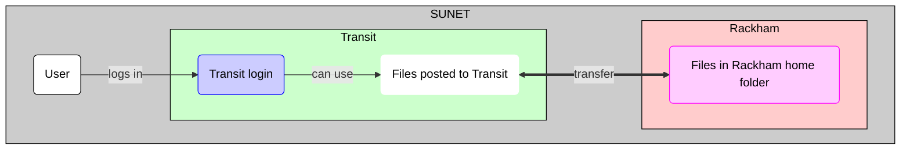

# Data transfer to/from Rackham using Transit and SFTP

Data transfer to/from Rackham using [Transit](../cluster_guides/transit.md)
is one of the ways ways to transfer files to/from Rackham

One can use SFTP to copy files between Rackham and Transit,
from either Rackham or Transit.

Both ways are shown step-by-step below.

- [Using SFTP from Rackham](rackham_file_transfer_using_transit_sftp_from_rackham.md)
- [Using SFTP from transit](rackham_file_transfer_using_transit_sftp_from_transit.md)

Basic `sftp` command can be found [here](../software/sftp.md).

## Overview

> Overview of file transfer on Rackham
> The purple nodes are about file transfer,
> the blue nodes are about 'doing other things'.
> The user can be either inside or outside SUNET.
