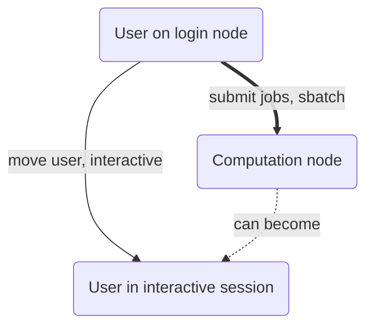

---
tags:
  - slurm
  - Simple Linux Utility for Resource Management
---

# Slurm

The UPPMAX clusters are a shared resource.
To ensure fair use, UPPMAX uses a scheduling system.
A scheduling system decides at what time which calculation is done.
The software used is called Slurm.

???- question "Why not write SLURM?"

    Indeed, Slurm started as an abbreviation of 'Simple Linux Utility
    for Resource Management'. However,
    the [Slurm homepage](https://slurm.schedmd.com/) uses 'Slurm'
    to describe the tool, hence we use Slurm too.

???- question "I thought Slurm was a drink?"

    Ah, yes, it is a drink in the tv-show Futurama too.

    Here we discuss the software called Slurm.

This page describes how to use Slurm in general.
See [optimising jobs](optimising_jobs.md)
how to optimise Slurm jobs.
See [Slurm troubleshooting](slurm_troubleshooting.md)
how to fix Slurm errors.

For information specific to clusters, see:

- [Slurm on Bianca](slurm_on_bianca.md)
- [Slurm on Pelle](slurm_on_pelle.md)
- [Slurm on Rackham](slurm_on_rackham.md)
- [Slurm on Snowy](slurm_on_snowy.md)

## Slurm Commands

The Slurm system is accessed using the following commands:

- `interactive` - Start an interactive session. This is described
  in-depth for [Bianca](start_interactive_session_on_bianca.md)
  and [Rackham](start_interactive_session_on_rackham.md)
- [`sbatch`](../software/sbatch.md) - Submit and run a batch job script
- `srun` - Typically used inside batch job scripts for running parallel jobs
  (See examples further down)
- [`scancel`](../software/scancel.md) - Cancel one or more of your jobs.
- [`sinfo`](../software/sinfo.md): view information
  about [Slurm](../cluster_guides/slurm.md) nodes and partitions



> The different types of nodes an UPPMAX cluster has.
> The thick edge shows the topic of this page:
> how to submit jobs to a computation node.

## Job parameters

This session describes how to specify a Slurm job:

- [Getting started](#getting-started) redirects to the cluster-specific pages
- [Partitions](#partitions) specify the type of job

### Getting started

To let Slurm schedule a job, one uses `sbatch`, like:

```bash
sbatch -A [project_code] [script_filename]
```

for example:

``` bash
sbatch -A sens2017625 my_script.sh
```

Minimal and complete examples of using `sbatch` is described at the respective cluster guides:

- [Bianca](../cluster_guides/slurm_on_bianca.md#sbatch-and-interactive-on-bianca)
- [Rackham](../cluster_guides/slurm_on_rackham.md#sbatch-and-interactive-on-rackham)
- [Snowy](../cluster_guides/slurm_on_snowy.md#sbatch-and-interactive-on-snowy)

### Specify duration of the run

To let Slurm schedule a job with a certain, one uses `sbatch`, like:

```bash
sbatch -A [project_code] --time [duration] [script_filename]
```

for example, for a job of 1 day, 23 hours, 59 minutes and 0 seconds:

``` bash
sbatch -A sens2017625 --time 1-23:59:00 my_script.sh
```

If the job takes too long, this will result in a timeout error
and the job will be aborted.

The maximum duration of the run depends on the cluster you use.

### Partitions

Partitions are a way to tell what type of job you are submitting,
e.g. if it needs to reserve a whole node, or part of a node.

To let Slurm schedule a job using a partition,
use the `--partition` (or `-p`) flag like this:

```bash
sbatch -A [project_code] --partition [partition_name] [script_filename]
```

for example:

```bash
sbatch -A sens2017625 --partition core my_script.sh
```

These are the partition names and their descriptions:

Partition name|Description
--------------|----------------------------------
`core`        |Use one or more cores
`node`        |Use a full node's set of cores
`devel`       |Development job
`devcore`     |Development job

#### The `core` partition

The `core` partition allows one to use one or more cores.

Here is the minimal use for one core:

```bash
sbatch -A [project_code] --partition core [script_filename]
```

For example:

```bash
sbatch -A sens2017625 --partition core my_script.sh
```

To specify multiple cores, use `--ntasks` (or `-n`) like this:

```bash
sbatch -A [project_code] --partition core --ntasks [number_of_cores] [script_filename]
```

For example:

```bash
sbatch -A sens2017625 --partition core --ntasks 2 my_script.sh
```

Here, two cores are used.

???- question "What is the relation between `ntasks` and number of cores?"

    Agreed, the flag `ntasks` only indicates the number of threads.
    However, by default, the number of tasks per core is set to one.
    One can make this link explicit by using:

    ```bash
    sbatch -A [project_code] --partition core --ntasks [number_of_cores] --ntasks-per-core 1 [script_filename]
    ```

This is especially important if you might adjust core usage
of the job to be something less than a full node.

### The `node` partition

Whenever -p node is specified, an entire node is used,
no matter how many cores are specifically requested with -n [no_of_cores].

For example, some bioinformatics tools show minimal increase in performance
when more than 8-10 cores/job; in this case, specify "-p core -n 8"
to ensure that only 8 cores (less than a single node) are allocated for such a job.

### The `devel` partition

### The `devcore` partition

### Specifying job parameters

Whether you use the UPPMAX clusters interactively or in batch mode, you always
have to specify a few things, like number of cores needed, running time etc.
These things can be specified in two ways:

Either as flags sent to the different Slurm commands (`sbatch`, `srun`, the
`interactive` command, etc.), like so:

``` bash
sbatch -A p2012999 -p core -n 1 -t 12:00:00 -J some_job_name my_job_script_file.sh
```

or, when using the `sbatch` command, it can be specified inside the job script
file itself, by using special `SBATCH` comments, for example:

``` bash title="job_script.sh"
#!/bin/bash -l

#SBATCH -A p2012999
#SBATCH -p core
#SBATCH -n 1
#SBATCH -t 12:00:00
#SBATCH -J some_job_name

```

If doing this, then one will only need to start the script like so, without any
flags:

``` bash
sbatch job_script.sh
```

???- question "How to see how many resources my project has used?"

    Use [projplot](../software/projplot.md).

## Need more resources or GPU?

### More memory

If you need extra memory (128 GB is available in common nodes) you can allocate larger nodes. The number and sizes differ among the clusters.

Table below shows the configurations and flags to use.

RAM|Rackham|Snowy|Bianca
-|-|-|-
256 GB| `-C mem256GB`| `-C mem256GB`| `-C mem256GB`
512 GB| N/A| `-C mem512GB`| `-C mem512GB`
1 TB| `-C mem1TB`| N/A| N/A
2 TB| N/A| `-p veryfat -C mem2TB`| N/A
4 TB| N/A | `-p veryfat -C mem4TB`| N/A

### GPUs

- Bianca: Nodes with Nvidia A100 40 GB
    - All GPU nodes have at least 256 GB RAM (fat nodes) with 16 CPU cores and 2 GPUs per node
- Snowy: Nodes with Tesla T4 16 GB
    - The GPU nodes have either 128 or 256 GB memory and one GPU per node

**Slurm options**:

- Snowy 128 GB: ``-M snowy -p node --gres=gpu:1 -t 1:0:1``   (Please note that -t has to be _more than_ 1 hr)
- Snowy 256 GB: ``-M snowy -p node -C mem256GB --gres=gpu:1  -t 1:0:1``
- Bianca: ``-C gpu --gres=gpu:1 -t 01:10:00``

- <https://slurm.schedmd.com/gres.html#Running_Jobs>

## The queue

???- question "Do you want to see a graphical representation of the scheduler?"

    [Slurm scheduler](./slurm_scheduler.md)


## [More about Slurm on UPPMAX](slurm_details.md)
