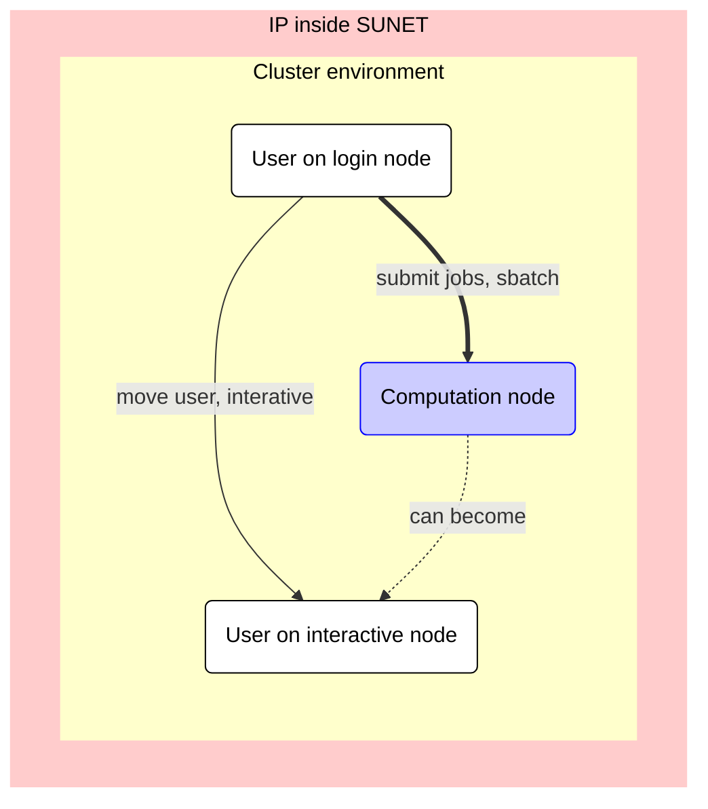

# Run on the calculation nodes (Slurm)

## Slurm Commands

The Slurm system is accessed using the following commands:

* `interactive` - Start an interactive session. This is described
  in-depth for [Bianca](start_interactive_node_on_bianca.md)
  and [Rackham](start_interactive_node_on_rackham.md)
* `sbatch` - Submit and run a batch job script
* `srun` - Typically used inside batch job scripts for running parallel jobs
  (See examples further down)
* `scancel` - Cancel one or more of your jobs.



> The different types of nodes an UPPMAX cluster has.
> White nodes: nodes a user can interact with.
> Blue nodes: nodes a user cannot interact with.
> The thick edge shows the topic of this page:
> how to submit jobs to a computation node.

### Specifying job parameters

Whether you use the UPPMAX clusters interactively or in batch mode, you always
have to specify a few things, like number of cores needed, running time etc.
These things can be specified in two ways:

Either as flags sent to the different Slurm commands (`sbatch`, `srun`, the
`interactive` command, etc.), like so:

``` bash
sbatch -A p2012999 -p core -n 1 -t 12:00:00 -J some_job_name my_job_script_file.sh
```

or, when using the `sbatch` command, it can be specified inside the job script
file itself, by using special `SBATCH` comments, for example:

``` bash title="job_script.sh"
#!/bin/bash -l
 
#SBATCH -A p2012999
#SBATCH -p core
#SBATCH -n 1
#SBATCH -t 12:00:00
#SBATCH -J some_job_name

```

If doing this, then one will only need to start the script like so, without any
flags:

``` bash
sbatch job_script.sh
```
