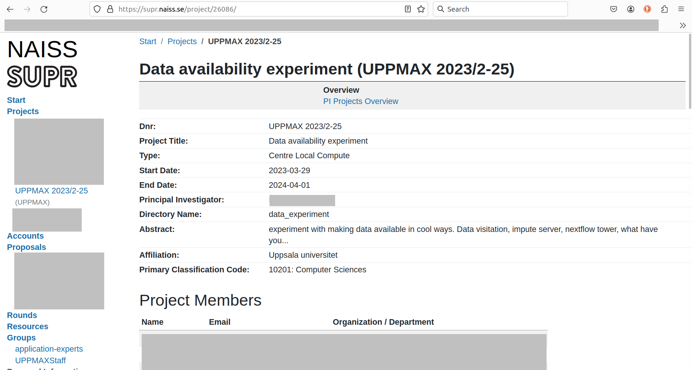

# Using Slurm on Pelle

This page describes how to use Slurm on Pelle.
For more general information on each, see pages
[Slurm](slurm.md)
and
[Pelle](pelle.md).

See [Slurm troubleshooting](slurm_troubleshooting.md)
for details on a couple of common Slurm errors.

!!! note "Newer Slurm"

    - Slurm on Pelle have been upgraded to version 25.05.
    - Several UPPMAX-specific Slurm changes from previous clusters have been removed, to make the config use more Slurm defaults. This makes the system easier to maintain and will behave more similar to clusters at other sites. Unfortunately this means that some extra changes to job scripts can be needed when moving from Rackham/Snowy.

??? note "Replacing &nbsp;`-n` , `--ntasks`&nbsp; with &nbsp;`-c` , `--cpus-per-task`&nbsp; when leaving Rackham"

    - We advise replacing the Slurm option `-n` (recommended in our documentation before) with `-c` for multi-threaded jobs. This is not Pelle-specific, it was circumstances on Rackham that made `-n` (almost) always work.
    - This prevents the allocation from being spread over multiple nodes.
    - `-n` , `--ntasks`&nbsp; is meant for processes that do not need direct access to the same memory, while `-c` , `--cpus-per-task`&nbsp; is meant for multi-threaded processes where the threads do need that. Read [Slurm Tasks on KU:s LUMI wiki](https://ku-it-datalab.pages.ku.dk/ku-it-lumi-wiki/job_submission/slurm_tasks/) for a more thorough explanation.
    - Thus, if you do have separate tasks, you should define the number of *tasks* with `-n` and the number of CPUs per task with `-c` (unless one). One case of this is when using MPI, where each rank is one task.

!!! warning "Time limits"

    - The max time limit for jobs is 10 days.
        - GPU jobs (on the GPU partition, the H100's and the L40s's) have a time limit of 2 days.

## Quick start

!!! info "Quick start for starting jobs on Pelle"

    ### Ways to start jobs

    - Interactive:
        - work interactively, starting programs and view data etcetera on a compute node
        - ``interactive -A uppmax202X-Y-ZZZ -t 3:0:0``
        - in addition to specifying account (project) this asks for 3&nbsp;hours (the default of 1&nbsp;min is rarely what you need)
        - [read more](slurm_on_pelle.md#sbatch-and-interactive-on-pelle)
        
    - Batch system:
        - Allocate much resources or long wall times and let job run by its own without interaction with you
        - ``sbatch <submit script>``
        - [read more](slurm_on_pelle.md#sbatch-and-interactive-on-pelle)

        ???- question "Demo/cheatsheet/template batch script"

            ``` sbatch
            #!/bin/bash
            #
            # A demo Slurm batch script showing the most important options and defaults on Pelle.
            #
            # Project id - change to your own! Mandatory, no default.
            #SBATCH -A uppmax2020-1-1
            #
            # Wall time. Default is 1 minute.
            # All of these are commented out, so this script gets the default.
            ##SBATCH -t 60        # 60 minutes
            ##SBATCH -t 1:5       # 1 minute and 5 seconds, will be rounded up to 2 minutes
            ##SBATCH -t 1:0:0     # 1 hour
            ##SBATCH -t 1-12      # 1 day and 12 hours
            #
            # Asking for 1 core on Pelle we'll get 2 (threads), ask for 3 and we'll get 4. Default is 2.
            #SBATCH -c 1   # the long name and more precise description is cpus-per-task
            #
            # Memory can be requested in three mutually exclusive ways. Default is 6000 per cpu.
            #SBATCH --mem=100           # 100 Mebibytes total, this script does not need much
            ##SBATCH --mem-per-cpu=10G  # 10 Gibibytes per cpu
            ##SBATCH --mem-per-gpu=20G  # 20 Gibibytes per gpu


            # We do not need any modules for this example

            # Printing some info that confirms what resources we got, can be useful for debugging
            echo "This job ran on: "
            /usr/bin/hostname
            uptime
            nproc
            free -h
            ulimit -a
            echo ""
            ```

    ### Wall times
    
    Specify the maximum time reserved before slurm breaks the job:

    - ``-t 10:0`` 10 minutes
    - ``-t 10:0:0`` 10 hours
    - ``-t 5-10`` 5 days and 10 hours
    
    ### Resources

    What amount of what kind of computer resources do you need?

    - Cores:
        - `-c <num>` , `--cpus-per-task=<number of cores>`
        - [read more](slurm_on_pelle.md#examples-with-core-jobs)
    - Tasks (MPI ranks or other parts that can run at separate nodes):
        - ``-n <number of tasks>``
    - Memory:
        - `--mem=<number of mebibytes>`
        - or `--mem-per-cpu`
    - Nodes:
        - ``-N <number of nodes>``
        - [read more](slurm_on_pelle.md#examples-with-node-jobs)
    - Large memory jobs:
        - ``-p fat``
        - [read more](slurm_on_pelle.md#the-fat-partition)
    - GPU (NVIDIA) jobs
        - T4 (36 nodes with 1 GPU each): ``interactive -A staff -t 1:0:0 -p haswell --gpus=t4``
        - Faster L40s (4 nodes with 10 GPUs each): ``interactive -A staff -t 1:0:0 -p gpu --gpus=l40s:1``
        - Superfast H100 (2 nodes with 2 GPUs each): ``interactive -A staff -t 1:0:0 -p gpu --gpus=h100:1``
        - [read more](slurm_on_pelle.md#the-gpu-partition)
    - Intel Haswell nodes (with 16 cores per node)
        - ``-p haswell ...``
        - [read more](slurm_on_pelle.md#the-haswell-partition)

    
## `sbatch` (and `interactive`) on Pelle

`sbatch` (and `interactive`) work the same as on the other clusters,
the only difference is that some flags/options may be different, like partition name, see below.

???- question "Want to start an interactive session?"

    See [how to start an interactive session on Pelle](start_interactive_session_on_pelle.md)

Here it is shown how to submit a job with:

- [Command-line Slurm parameters](#sbatch-a-script-with-command-line-slurm-parameters)
- [Slurm parameters in the script](#sbatch-a-script-with-slurm-parameters-in-script)

## Partitions on Pelle

Partition flag is either ``--partition`` or ``-p``

Partition name|Description
--------------|----------------------------------
`pelle`       | (Default) Use one or more CPU cores
`fat`         | Use a fat node with 2 or 3 TB memory, see below
`gpu`         | GPU nodes, 2 types see below
`haswell`     | Old Snowy/Irma nodes, half with GPUs (T4)

For the most detailed view of the Pelle Slurm config in this regard, the nerds among us can read the relevant part of the config file with `tail -n 20 /etc/slurm/slurm.conf`.

### The `pelle` partition

The `pelle` partition is default so you can omit specifying `-p` or `--partition`.

This is the ordinary CPU nodes of Pelle.

!!! warning

    - Time limit is 10 days on the CPU nodes.
    - You may, if really needed, ask for more through the support ``support@uppmax.uu.se``.

!!! info

    The compute node CPUs have Simultaneous multithreading (SMT) enabled. Each CPU core runs two Threads. In Slurm the Threads are
    referred to as CPUs. [Learn more here about SMT](slurm_on_pelle.md#smt)

No of nodes | CPUs                            | Cores<br/>Threads | Memory  | Scratch | GPUs
----------- | ------------------------------- | ----------------- | ------- | ------- | ----
80          | AMD EPYC 9454P (Zen4)  2.75 GHz | 48<br/>96         | 768 GiB | 1.7 TB  | N/A

!!! note "Much more cores per node compared to Rackham"

    - You can now have 96 parallel processes per node!
    - :warning: Even more important that you not by mistake allocate a full node when needing just a part of it.
    - A full node is 768 GB, compared to 128 GB on Rackham. That means less need for a "fat" partition allocation.

#### Examples with core jobs

Here is the minimal use for one core:

```bash
sbatch -A [project_code] [script_filename]
```

For example:

```bash
sbatch -A staff my_script.sh
```

To specify multiple cores, use `--cpu-per-tasks` (or `-c`) like this:

```bash
sbatch -A [project_code] -c [number_of_cores] [script_filename]
```

For example:

```bash
sbatch -A staff -c 2 my_script.sh
```

Here, two cores are used.

???- question "What is the relation between `ntasks` and number of cores?"

    Agreed, the flag `ntasks` only indicates the number of tasks.
    However, by default, the number of tasks per core is set to one.
    One can make this link explicit by using:

    ```bash
    sbatch -A [project_code] --partition --ntasks [number_of_cores] --ntasks-per-core 1 [script_filename]
    ```

This is especially important if you might adjust core usage
of the job to be something less than a full node.

- One task, using two threads: ``--ntasks=1 --cpus-per-task=2``
- Two tasks, using one thread each: ``--ntasks=2 --cpus-per-task=1``


#### Examples with node jobs

- On Rackham you have used ``-p node`` or ``-p core`` to specify node/core jobs.
- This is not used on Pelle. Instead Slurm's standard options is used to specify the job requirements.

- Example to request 2 full nodes: ``--nodes=2 --exclusive``

#### Job memory specification

- Currently you do not have to request additional CPUs to get additional memory.
- You can use all Slurm options
    - ``--mem``
    - ``--mem-per-cpu``

### The `fat` partition

With the ``fat`` partition you reach compute nodes with more memory.

!!! warning

    - Time limit is 10 days on the fat nodes.
    - You may, if really needed, ask for more through the support ``support@uppmax.uu.se``.

No of nodes | CPUs                            | Cores<br/>Threads | Memory | Scratch | GPUs
----------- | ------------------------------- | ----------------- | ------ | ------- | ----
1           | AMD EPYC 9454P (Zen4)  2.75 GHz | 48<br/>96         | 2 TiB  | 6.9 TB  | N/A
1           | AMD EPYC 9454P (Zen4)  2.75 GHz | 48<br/>96         | 3 TiB  | 6.9 TB  | N/A

!!! note

    Jobs on these nodes always allocate the entire node with all cores.

- To allocate 2 TB: ``-p fat -C 2TB``

    - Example: ``interactive -A staff -t 1:0:0 -p fat -C 2TB``

- To allocate 3 TB: ``-p fat -C 3TB``

    - Example: ``interactive -A staff -t 1:0:0 -p fat -C 3TB``

### The ``gpu`` partition

With the ``gpu`` partition you reach the nodes with GPUs.

!!! warning

    - Time limit is 2 days.
    - You may, if really needed, ask for more through the support ``support@uppmax.uu.se``.
    - The T4 GPUs in the Haswell partition can be booked for 10 days.

No of nodes | CPUs                           | Cores<br/>Threads | Memory  | Scratch | GPUs
----------- | ------------------------------ | ----------------- | ------- | ------- | ---------------
4           | 2x AMD EPYC 9124 (Zen4)  3 GHz | 2 x 16<br/>2 x 32 | 384 GiB | 6.9 TB  | 10x NVIDIA L40s
2           | 2x AMD EPYC 9124 (Zen4)  3 GHz | 2 x 16<br/>2 x 32 | 384 GiB | 6.9 TB  | 2x NVIDIA H100

To avoid long waiting times we primarily recommend to allocate the default ``L40s`` and just one of them.
Or, if you can use one of the older T4 GPUs, those are in greater supply.

<!--
- To allocate GPUs without specifying which type (will default to L40s in the future): ``-p gpu --gpus=<number of GPUs>``
-->

- To allocate L40s: ``-p gpu --gpus=l40s:<number of GPUs>``

    - Example with 1 GPU: ``interactive -A staff -t 1:0:0 -p gpu --gpus=l40s:1``
    - Example with the maximum 10 GPUs: ``interactive -A staff -t 1:0:0 -p gpu --gpus=l40s:10``

- To allocate H100: ``-p gpu --gpus=h100:<number of GPUs>``

    - Example with 1 GPU: ``interactive -A staff -t 1:0:0 -p gpu --gpus=h100:1``
    - Example with both GPUs: ``interactive -A staff -t 1:0:0 -p gpu --gpus=h100:2``
    - There are just 2 nodes with 2 each of these, so queues may become long if
      demand is high.

- Currently you do not have to request additional CPUs to get additional memory.
- You can use all Slurm options
    - ``--mem``
    - ``--mem-per-cpu``
    - ``--mem-per-gpu`` to specify memory requirements.

### The `haswell` partition

This partition holds older hardware that may be in less demand.

No of nodes | CPUs                                 | Cores = Threads | Memory  | Scratch | GPUs
----------- | ------------------------------------ | --------------- | ------- | ------- | ---------
36          | 2x Xeon E5-2630 v3 2.4 GHz (Haswell) | 2 x 16          | 256 GiB | 1.8 TB  | N/A
34          | 2x Xeon E5-2630 v3 2.4 GHz (Haswell) | 2 x 16          | 256 GiB | 1.8 TB  | NVIDIA T4

<!-- Two of the GPU nodes in this partition, p2021 and p2022, have dual 10-core CPUs instead.
But these are reserved for staff so we don't include them here. -->

- Example with 8 cores (1 socket): `interactive -A staff -t 1:0:0 -p haswell -c 8`
- Example with a T4 GPU: `interactive -A staff -t 1:0:0 -p haswell --gpus=t4`
    - If you ask for several T4 GPUs, you do get them, but they are spread
      across different nodes with just one GPU per node.

      ``` bash
      sbatch -A staff -t 1:0:0 -p haswell --gpus=t4:16
      ```

## `sbatch` a script with command-line Slurm parameters

The minimal command to use `sbatch` with command-line Slurm parameters is:

``` bash
sbatch -A [project_code] [script_filename]
```

where `[project_code]` is the project code, and `[script_filename]`
the name of a bash script, for example:

``` bash
sbatch -A uppmax2023-2-25 my_script.sh
```

???- question "Forgot your Rackham project?"

    One can go to the SUPR NAISS pages to see one's projects,

    

    > Example of the Rackham project called 'UPPMAX 2023/2-25'

    On the SUPR NAISS pages, projects are called 'UPPMAX [year]/[month]-[day]',
    for example, 'UPPMAX 2023/2-25'.
    The UPPMAX project name, as to be used on Rackham,
    has a slightly different name:
    the account name to use on Rackham is `uppmax[year]-[month]-[day]`,
    for example, `uppmax2023-2-25`

???- question "What is in the script file?"

    The script file `my_script.sh` is a minimal example script.
    Such a minimal example script could be:

    ```bash
    #!/bin/bash
    echo "Hello"
    ```

Again, what is shown here is a minimal use of [`sbatch`](../software/sbatch.md).

## `sbatch` a script with Slurm parameters in script

The minimal command to use `sbatch` with Slurm parameters in the script:

``` bash
sbatch [script_filename]
```

where `[script_filename]` the name of a bash script, for example:

```bash
sbatch my_script.sh
```

The script must contain at least the following lines:

```text
#SBATCH -A [project_code]
```

where `[project_code]` is the project code, for example:

```bash
#SBATCH -A uppmax2023-2-25
```

???- question "Forgot your Pelle project?"

    One can go to the SUPR NAISS pages to see one's projects,

    

    > Example of the Rackham project called 'UPPMAX 2023/2-25'

    On the SUPR NAISS pages, projects are called 'UPPMAX [year]/[month]-[day]',
    for example, 'UPPMAX 2023/2-25'.
    The UPPMAX project name, as to be used on Rackham,
    has a slightly different name:
    the account name to use on Rackham is `uppmax[year]-[month]-[day]`,
    for example, `uppmax2023-2-25`

A full example script would be:

```bash
#!/bin/bash
#SBATCH -A uppmax2023-2-25
echo "Hello"
```

## SMT

The compute node CPUs have Simultaneous multithreading (SMT)
enabled. Each CPU core runs two Threads. In Slurm the Threads are
referred to as CPUs.

Different jobs are never allocated to the same CPU core. The smallest
possible job always gets one Core with two Threads (CPUs).

Jobs requesting multiple tasks or cpus gets threads by default.

Some examples:

- `--ntasks=2` - one core, two threads
- `--ntasks=1 --cpus-per-task=4` - two cores, four threads
- `--ntasks=2 --cpus-per-task=3` - three cores, six threads.

### One thread per core to avoid SMT

If you suspect SMT degrades the performance of your jobs, you can you
can specify `--threads-per-core=1` in your job.

Same examples as before but with `--threads-per-core=1`:

- `--ntasks=2 --threads-per-core=1` - two cores, (4 threads, 2 used)
- `--ntasks=1 --cpus-per-task=4 --threads-per-core=1` - 4 cores (8 threads, 4 unused)
- `--ntasks=2 --cpus-per-task=3 --threads-per-core=1` - 6 cores (12 threads, 6 unused)

When doing this you should launch your tasks using `srun` to ensure
your processes gets pinned to the correct CPUs (threads), one per
core.

Again, what is shown here is a minimal use of [`sbatch`](../software/sbatch.md).

## Per-job scratch directories

Each job get job-specific private temporary directories on the compute
nodes. This means that directories like `/tmp`, `/scratch`, `/dev/shm`
start empty for each job. This is implemented using Slurm's
`job_container/tmpfs` plugin.

To get the path for node local scratch in job scripts you should still
use the variable `$TMPDIR` or the equivalent `$SNIC_PATH`.

## More allocated memory can be used (/dev/shm size)

The size of /dev/shm have been increased so all allocated memory can
be used, up to max 99% of a compute nodes total memory. On previous
clusters the limit was 50% of total memory.

## Billing Weights

Based on the type of resource (CPU, fat node, GPU), Slurm multiplies the requested allocation with its associated billing weight.
These billing weights are based on the [price associated](https://www.uu.se/en/centre/uppmax/get-started/terms-and-fees#h-Pricelist) with these resources.
For the most detailed view of the Pelle Slurm config, one can read the relevant part of the config file with `tail -n 20 /etc/slurm/slurm.conf`
