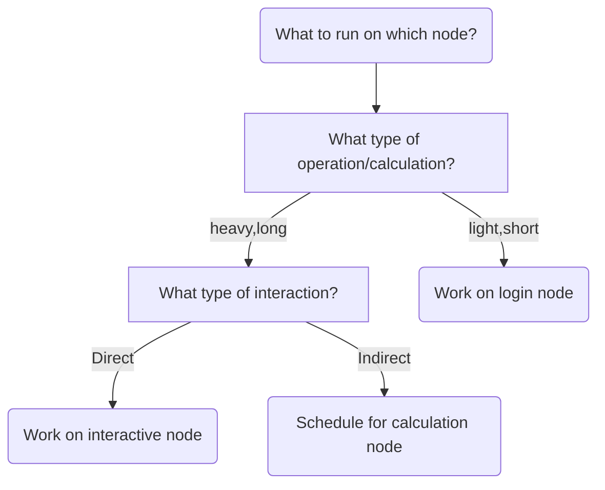

# Starting an interactive node

Below we describe the general ideas of using an interactive node:

- [the types of nodes](#types-of-nodes)
- [When to use an interactive node](#when-to-use-an-interactive node)

To start an interactive node on specific cluster:

- [Start an interactive node on Bianca](start_interactive_node_on_bianca.md)
- [Start an interactive node on Rackham](start_interactive_node_on_rackham.md)
- [Start an interactive node on Snowy](start_interactive_node_on_snowy.md)

## Types of nodes

The UPPMAX HPC clusters have three types of nodes:

???- tip "What are nodes?"

    What nodes are, is described in general terms [here](uppmax_cluster.md).

- **[login nodes](../cluster_guides/login_node.md)**: nodes where a user enters and interacts with the system
- **calculation nodes**: nodes that do the calculations

???- tip "Requesting a calculation to run"

    Requesting a calculation is described [here](slurm.md).
    This is done by using the Slurm scheduler.

- **interactive nodes**: a type of calculation node,
  where a user can do calculations directly

???- tip "How can I find out on which node I am?"

    In a [terminal](../software/terminal.md), type `hostname`:

    - the [login node](../cluster_guides/login_node.md) has name `rackham[number]`, where `[number]` is the number of the login node
    - an interactive node has name `r[number]`, where `[number]` is the compute node number

As a login is shared with all users,
there is a simple rule to use it fairly:

> Only do short and light things on the login node

Examples of short and light things are:

- Editing files
- Copying, deleting, moving files
- Scheduling jobs
- Starting an interactive session

Examples of heavy things are:

- Running code with big calculations
- Develop code with big calculations line-by-line

???- tip "Develop code with big calculations line-by-line "

    This usage is typically done an interactive node

### When to use an interactive node

Some users develop computer code on an HPC cluster
in a line-by-line fashion.
These users typically want to run a (calculation-heavy)
script frequently, to test
if the code works.

However, scheduling each new line is too slow, as it
can take minutes before the new code is run.
Instead, there is a way to directly work
with such code: use an interactive node.

An interactive node is a type of calculation node,
where one can run heavy calculations directly.

