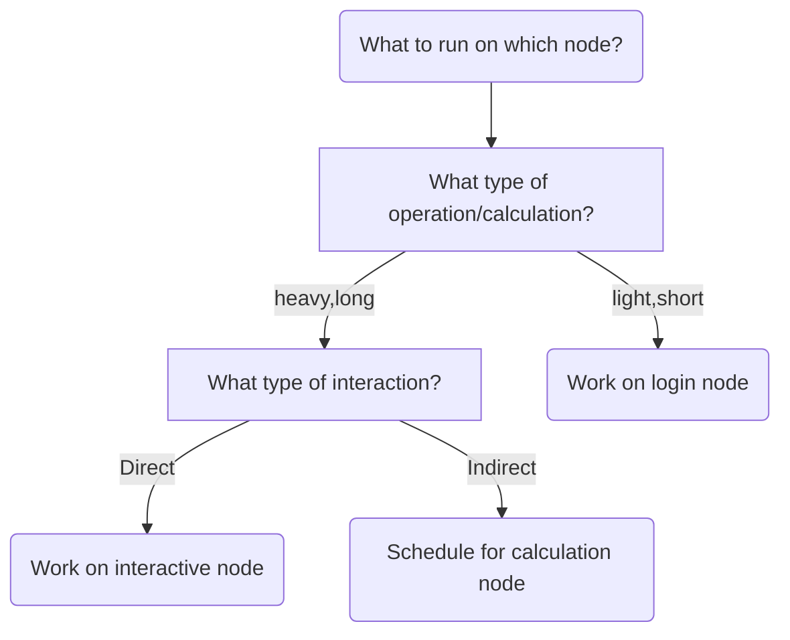

# Starting an interactive node


Bianca has three types of nodes:

???- tip "What are nodes?"

    What nodes are, is described in general terms [here](overview.md).

- **login nodes**: nodes where a user enters and interacts with the system
- **calculation nodes**: nodes that do the calculations

???- tip "Requesting a calculation to run"

    Requesting a calculation to run is part of this course 
    and is described [here](slurm_intro.md).
    This is done by using the SLURM scheduler.

- **interactive nodes**: a type of calculation node, 
  where a user can do calculations directly

???- tip "How can I find out on which node I am?"

    In a terminal, type `hostname`:

    - the login node has `[project]-bianca`, where `[project]` is the name of the project, e.g. `sens2023598`
    - the interactive node has `b[number]` in it, where `[number]` is the compute node number

As a Bianca login is shared with all users, 
there is a simple rule to use it fairly:

> Only do short and light things on the login node

Examples of short and light things are:

- Editing files
- Copying, deleting, moving files
- Scheduling jobs
- Starting an interactive session

Examples of heavy things are:

- Running code with big calculations
- Develop code with big calculations line-by-line 

???- tip "Develop code with big calculations line-by-line "

    This usage is typically done an interactive node

### Use-case for using an interactive node

Some users develop computer code on Bianca
in a line-by-line fashion. 
These users typically want to run a (calculation-heavy) 
script frequently, to test
if the code works.

However, scheduling each new line is too slow, as it
can take minutes before the new code is run.
Instead, there is a way to directly work 
with such code: use an interactive node.

An interactive node is a type of calculation node,
where one can run heavy calculations directly.




To use an interactive node, in a terminal, type:

```bash
interactive -A [project name] -n [number_of_cores] -t [session_duration]
```

For example:

```bash
interactive -A sens2023598 -n 2 -t 8:00:00
```

This starts an interactive session using project `sens2023598`
that uses 2 cores and has a maximum duration of 8 hours.

!!! note "Has Bianca frozen?"

    It can take tens of minutes before an interactive node is allocated.

    Bianca has not frozen, go ahead and have a coffee break :-)

