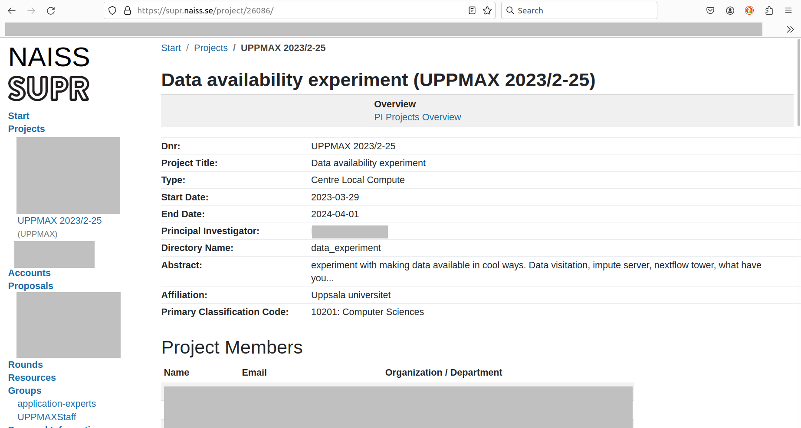

---
tags:
  - start
  - interactive
  - session
  - Pelle
---

# Starting an interactive session on Pelle

This page describes how to start an interactive session on [Pelle](pelle.md),
unlike the [general information on starting an interactive session](start_interactive_session.md).

To use an interactive session, in a [terminal](../software/terminal.md), type:

```bash
interactive -A [project name]
```

For example:

```bash
interactive -A uppmax2023-2-25
```

This starts an interactive session using project `uppmax2023-2-25`
that has a default duration of 1 hour.

???- tip "Forgot your Pelle project?"

    One can go to the SUPR NAISS pages to see one's projects,

    

    > An example of the Pelle project called 'UPPMAX 2023/2-25'

    On the SUPR NAISS pages, projects are called 'UPPMAX [year]/[month]-[day]',
    for example, 'UPPMAX 2023/2-25'.
    The UPPMAX project name, as to be used on Pelle,
    has a slightly different name:
    the account name to use on Pelle is `uppmax[year]-[month]-[day]`,
    for example, `uppmax2023-2-25`

To increase the duration of the interactive session,
add the use of `-t`:

```bash
interactive -A [project name] -t [session_duration]
```

For example:

```bash
interactive -A uppmax2023-2-25 -t 8:00:00
```

This starts an interactive session using project `uppmax2023-2-25`
that has a maximum duration of 8 hours.

!!! tip "To reach high-memory or GPU nodes"

    See [Partitions on Pelle](slurm_on_pelle.md#partitions-on-pelle)

???- note "Has Pelle frozen?"

    It can take tens of seconds before an interactive session is allocated.

    Pelle has not frozen, just be a bit more patient.


To stop the session, do:

```bash
exit
```

This will take you back to the login node.
