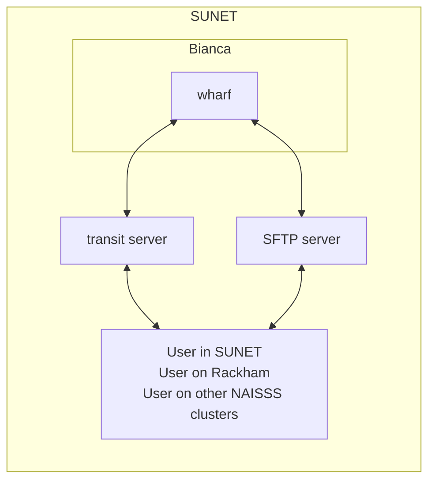

# File transfer to/from Bianca



[File transfer](file_transfer.md) is the process of getting files
from one place to the other. This page shows how to do [file transfer](file_transfer.md) to/from
the [Bianca](bianca.md) UPPMAX cluster.

For all file transfer on Bianca:

* [The user needs to be inside of SUNET](../getting_started/get_inside_sunet.md)
* The files are moved from/to [the `wharf` folder](wharf.md)

## File transfer methods

There are multiple ways to transfer files to/from Bianca:

Method                                                        |Features
--------------------------------------------------------------|---------------------------------------------
[Using a graphical program](#using-a-graphical-program)       |Graphical interface, intuitive, for small amounts of data only
[Using `sftp`](#using-sftp)                                   |Terminal, easy to learn, terminal-based, can use terminal commands to select files
[Using `lftp`](#using-lftp)                                   |Terminal
Transit server from/to Rackham, see below                     |Terminal, can be used to transfer data between clusters in general
[Mounting `wharf` on your local computer](#mounting-wharf)    |Both graphical and terminal, need a computer with `sshfs` installed

## Using a graphical program


> FileZilla connected to Bianca

To transfer files to/from [Bianca](bianca.md)
one can use a graphical tool, such as FileZilla and WinSCP.
See [File transfer using a graphical program](bianca_file_transfer_using_gui.md)
for details.

## Using `sftp`

`sftp` is a terminal SFTP client to transfer files to/from Bianca.
See [using `sftp` with Bianca](sftp_with_bianca.md).

## Using `lftp`

`sftp` is a terminal SFTP client to transfer files to/from Bianca.
See [using `lftp` with Bianca](lftp_with_bianca.md).

## Transit server

To facilitate secure data transfers to, from,
and within the system for computing on sensitive data a special service is available
via SSH at `transit.uppmax.uu.se`.


See [the UPPMAX documentation on the Transit server](transit.md).

* Note that your home directory is mounted _read-only_, any changes you do to your "local" home directory (on transit) will be lost upon logging out.

* You can use commands like ``rsync``, ``scp`` to fetch data and transfer it to your bianca wharf.
  * You can use cp to copy from Rackham to the wharf
* Remember that you cannot make lasting changes to anything except for mounted wharf directories. Therefore you have to use rsync and scp to transfer from the ``wharf`` to Rackham.
* The mounted directory will be kept for later sessions.

### Moving data from transit to Rackham

* **On Rackham:** (_or other computer_) copy files to Bianca via transit:

```bash
# scp
scp path/my_files my_user@transit.uppmax.uu.se:sens2023531/

# rsync
rsync -avh path/my_files my_user@transit.uppmax.uu.se:sens2023531/
```

* **On transit:** copy files to Bianca from Rackham (_or other computer_)

```bash
# scp
scp my_user@rackham.uppmax.uu.se:path/my_files ~/sens2023531/

# rsync
rsync -avh my_user@rackham.uppmax.uu.se:path/my_files ~/sens2023531/
```

    :book:  `rsync` [tutorial](https://www.digitalocean.com/community/tutorials/how-to-use-rsync-to-sync-local-and-remote-directories) for beginners.

:warning: Keep in mind that project folders on Rackham are not available on transit.

### Moving data between projects

* You can use transit to transfer data between projects
  by mounting the wharfs for the different projects
  and transferring data with `rsync`.
* Note that you may of course only do this if this is allowed
  (agreements, permissions, etc.)

## Mounting `wharf` on your local computer

Mounting `wharf` means that a `wharf` folder is added to the
filesystem of your local computer, after which you can use
it like any other folder.

See [the UPPMAX documentation of `wharf`](wharf.md) on how to do so.

---

!!! info "Summary"

    - For simple transfers use SFTP to connect to `bianca-sftp.uppmax.uu.se` - use command line `sftp` or tools that support SFTP protocol.
    - For `rsync` - sync files to pre-mounted wharf folder from Rackham or secure local computer.
    - Keep in mind that project folders on Rackham are not available on transit.

## Bianca file transfer as image


