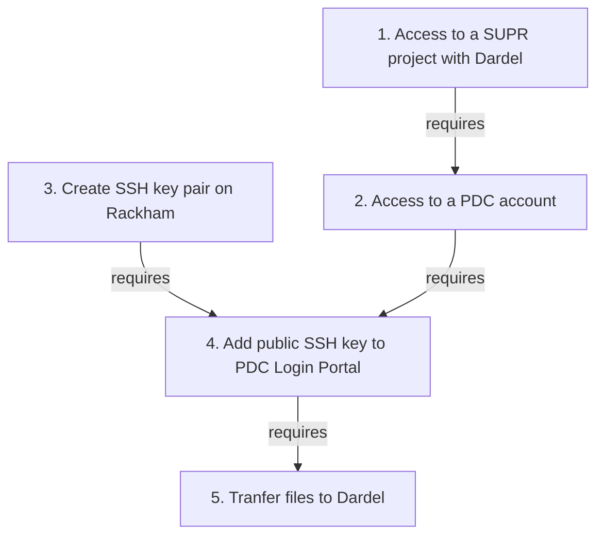

# File transfer to/from Dardel


This page describes how to transfer files to Dardel,
the HPC cluster at PDC in Stockholm.

## Why do I need this?

The Rackham cluster will be decommissioned at the end of 2024 
so all projects have to migrate their data and calculations to other resources. 
The plan from NAISS is that all Rackham users will move to 
the Dardel cluster at PDC.

## How do I do this?

First, we are here to help.
Please [contact support](../support.md) if you run into problems
when trying the guide below.

To transfer your files to Dardel, follow the steps below.



### 3. Create an SSH key pair

How to create an SSH key pair is described in detail at [the PDC page on how to create an SSH key pair](https://www.pdc.kth.se/support/documents/login/ssh_login.html#how-to-create-ssh-key-pairs).

On Rackham, do:

```
# generate the key
ssh-keygen -t ed25519 -N "" -f ~/.ssh/id_ed25519-pdc
```

and you have created a SSH key pair.

???- question "How do I know this worked?"

    On Rackham, in a terminal, type:

    ```
    $ cat ~/.ssh/id_ed25519-pdc.pub
    ```

    This will show a text similar to:

    ```
    ssh-ed25519 AAAA63Nz1C1lZkI1NdE5ABAAIA7RHe4jVBRTEvHVbEYxV8lnOQl22N+4QcUK+rDv1gPS user@rackham2.uppmax.uu.se
    ```


### 5. Add the public SSH key to PDC:s Login Portal

How to add the SSH public key is described
in detail in [the PDC documentation on how to log in with SSH keys](https://www.pdc.kth.se/support/documents/login/ssh_login.html).

???- question "How does the upload look like?"

    

    > Click on 'Prove Indentity'

    

    > PDC key managements before any keys are added.

After having uploaded your public SSH key, you will be able to see your registered keys.

???- question "How does that look like?"

    

    > Here we see that there is an SSH key uploaded.

### 6. Transfer files

To facilitate this move we have created Darsync, 
a tool that can inspect your files and make suggestions 
to make the transfer easier, 
as well as generating a script file you can submit to [SLURM](slurm.md) 
to perform the actual file transfer. 
[Read more about how to use Darsync here](../cluster_guides/darsync.md).

```
$ export PATH=$PATH:/proj/staff/dahlo/testarea/darsync
$ darsync gen
```

### 6. Delete the SSH key pair


## Link

 * [PDC's page on getting access to Dardel](https://www.pdc.kth.se/support/documents/getting_access/get_access.html)

 * [PDC's page on login to Dardel](https://www.pdc.kth.se/support/documents/login/dardel.html)


