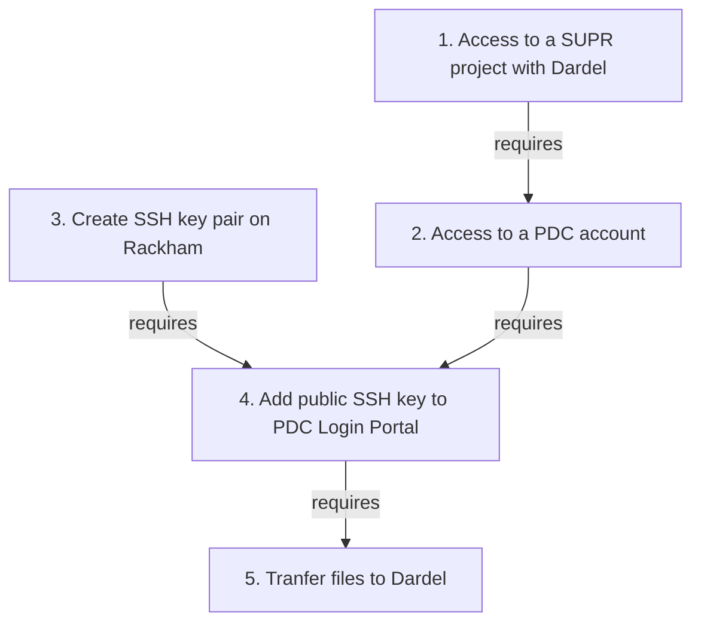
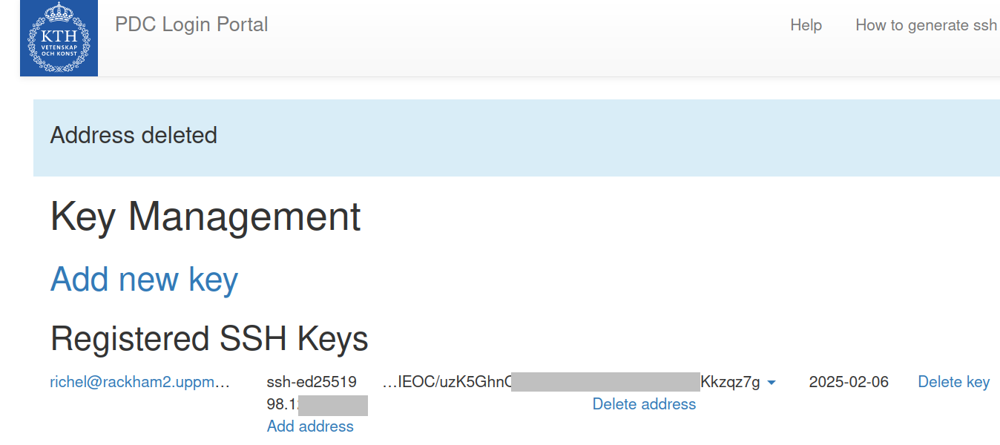

# File transfer to/from Dardel


This page describes how to transfer files to Dardel,
the HPC cluster at PDC in Stockholm.

## Why do I need this?

The Rackham cluster will be decommissioned at the end of 2024
so all projects have to migrate their data and calculations to other resources.
The plan from NAISS is that all Rackham users will move to
the Dardel cluster at PDC.

## How do I do this?

First, we are here to help.
Please [contact support](../support.md) if you run into problems
when trying the guide below.

To transfer your files to Dardel, follow the steps below.



### 3. Create an SSH key pair

How to create an SSH key pair is described in detail at [the PDC page on how to create an SSH key pair](https://www.pdc.kth.se/support/documents/login/ssh_login.html#how-to-create-ssh-key-pairs).

On Rackham, do:

```bash
# generate the key
ssh-keygen -t ed25519 -N "" -f ~/.ssh/id_ed25519_pdc
```

and you have created a SSH key pair.

???- question "How do I know this worked?"

    On Rackham, in a terminal, type:

    ```
    $ cat ~/.ssh/id_ed25519_pdc.pub
    ```

    This will show a text similar to:

    ```
    ssh-ed25519 AAAA63Nz1C1lZkI1NdE5ABAAIA7RHe4jVBRTEvHVbEYxV8lnOQl22N+4QcUK+rDv1gPS user@rackham2.uppmax.uu.se
    ```


### 5. Add the public SSH key to PDC:s Login Portal

How to add the SSH public key is described
in detail in [the PDC documentation on how to add SSH keys](https://www.pdc.kth.se/support/documents/login/ssh_login.html#in-the-login-portal).

You will need to get the public part of the key in order to complete this step.i On Rackham, in a terminal, type:

```bash
cat ~/.ssh/id_ed25519_pdc.pub
```

This will show a text similar to:

```text
ssh-ed25519 AAAA63Nz1C1lZkI1NdE5ABAAIA7RHe4jVBRTEvHVbEYxV8lnOQl22N+4QcUK+rDv1gPS user@rackham2.uppmax.uu.se
```

Select and copy that text, it is the public key you will add.

In short,

1. Open the [PDC Login Portal](https://loginportal.pdc.kth.se/)
1. Follow the instructions there to login.
1. Click on the `Add new key` link.
1. Paste the public key you copied after running the `cat` command above.
1. Make up a name for the key so you know which computer it resides on. E.g. `rackham-darsync`
1. Press the `Save` button.

???- question "How does the adding the key look like?"

    

    > Click on 'Prove Indentity'

    

    > PDC key managements before any keys are added.

    

    > How it looks when adding a new key.

After having added your public SSH key, you will be able to see your registered keys.

???- question "How does that look like?"

    

    > Here we see that there is an SSH key added.

The next thing you have to do is to add UPPMAX as a placer permitted to use your newly added key. Do that by pressing the `Add address` link for the key you just added. At the bottom of the form you have a section called `Custom domain`. Add `*.uppmax.uu.se` in that field and press `Save`.

???- question "How does that look like?"

    

    > This is where you enter UPPMAX as allowed to use this key.

???- question "For staff only"

    @Richel, need a screenshot of adding custom domain.

To validate that it work you can connect to Dardel via SSH:

```bash
# replace your_dardel_username with your actual Dardel username
ssh -i ~/.ssh/id_ed25519_pdc your_dardel_username@dardel.pdc.kth.se
```

???- question "For staff only"

    @Richel, need a screenshot of ssh working

### 6. Transfer files

To facilitate this move we have created Darsync,
a tool that can inspect your files and make suggestions
to make the transfer easier,
as well as generating a script file you can submit to [Slurm](slurm.md)
to perform the actual file transfer.
[Read more about how to use Darsync here](../cluster_guides/darsync.md).

Here is a summary of how to run it, using `/path/to/dir` as a placeholder for the actual path to the directory you want to copy to Dardel:

```bash
module load darsync

darsync check --local-dir /path/to/dir
# fix any errors the check step found
darsync gen --local-dir /path/to/dir --outfile ~/dardel_transfer_script.sh
```

### 6. Submit the script created by Darsync

Submit the transfer script created by Darsync to Slurm:

```bash
sbatch --output=~/dardel_transfer.out --error=~/dardel_transfer.err ~/dardel_transfer_script.sh
```

### 7. Check logs

Once the submitted job has finished, have a look at the log file produced by the job and make sure it did not end in a error message.

```bash
tail ~/dardel_transfer.out
tail ~/dardel_transfer.err
```

???- question "For staff only"

    @Richel, need a screenshot of successful rsync command, as well as a failed one?

If there are any errors you can either run `darsync gen` again and correct any mistakes you made and submit the new script file.

If you have updated your files at UPPMAX and want to sync over the changes, just submit the same script file again and it will only transfer over the modified files.

If your data transfer took too long and got killed by Slurm, or if it crashed for some other reason, just submit the same script again and it till pick up from where it left off.

### 8. Delete the SSH key pair

When you are done with transferring files you should delete your SSH keys you created in the previous steps in this guide. The SSH keys created where created without a password to protect them (required to run darsync as a unattended job), and it's best to delete them.

```bash
rm ~/.ssh/id_ed25519_pdc*
```

Create new ones if you still need to connect to Dardel from UPPMAX. To create new keys with password on them, simply run:

```bash
ssh-keygen -t ed25519
```

and add the new public key (`~/.ssh/id_ed25519.pub`) to the PDC Login Portal following the same steps as above.

Once you are sure your data has been transferred, we recommend that you switch over to only work on Dardel. If you keep working on both clusters you will easily forget which cluster has the most up-to-date version of the files.

## Link

- [PDC's page on getting access to Dardel](https://www.pdc.kth.se/support/documents/getting_access/get_access.html)
