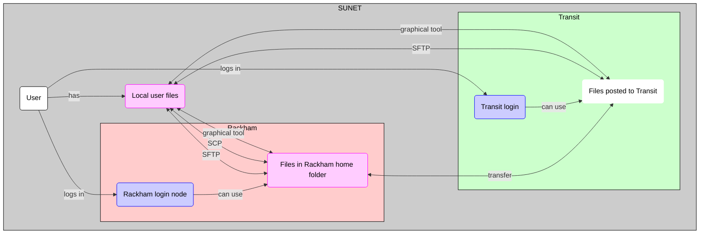

---
tags:
  - Rackham
  - file
  - transfer
  - data
---

# File transfer to/from Rackham

There are multiple ways to transfer files to/from Rackham:

Method                                                        |Features
--------------------------------------------------------------|---------------------------------------------
[Using a graphical program](#using-a-graphical-program)       |Graphical interface, intuitive, for small amounts of data only
[Using SCP](#using-scp)                                       |Terminal, easy to learn, can be used in scripts
[Using SFTP](#using-sftp)                                     |Terminal, easy to learn, secure
[Using transit](#using-transit)                               |Terminal, easy to learn, secure, can transfer between HPC clusters

Each of these methods is discussed below.

## Using a graphical program

One can transfer files to/from Rackham using a graphical program.
A graphical interface is intuitive to most users.
However, it can be used for small amounts of data only
and whatever you do cannot be automated.

See [Rackham file transfer using a graphical program](rackham_file_transfer_using_gui.md)
for a step-by-step guide how to transfer files using
a graphical tool.

## Using SCP

One can transfer files to/from Rackham
using SCP in a [terminal](../software/terminal.md).
This works similar to a regular copy of files,
except that a remote address needs to be specified.
The advantage of SCP is that is can be used in scripts.

See [Rackham file transfer using SCP](../software/rackham_file_transfer_using_scp.md)
for a step-by-step guide how to transfer files using SCP.

## Using SFTP

One can transfer files to/from Rackham using SFTP in a [terminal](../software/terminal.md).
One connects a local and a remote folder,
after which one can upload and download files.
SFTP is considered a secure file transfer protocol.

See [Rackham file transfer using SFTP](../software/rackham_file_transfer_using_sftp.md)
for a step-by-step guide how to transfer files using SFTP.

## Using `transit`

One can transfer files to/from Rackham using the UPPMAX `transit` server.
One connects a local folder and the `transit` server,
after which one can upload and download files.

See [Rackham file transfer using `transit`](rackham_file_transfer_using_transit.md)
for a step-by-step guide how to transfer files using the `transit` UPPMAX server.

### Overview

> Overview of file transfer on Rackham
> The purple nodes are about file transfer,
> the blue nodes are about 'doing other things'.
> The user can be either inside or outside SUNET.
