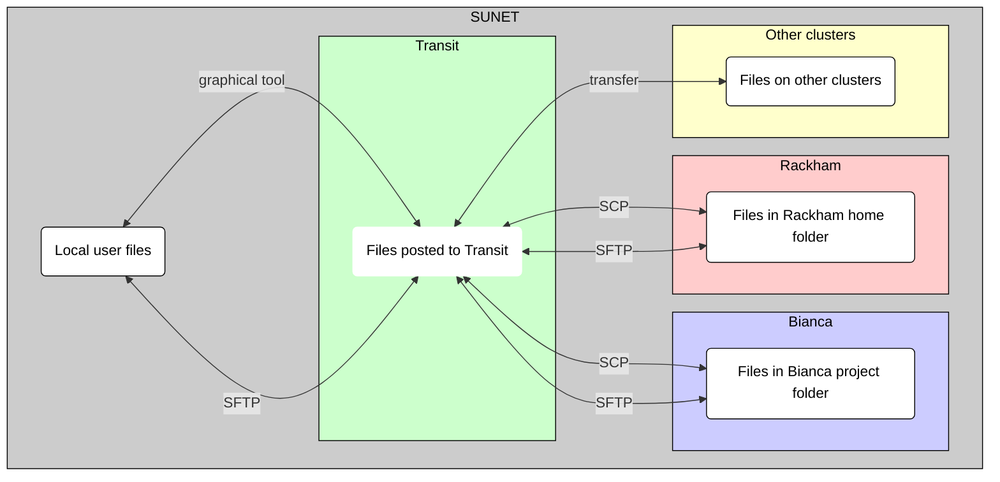

# File transfer to/from Transit

There are multiple ways to transfer files to/from Transit:

???- question "What is Transit?"

    Transit is an UPPMAX service to send files around.
    It is not a file server.

    See [the page about Transit](transit.md) for more detailed information.

Method                                                        |Features
--------------------------------------------------------------|---------------------------------------------
[Using a graphical program](#using-a-graphical-program)       |Graphical interface, intuitive, for small amounts of data only
[Using SFTP](#using-SFTP)                                     |Terminal, easy to learn, secure
[Using SCP](#using-SCP)                                       |:no_entry: only download, terminal, easy to learn, can be used in scripts

Each of these methods is discussed below.

## Using a graphical program

One can transfer files to/from Transit using a graphical program.
A graphical interface is intuitive to most users.
However, it can be used for small amounts of data only
and whatever you do cannot be automated.

See [Transit file transfer using a graphical program](transit_file_transfer_using_gui.md)
for a step-by-step guide how to transfer files using
a graphical tool.

## Using SCP

One **cannot upload** files to Transit using SCP in a terminal:
Transit only allows for sending files from A to B, not for storing them.

One **can download** the files on Transit.
However, Transit is not a file server.
Instead, the files that appear to be on Transit
are the files in your Rackham home folder. 
Due to this, it makes more sense to [use SCP to transfer files to/from Rackham](rackham_file_transfer_using_scp.md).

For completeness sake, see [Transit file transfer using SCP](transit_file_transfer_using_scp.md)
for a step-by-step guide how to transfer files using SCP. 
It show one cannot upload files to Transit.

## Using SFTP

One can transfer files to/from Transit using SFTP in a terminal.
One connects a local and a remote folder, 
after which one can upload and download files.
SFTP is considered a secure file transfer protocol.

See [Transit file transfer using SFTP](transit_file_transfer_using_sftp.md)
for a step-by-step guide how to transfer files using SFTP.

### Overview

> Overview of file transfer on Transit

