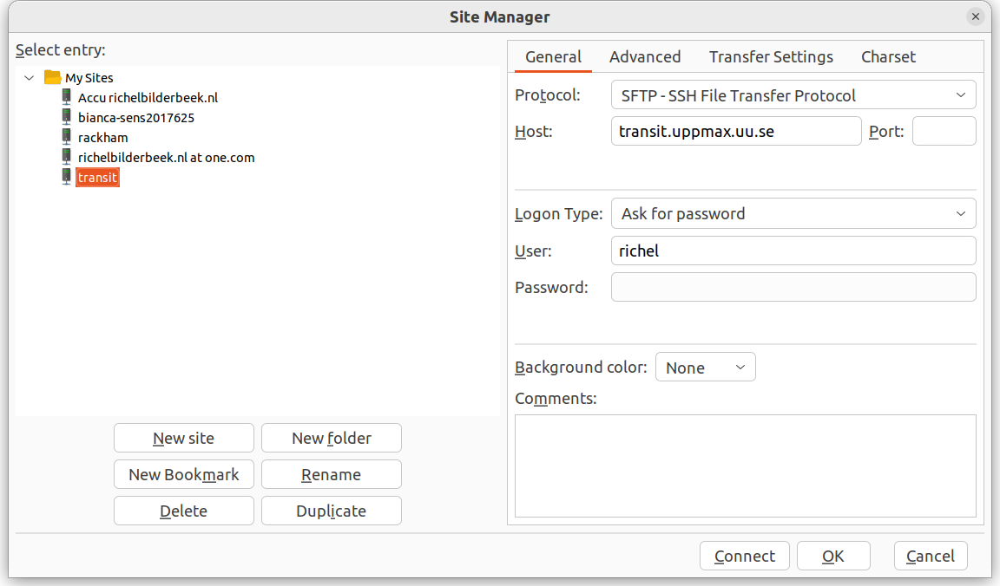
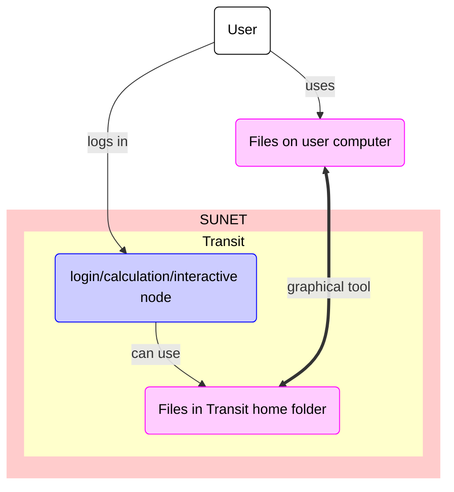

# File transfer to/from Transit using a graphical tool

Data transfer to/from Transit using a graphical tool
is one of the ways to transfer files to/from Transit

???- question "What are the other ways?"

    Other ways to transfer data to/from Transit are described [here](transfer_transit.md)

Here, we show how to transfer files using a graphical tool called FileZilla.

> FileZilla connected to Transit

## Using FileZilla

> The FileZilla logo

???- question "Would you like a video?"

    If you like to see how to do file tranfer from/to Transit
    using FileZilla, watch the video 
    [here](https://youtu.be/7wHRCMdnNZE)

FileZilla is a secure file transfer tool that works under Linux, Mac and Windows.

To transfer files to/from Transit using FileZilla, do:

- Get inside SUNET

???- question "Forgot how to get inside SUNET?"

    It is discussed [at the 'login to Bianca' page](login_bianca.md). 

???- question "How will this look like when I am outside SUNET?"

    When outside of SUNET, the connect will fail like this:

    

- Start FileZilla
- From the menu, select 'File | Site manager'

???- tip "Where is that?"

    It is here:

    
    
    > The FileZilla 'File' menu contains the item 'Site manager'

- Click 'New site'

???- tip "Where is that?"

    It is here:

    

- Create a name for the site, e.g. `transit`.
- For that site, use all standards, except:
    - Set protocol to 'SFTP - SSH File Transfer Protocol'
    - Set host to `transit.uppmax.uu.se`
    - Set user to `[username]`, e.g. `sven`

???- tip "How does that look like?"

    It looks similar to this:

    

- Click 'Connect'
- You will be asked for your password, hence
  type `[your password]`, e.g. `VerySecret`.
  You can save the password.

???- tip "How does that look like?"

    It looks similar to this:

    

Now you can transfer files between your local computer and Transit.

???- tip "How does that look like?"

    It looks like this:

    

## Where do my files end up?

They end up in your personal home folder.

Its location is at `/home/[user_name]`,
for example, at `/home/sven`.

???- tip "How does that look like?"

    It looks like this:

    

### File transfer overview

> Overview of file transfer on Transit
> The purple nodes are about file transfer,
> the blue nodes are about 'doing other things'.
> The user can be either inside or outside SUNET.
