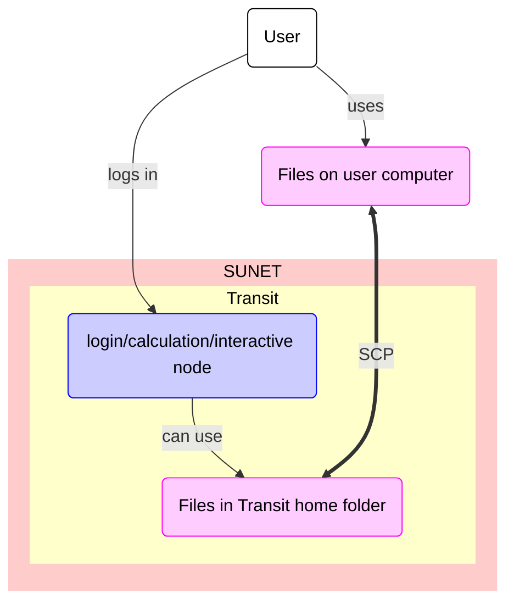

# Data transfer to/from Transit using SCP

Data transfer to/from [Transit](../cluster_guides/transit.md) using SCP
is one of the ways ways to [transfer files to/from Transit](../cluster_guides/transfer_transit.md).

???- question "What is Transit?"

    Transit is an UPPMAX service to send files around.
    It is not a file server.

    See [the page about Transit](transit.md) for more detailed information.

???- question "What are the other ways to transfer files from/to Transit?"

    Other ways to transfer data to/from Transit are described [here](transfer_transit.md)

One **cannot** transfer files to/from Transit using SCP.
SCP is an abbreviation of 'Secure copy protocol',
however, it is not considered 'secure' anymore:
instead it is considered an outdated protocol.
The program `scp` allows you to transfer files to/from Transit using SCP,
by coping them between your local computer and Transit.

## How to transfer files between a local computer and Transit

The process is:

### 1. Get inside SUNET

???- question "Forgot how to get within SUNET?"

    See the 'get inside the university networks' page [here](../getting_started/get_inside_sunet.md)

### 2. Start a terminal on your local computer

### 3a. Using `scp` to download from Transit

In the terminal, copy files using `scp` to download files from Transit:

```
scp [username]@transit.uppmax.uu.se:/home/[username]/[remote_filename] [local_folder]
```

where `[remote_filename]` is the path to a remote filename,
`[username]` is your UPPMAX username,
and `[local_folder]` is your local folder, for example:

```
scp sven@transit.uppmax.uu.se:/home/sven/my_remote_file.txt /home/sven
```

If asked, give your UPPMAX password.

You can get rid of this prompt if you have setup SSH keys

### :no_entry: 3b. Using `scp` to upload from Transit

This is how you **would** copy a file from your local computer to Transit:

```
scp [local_filename] [username]@transit.uppmax.uu.se:/home/[username]
```

where `[local_filename]` is the path to a local filename,
and `[username]` is your UPPMAX username, for example:

```
scp my_file.txt sven@transit.uppmax.uu.se:/home/sven
```

However, Transit is not a file server.
The `scp` command will complete successfully,
yet the file will not be found on Transit.

If asked, give your UPPMAX password.
You can get rid of this prompt if you have setup SSH keys

## Overview



> Overview of file transfer on Transit
> The purple nodes are about file transfer,
> the blue nodes are about 'doing other things'.
> The user can be either inside or outside SUNET.
