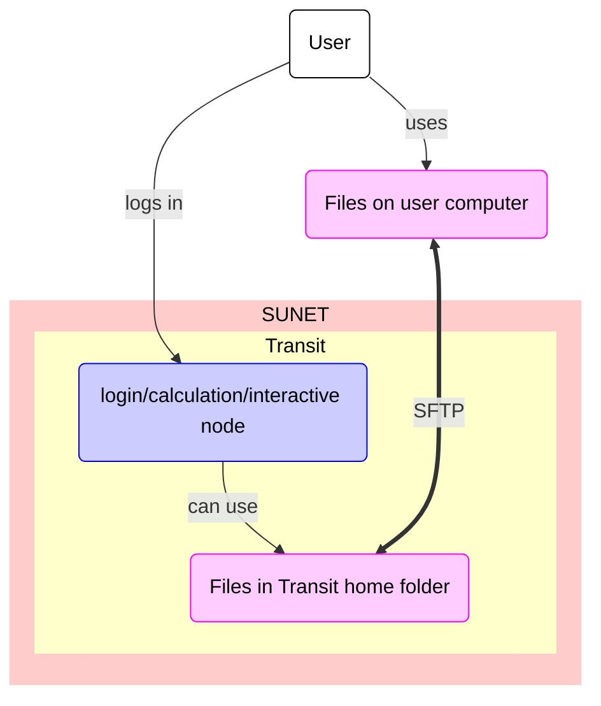

# Data transfer to/from Transit using SFTP

Data transfer to/from Transit using SFTP
is one of the ways ways to transfer files to/from Transit

???- question "What are the other ways?"

    Other ways to transfer data to/from Transit are described [here](transfer_transit.md)

One can transfer files to/from Transit using SFTP.
SFTP is an abbreviation of 'SSH File Transfer Protocol',
where 'SSH' is an abbreviation of 'Secure Shell protocol'
The program `sftp` allows you to transfer files to/from Transit using SFTP.

The process is:

1. Start a terminal on your local computer
2. In the terminal, run `sftp` to connect to Transit by doing:

```
sftp [username]@transit.uppmax.uu.se 
```

where `[username]` is your UPPMAX username, for example:

```
sftp sven@transit.uppmax.uu.se 
```

3. If asked, give your UPPMAX password. 
   You can get rid of this prompt if you have setup SSH keys

4. In `sftp`, upload/download files to/from Transit

Basic `sftp` command can be found [here](https://www.uppmax.uu.se/support/user-guides/basic-sftp-commands/).



> Overview of file transfer on Transit
> The purple nodes are about file transfer,
> the blue nodes are about 'doing other things'.
> The user can be either inside or outside SUNET.

## Fail log

```
richel@richel-N141CU:~$ ls
Arduino   Documents  GitHubs     Music     rosegarden  Templates
Codeberg  Downloads  GitLabs     Pictures  sketchbook  Terraria
demo.txt  Emulation  go          Public    snap        Videos
Desktop   games      miniconda3  R         stash       work
richel@richel-N141CU:~$ sftp richel@transit.uppmax.uu.se
Connected to transit.uppmax.uu.se.
sftp> put demo.txt 
Uploading demo.txt to /domus/h1/richel/demo.txt
demo.txt                                  100%   53     8.6KB/s   00:00    
sftp> exit
richel@richel-N141CU:~$ ssh richel@transit.uppmax.uu.se
Last login: Wed Jan  3 12:42:19 2024 from vpnpool188-187.anst.uu.se

Transit server

You can mount bianca wharf with the command

mount_wharf PROJECT [path]

If you do not give a path the mount will show up as PROJECT in your home
directory.

Note; any chagnes you do to your normal home directory will not persist.


[richel@transit ~]$ ls
Documents                    project_number.txt
environment.yml              q.sh
fake.csv                     qsp.sh
genpipes                     qs.sh
GitHubs                      R
glob                         requirements.txt
iamonrackham                 send_to_bianca_sens2021565.sh
login_bianca_sens2017625.sh  staff
mapAD                        start_interactive.sh
mi.license                   to_bianca.sh
private                      uppmax2023-2-25
[richel@transit ~]$ 
```
