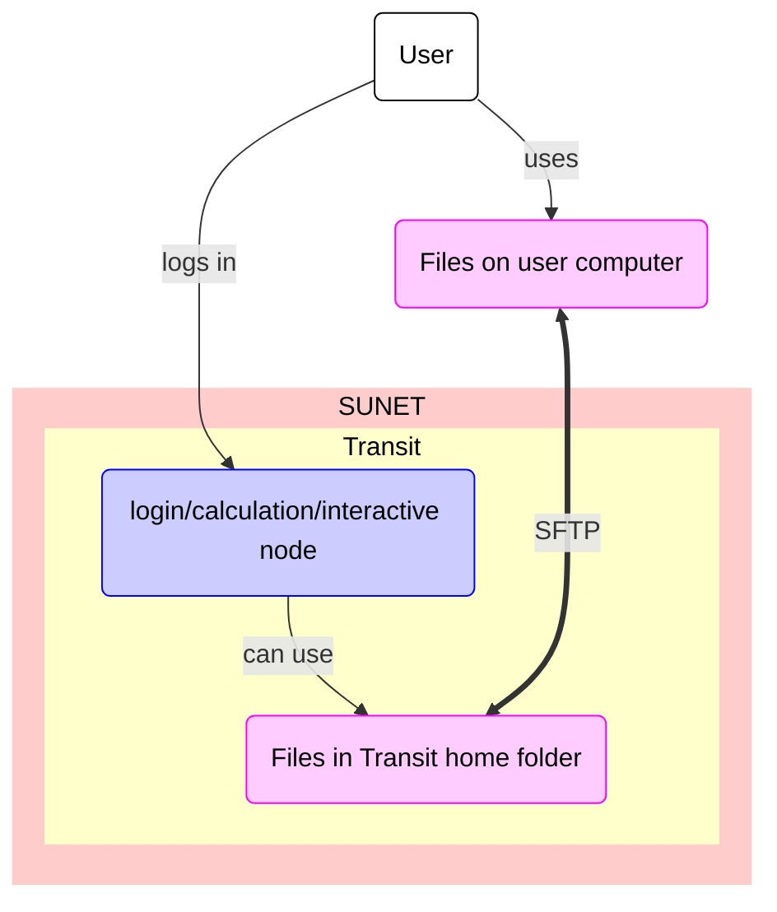

# Data transfer to/from Transit using SFTP

Data transfer to/from Transit using SFTP
is one of the ways ways to transfer files to/from Transit

???- question "What are the other ways?"

    Other ways to transfer data to/from Transit are described [here](transfer_transit.md)

One can transfer files to/from Transit using SFTP.
SFTP is an abbreviation of 'SSH File Transfer Protocol',
where 'SSH' is an abbreviation of 'Secure Shell protocol'
The program `sftp` allows you to transfer files to/from Transit using SFTP.

The process is:

1. Get inside SUNET

???- question "Forgot how to get inside SUNET?"

    It is discussed [at the 'login to Bianca' page](login_bianca.md). 

2. Start a terminal on your local computer
3. In the terminal, run `sftp` to connect to Transit by doing:

```
sftp [username]@transit.uppmax.uu.se 
```

where `[username]` is your UPPMAX username, for example:

```
sftp sven@transit.uppmax.uu.se 
```

4. If asked, give your UPPMAX password. 
   You can get rid of this prompt if you have setup SSH keys

5. In `sftp`, upload/download files to/from Transit

Basic `sftp` command can be found [here](https://www.uppmax.uu.se/support/user-guides/basic-sftp-commands/).



> Overview of file transfer on Transit
> The purple nodes are about file transfer,
> the blue nodes are about 'doing other things'.
> The user can be either inside or outside SUNET.
