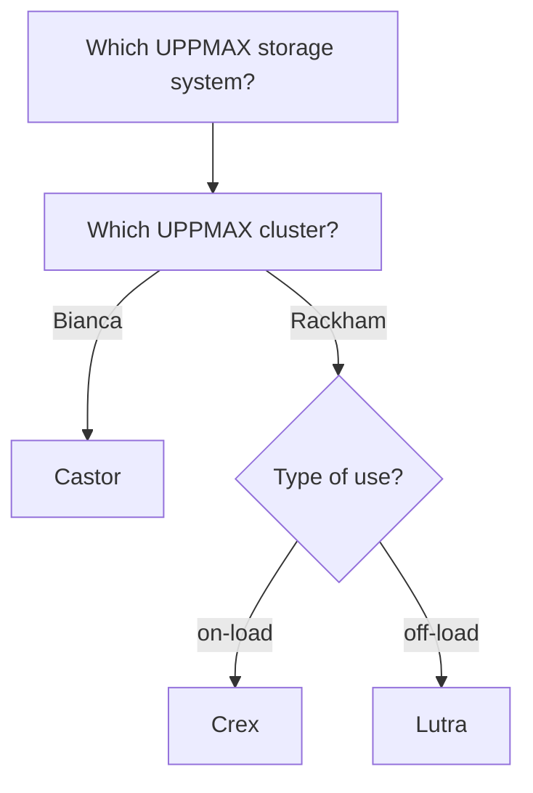

# UPPMAX

UPPMAX is an organization that provides 
HPC infrastructure that is physically located in Uppsala. 

- [UPPMAX as an organization](uppmax_as_an_organization.md)

To do so, UPPMAX has multiple systems

- [UPPMAX systems](uppmax_systems.md)

## UPPMAX systems

Here we place Bianca between the other UPPMAX systems.

There are three types of UPPMAX systems:

- Computing systems
- Storage systems
- Cloud services

### UPPMAX computing systems

Computing systems allow a user to do heavier computational calculations.
At UPPMAX, we use multiple HPC clusters,
that are discussed [here](uppmax_cluster.md)

### UPPMAX storage systems

Storage systems allow a user to storage (big amounts of) data,
for either active use (i.e. in calculations) or to archive it.
Storage for active use is also called 'on-load' storage,
where archived data is called 'off-load' storage.

The [UPPMAX storage systems](https://www.uppmax.uu.se/resources/systems/storage-systems/) are:

- On-load: Castor for Bianca, Crex for Rackham
- Off-load: Lutra for Rackham

### UPPMAX Cloud services

Cloud services allow a user to have something active (typically a website)
that can be accessed by the internet.

For this, the [UPPMAX cloud](https://www.uppmax.uu.se/resources/systems/the-uppmax-cloud/)
has a service called 'Dis' (the Swedish word for 'haze') and is part of
the `EAST-1` region of the SNIC science cloud. 

## Bianca

Here we describe what Bianca is, 
where her name comes from,
and the ideas behind her design.

### Bianca's name

Bianca, like all clusters at UPPMAX, 
is named after a Tintin character,
in this case after Bianca Castafiore.

### Bianca's design

Bianca is an high-performance computing (HPC) cluster for sensitive data.

Or: Bianca is a group of computers that can effectively run many calculations, 
as requested by multiple people, at the same time.
As the data is sensitive, it is protected to remain only on Bianca.

Bianca is designed to

- Protect the sensitive data: 
    - (1a) Accidental data leaks should be difficult
    - (1b) Law: if data is leaked, the person doing so should be possibly identified
- Emulate a standard HPC cluster environment:
    - (2a) Use the hardware as efficient as possible
    - (2b) Distributes shared resources (CPU, memory) in a fair way
    - (2c) make correct data management as easy as possible

Bianca runs the Linux operating system and all users need some
basic Linux knowledge to use her.

???- tip "Using Linux"

    Using Linux (and especially the so-called command-line/terminal) is essential
    to use Bianca. Learning the essential Linux commands 
    is part of this course and is described [here](linux.md).
