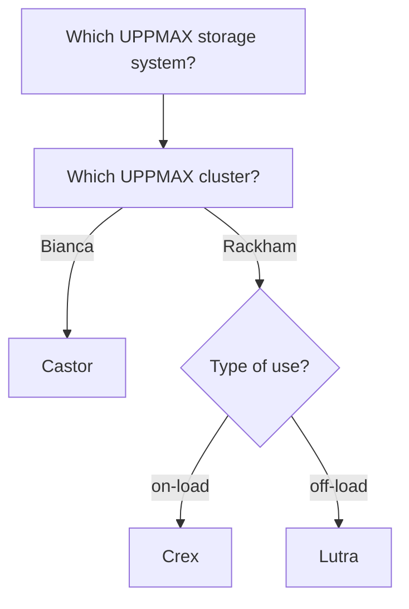

# UPPMAX

[UPPMAX in an organization](uppmax_as_an_organization.md) 
that provides HPC infrastructure that is physically located in Uppsala. 
To do so, it provides the [UPPMAX systems](uppmax_systems.md) below.

## UPPMAX systems

Here we place Bianca between the other UPPMAX systems.

There are three types of UPPMAX systems:

- Computing systems
- Storage systems
- Cloud services

One can apply for these resources, 
as is described [here](../getting_started/project_apply).

### UPPMAX computing systems

Computing systems allow a user to do heavier computational calculations.
At UPPMAX, we use multiple HPC clusters,
that are discussed [here](uppmax_cluster.md)

### UPPMAX storage systems

Storage systems allow a user to storage (big amounts of) data,
for either active use (i.e. in calculations) or to archive it.
Storage for active use is also called 'on-load' storage,
where archived data is called 'off-load' storage.

The [UPPMAX storage systems](https://www.uppmax.uu.se/resources/systems/storage-systems/) are:

- On-load: Castor for Bianca, Crex for Rackham
- Off-load: Lutra for Rackham

### UPPMAX Cloud services

Cloud services allow a user to have something active (typically a website)
that can be accessed by the internet.

For this, the [UPPMAX cloud](https://www.uppmax.uu.se/resources/systems/the-uppmax-cloud/)
has a service called 'Dis' (the Swedish word for 'haze') and is part of
the `EAST-1` region of the SNIC science cloud. 
