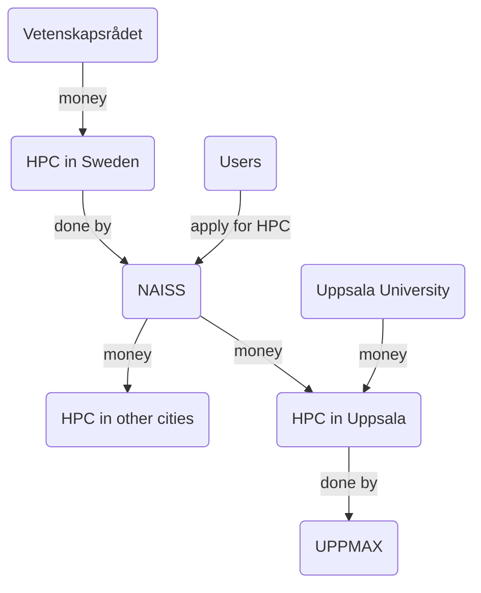

# UPPMAX as an organisation

UPPMAX is a provider of HPC infrastructure
that is physically located in Uppsala.

???- question "Where can I find an overview of UPPMAX?"

    See [our overview of UPPMAX](uppmax.md).

Here we place UPPMAX within the bigger, national, picture,
starting from the biggest source of money for research in Sweden.

[Vetenskapsrådet](https://www.vr.se) ('Science counsel', VR) is biggest funder
of research in Sweden and funds the national HPC infrastructure.

The [National Academic Infrastructure for Supercomputing in Sweden](https://www.naiss.se/) (NAISS) provides such HPC infrastructure: computing power, storage and data services. Applications for these resources starts at
[this NAISS page](https://www.naiss.se//#application-rounds-for-compute-and-storage-resources). These resources are physically located in multiple places in Sweden,
among other Uppsala.

[Uppsala Multidisciplinary Center for Advanced Computational Science](https://www.uppmax.uu.se/) (**UPPMAX = UppMACS**)
provides the HPC infrastructure that is physically located in Uppsala.
Part of this is to provide training and [support](https://www.uppmax.uu.se/support).

