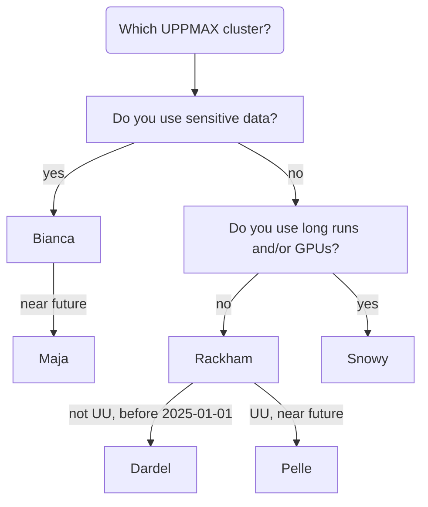
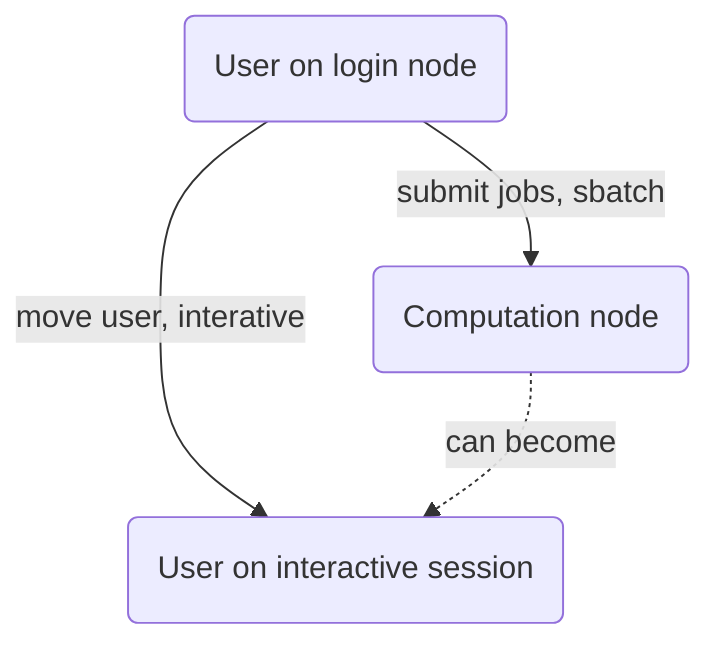
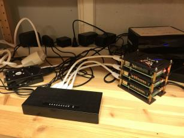
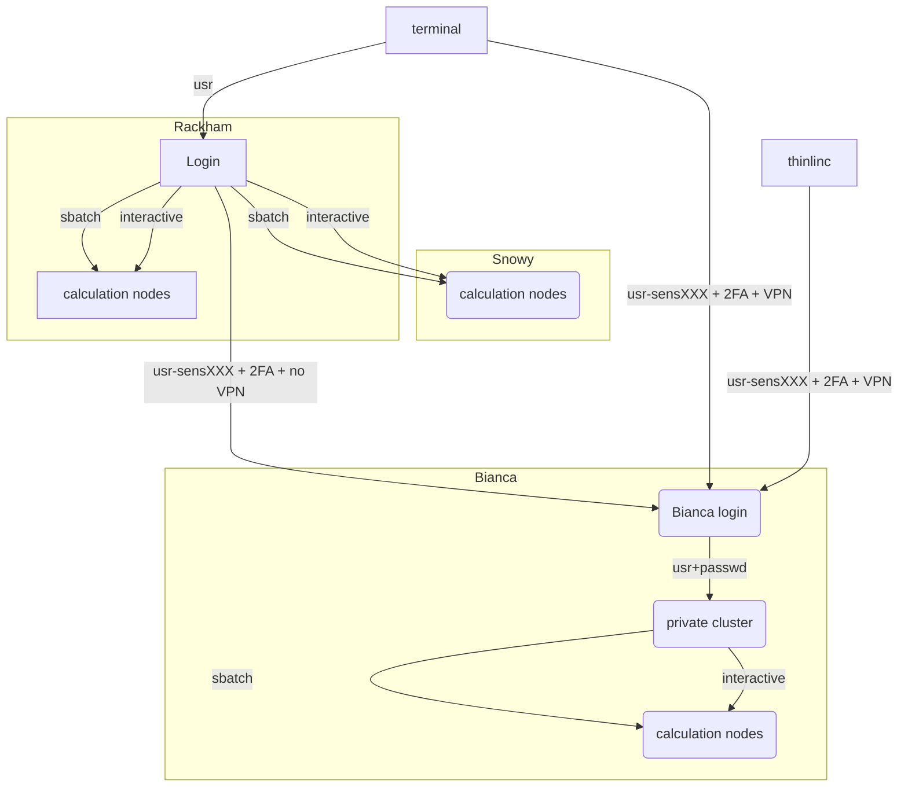

# The UPPMAX clusters

UPPMAX is an organization that provides HPC clusters.

???- question "Where can I find an overview of UPPMAX?"

    See [the UPPMAX page about itself](uppmax.md)

???- question "Where can I find an overview of UPPMAX's systems?"

    See [the UPPMAX page about its systems](uppmax_systems.md)

After giving [an overview of the different UPPMAX clusters](#overview-of-uppmax-clusters),
it is discussed [what a computer cluster is](#what-is-a-computer-cluster-technically),
how [it differs from a supercomputer](#difference-between-a-supercomputer-and-a-high-performing-computer-cluster),
what [the restrictions of a computer cluster are](#restrictions-on-a-computer-cluster),
as well as some added [restrictions on a sensitive data computer cluster](#restrictions-on-a-sensitive-data-computer-cluster).

This is followed by a [detailed technical summary of the clusters](#uppmax-clusters-technical-summary)
and a [detailed overview of the clusters](#detailed-overview-of-the-uppmax-systems).

## Overview of UPPMAX clusters

UPPMAX clusters are computing systems,
i.e. they allow a user to do heavy computational calculations.

All UPPMAX clusters are named after Tintin characters.
UPPMAX has, among others, the following clusters:

- [Bianca](bianca.md): for sensitive data, general use.
  In the near future, will be replaced by [Maja](maja.md)
- [Rackham](rackham.md): regular data, general purpose.
  Will be only for UU staff at 2025-01-01.
  In the near future, will be replaced by [Pelle](pelle.md)
- [Snowy](snowy.md): regular data, long runs and GPU:s

[System usage](https://docs.uppmax.uu.se/cluster_guides/system_usage/system_usage.html){ .md-button .md-button--primary }

Another cluster UPPMAX is involved in:

- [Dardel](dardel.md): a general purpose HPC cluster in Stockholm.
  Consider moving your files to it already

All UPPMAX clusters follow the same [file system](uppmax_filesystem.md),
with special folders.

## What is a computer cluster technically?

A computer cluster is a machine that consists out of many computers.
These computers work together.

Each computer of a cluster is called a **node**.

There are three types of nodes:

- **[login nodes](../cluster_guides/login_node.md)**: nodes where a user enters and interacts with the system

???- tip "Logging in"

    Logging in is described separately per cluster:

    - [Bianca](../getting_started/login_bianca.md).
    - [Rackham](../getting_started/login_rackham.md).
    - [Snowy](../getting_started/login_snowy.md).

- **calculation nodes**: nodes that do the calculations

???- tip "Requesting a calculation to run"

    Requesting a calculation to run is described
    [on the UPPMAX page about the job scheduler](slurm.md).

- **interactive sessions**: a user on a calculation node

???- tip "Requesting an interactive session"

    Requesting an interactive session is described per cluster:

    - [Bianca](start_interactive_session_on_bianca.md)
    - [Rackham](start_interactive_session_on_rackham.md)

    This is done by requesting an interactive session
    from the Slurm scheduler.

Each node contains several CPU/GPU cores, RAM and local storage space.

A user logs in to a [login node](../cluster_guides/login_node.md) via the Internet.

> The different types of nodes an UPPMAX cluster has.

## Difference between a supercomputer and a (high-performing) computer cluster

A supercomputer is a machine that is optimized for doing calculations
quickly. For example, to predict the weather for tomorrow, the calculation
may not take a week. The image above is a supercomputer.

A computer cluster is a set of computers that work together so that they can be viewed as a single system.
The image above shows a home-made computer cluster.
This home-made computer cluster may not be suitable for high-performance computing.

The image above shows Rackham, another UPPMAX
computer cluster, suitable for high-performance computing.
This makes Rackham an high-performance computing (HPC) cluster.
Bianca and Rackham are HPC clusters.

When using this definition:

> a supercomputer is one big computer,
> while high-performance computing is many computers working toward the same goal
>
> [Frank Downs](https://fedtechmagazine.com/article/2021/04/high-performance-computing-government-aggregating-impact-perfcon)

one could conclude that the UPPMAX HPC cluster can be used as a supercomputer
when a user runs a calculation on all nodes.

## Restrictions on a computer cluster

A computer cluster is a group of computers that can run
many calculations, as requested by multiple people, at the same time.

To ensure fair use of this shared resource, regular users
are restricted in some ways:

- Users cannot run calculations directly.
  Instead, users need to request either (1) a calculation to be run,
  or (2) an interactive session

???- tip "Requesting a calculation to run"

    Requesting a calculation to run is described
    [at the UPPMAX page about the job scheduler](slurm.md).

???- tip "Requesting an interactive session"

    Requesting an interactive session is described per cluster:

    - [Bianca](start_interactive_session_on_bianca.md)
    - [Rackham](start_interactive_session_on_rackham.md)

    This is done by requesting an interactive session
    from the Slurm scheduler.

- Users cannot install software directly.
  Instead, users need to use pre-installed software or learn
  techniques how to run custom software anyway

???- tip "Using pre-installed software"

    Using pre-installed software is described
    [at the UPPMAX page about the software module system](modules.md).

???- tip "How to run custom software"

    Using [a Singularity container](../software/singularity.md)
    allows you to run most custom software on any HPC cluster

These restrictions apply to most general-purpose clusters
and all UPPMAX clusters.

## Restrictions on a sensitive data computer cluster

Next to the general restrictions above,
a sensitive data cluster has additional restrictions.

Here is an overview which clusters are designed for sensitive data:

Cluster name|Sensitive data yes/no?
------------|----------------------
Bianca      |Yes
Rackham     |No
Snowy       |No

On a sensitive data cluster,
(sensitive) data must be protected to remain there,
due to which there are these additional restrictions to users:

- Users have no direct access to internet.
  Instead, users can up/download files from/to a special folder.

???- tip "File transfer"

    Transferring files is described per sensitive data cluster:

    - [Bianca](transfer_bianca.md).

The goal is to prevent the *accidental* up/download of sensitive data.
As these up/downloads are monitored, in case of an accident,
the extent of the leak and the person (accidentally) causing it
is known. Identifying a responsible person in case of such an
accident is required by law.

## UPPMAX clusters technical summary

This is a technical summary of the UPPMAX clusters:

.                       |Rackham        |Snowy                     |Bianca
------------------------|---------------|--------------------------|-------------------------
**Purpose**             |General-purpose|General-purpose           |Sensitive
**# Intel CPU Nodes**   |486+144        |228                       |288
**# GPU Nodes**         |-              |50, Nvidia T4             |10, 2x Nvidia A100 each
**Cores per node**      |20/16          |16                        |16/64
**Memory per node**     |128 GB         |128 GB                    |128 GB
**Fat nodes**           |256 GB & 1 TB  |256, 512 GB & 4 TB        |256 & 512 GB
**Local disk (scratch)**|2/3 TB         |4 TB                      |4 TB
**Login nodes**         |Yes            |No (reached from Rackham) |Yes (2 cores and 15 GB)
**"Home" storage**      |Domus          |Domus                     |Castor/Cygnus
**"Project" Storage**   |Crex, Lutra    |Crex, Lutra               |Castor/Cygnus

## Detailed overview of the UPPMAX systems

