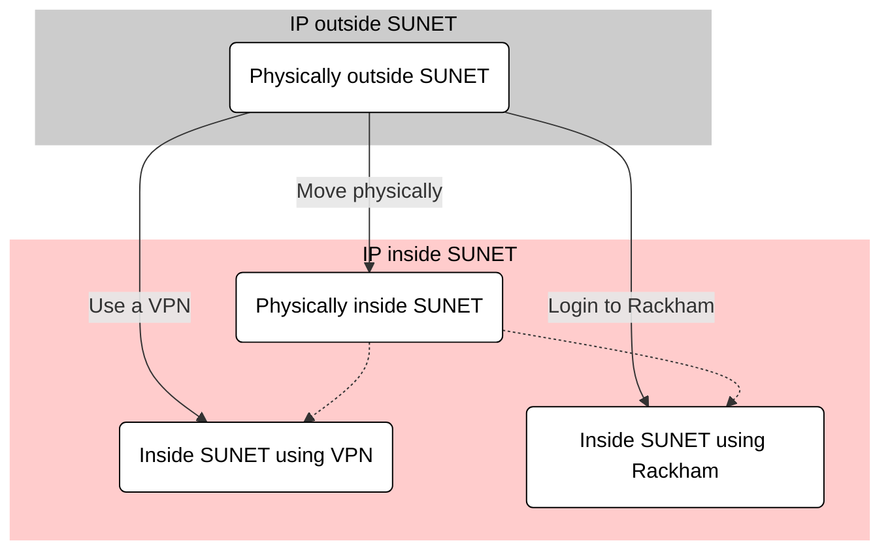

# Get inside the university networks

One cannot connect to all UPPMAX clusters everywhere around the world.
Instead, one needs to get inside the university networks first.
This page described how to get inside the university networks,
or, to use more precise language, to obtain a [SUNET](https://www.sunet.se/) Internet Protocol ('IP') address.

There are these ways to do this:

- Physically move inside SUNET
- Use a VPN (a 'virtual private network')
- Use an HPC cluster within SUNET

Each of these three ways are described below.

## Physically move inside SUNET

To connect to all UPPMAX clusters, one must be inside SUNET.

All Swedish university buildings are within SUNET.
Hence, working from a University building 
is a non-technical solution to get direct access to Bianca.

## Use a virtual private network

???- question "Want a video to see how to install the UU VPN?"

    - [Install VPN client for Ubuntu and Uppsala university](https://youtu.be/AIJKbJeu0MI?si=9ES3ZECykwc8tT28)

To connect to all UPPMAX clusters, one must be inside SUNET.

A virtual private network (VPN) allows one to access all UPPMAX clusters indirectly:
your computer connects to the VPN within SUNET, where that VPN accesses
your favorite UPPMAX cluster.

To be able to use a VPN to get inside of SUNET:

- For Uppsala University: [go to this page](https://www.uu.se/medarbetare/stod-och-verktyg/verktyg-och-guider/logga-in-pa-ett-sakert-satt)
- For Lund University: [go to this page](https://luservicedesk.service-now.com/support_en?id=kb_article_en&sys_id=a0d9ee21db74605020681ea605961927)

- For other Swedish universities, search their websites to get the required VPN credentials.

???- tip "Want a video to see how the UU VPN is used?"

    - [Use the UU VPN with 2FA](https://youtu.be/QEJTKvQoiVI)
    - [Use the UU VPN (yet without 2FA) to access the Bianca remote desktop website](https://youtu.be/Ni9nyCf7me8)

## Use an HPC cluster within SUNET

To connect to all UPPMAX clusters, one must be inside SUNET.

An HPC cluster within SUNET (for example, [Rackham](../cluster_guides/rackham.md))
allows one to access all other clusters:
your computer connects to the HPC cluster within SUNET, 
after which one accesses all other clusters.

However, when using this method, one can only use the console 
environments (i.e. no remote desktop environment).
