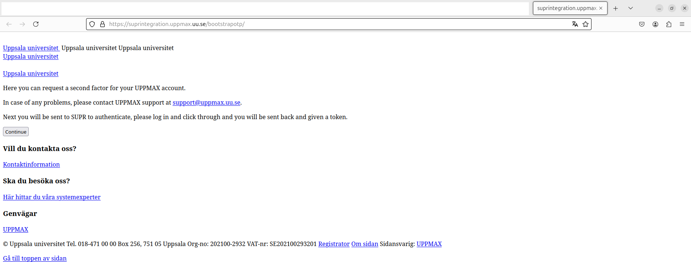

---
tags:
  - 2FA
  - MFA
  - UPPMAX
---

# Setting up two factor authentication for UPPMAX

Two factor authentication (abbreviated to '2FA')
increases the security of your UPPMAX account
and is mandatory is multiple contexts.

???- question "Why is this important?"

    See [Why is 2FA important?](why_2fa.md)

This page describes how to set this up.

## Procedure

???- question "Prefer a video?"

    Watch [the YouTube video 'Get your UPPMAX 2FA'](https://youtu.be/eSn0kLkU5Dc)

### 1. Install a 2FA app

Install an app to use for 2FA.

???- question "Which app do you recommend?"

    Any app that works for you.

    Search for '2FA' or 'OTP' (short for
    'one time password')..

    Wikipedia maintains a list of 2FA apps
    [here](https://en.wikipedia.org/wiki/Comparison_of_OTP_applications).

### 2. Go to <https://suprintegration.uppmax.uu.se/bootstrapotp/>

In your web browser, go to <https://suprintegration.uppmax.uu.se/bootstrapotp/>.

???- question "How does this look like?"

    Here is how <https://suprintegration.uppmax.uu.se/bootstrapotp/>
    looks like:

    

This will take you to the UU page to request a second factor for your UPPMAX account.

### 3. Click on 'Continue'

At this page, click on 'Continue' to be sent to a 'Login to SUPR' page.

Click on 'Continue' to be sent to a 'Login to SUPR' page.

### 4. Log in to SUPR

At the 'Login to SUPR' page, log in, in any way that works for you.

???- question "How does this look like?"

    

In case you are not logged in already, log in to SUPR.

### 5. Press the button 'Prove My Identity to UPPMAX'

Acknowledge to SUPR that they may tell UPPMAX who you are,
by pressing the button "Prove My Identity to UPPMAX" on the page.

### 6. Scan the QR-code with your 2FA app

Scan the QR-code with your 2FA app.

???- question "How does that look like?"

    

More details [here](get_uppmax_2fa_qr.md).

### 7. Enter the code on the webpage

Your application will show you a code, enter this code on the same webpage.

More details [here](get_uppmax_2fa_qr_code.md).

### 8. See acknowledgement that the new two factor has been registered

You should see an acknowledgement that the new two factor has been registered.

???- question "How does that look like?"

    

### 9. Wait for a confirmation email

After this procedure, it takes around 15 minutes before you can use
the 2FA to log in.

## FAQ

???- question "How does the use of a 2FA app looks like?"

    

    > UPPMAX 2FA set up for a fictional UPPMAX user called `sven`

???- question "How do I know I used my new 2FA too early?"

    Simple answer: when you've used your new 2FA before having
    received an email.

    Another way to find out: go to <bianca.uppmax.uu.se>
    and try to use your new 2FA. You will get a 'Authentication failed'
    error when your new 2FA is not active yet.

    

???- question "How long does it take before my 2FA is active?"

    This is a matter of minutes.

    It takes a little while before your newly registered factor is usable,
    but this should be a matter of minutes, not days.

???- question "Will I get an email when my 2FA is active?"

    No.

    There is no extra mail sent to let you know that the newly registered
    factor is usable, just the confirmation mail that mentions
    that it will be activated soon.

## Troubleshooting

Troubleshooting

Some of the common problems we've seen include

- Not having an account at UPPMAX. This is required to get the second factor for your account.
- Using a device having it's time set differently from our systems. There are services on the internet (e.g. <https://time.is/>) you can visit from the device you try to manage the code on that will show you if your device settings are problematic.
- Noting the code given at first and trying to use it every time when asked for a code. The code to give will change every thirty second and you should give whatever code is shown at the time.
- Expecting something else to be sent to you. You register the new second factor as part of the process. A confirmation mail is sent as well, but this is mostly to let you know in case your account details in SUPR have gone astray and someone else has registered a second factor for your account.
