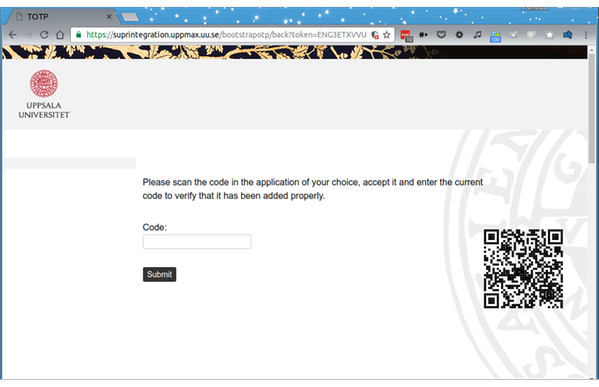

---
tags:
  - 2FA
  - MFA
  - UPPMAX
  - QR
---

# Setting up the QR code for two factor authentication for UPPMAX

Part of [setting up two factor authentication for UPPMAX](get_uppmax_2fa.md)
is to get a QR code.



You need to scan this QR code to add your account to your software.
Most softwares call this "Add account" or similar
and will offer an option to scan a QR code using the smartphone camera
or select an area of the screen where the code is.

Note that this must often be done from
within the app for two factor authentication.

If you see a string similar to

```text
otpauth://totp/username@UPPMAX?secret=SOMETEXT&issuer=UPPMAX
```

it didn't work and you probably need to do something different
(such as starting the app and select scan from within).

Once you've scanned the code, you are often allowed to change the name the
software will use for the account before you add it.
You can change the name if you want - changing the name does not affect the
codes generated.
Finish adding the account to the software.
