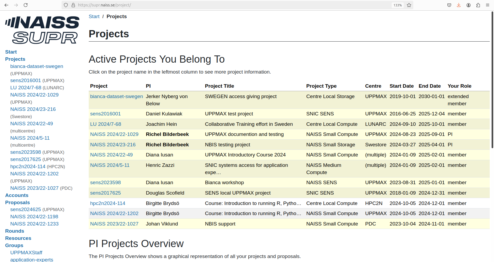

# Join an existing project

To use an UPPMAX cluster, one [needs to apply to a project](project_apply.md).
This page describes how to join an existing project.

## Procedure

### 1. Go to [https://supr.naiss.se/](https://supr.naiss.se/)

> Example SUPR NAISS main page

### 2. Click on 'Projects'

On the main page, click on 'Projects'

> On the main page, click on 'Projects'

### 3. Scroll to 'Request Membership in Project'

At the 'Projects' page, scroll down to 'Request Membership in Project'.

> At the 'Projects' page, scroll down to 'Request Membership in Project'

This is the 'Request Membership in Project' section:

> At the 'Projects' page, here is the 'Request Membership in Project'

### 4. Search for a project

At 'Request Membership in Project' in the 'Projects' page, enter a seach term and click 'Search for project'

> At 'Request Membership in Project' in the 'Projects' page, enter a seach term and click 'Search for project'.
> In this example, the search term is 'DNA'

### 5. Search for a project

At the 'Request Membership in Project', click on 'Request' for the project you want to request membership of.

> At the 'Request Membership in Project', click on 'Request' for the project you want to request membership of.

### 6. Wait for email

After your request, the PI of the project will receive an email
and will accept or reject your proposal.
