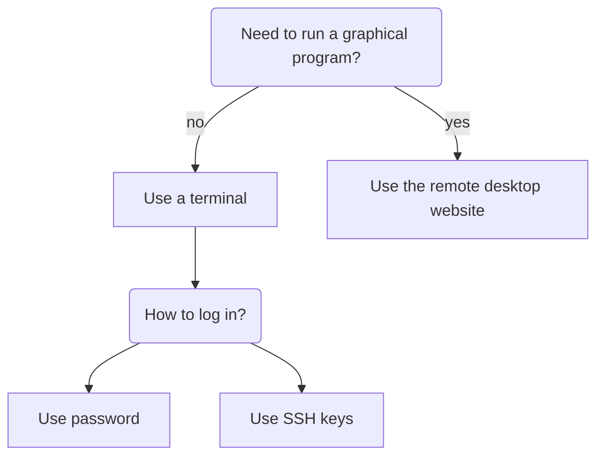

---
tags:
  - login
  - log in
  - Bianca
---

# Log in to Bianca

> The two Bianca environments to work on Bianca.
> At the left is a remote desktop environment.
> At the the right is the console environment.

There are multiple UPPMAX clusters one can [log in to](../getting_started/login.md).
Here it is described how to log in to [Bianca](../cluster_guides/bianca.md):

- [Prerequisites](bianca_usage_prerequisites.md) describes what is needed before one can access Bianca
- [The two Bianca environments](#the-two-bianca-environments) shows the two ways to access Bianca:
    - For a remote desktop environment, go to [access Bianca remote desktop environment via a website](login_bianca_remote_desktop_website.md)
    - For a console environment, go to [login to the Bianca console environment with a password](login_bianca_console_password.md).
      If you want to get rid of using a password every time, see [login to the Bianca console environment with an SSH key](login_bianca_console_ssh_key.md)

## The two Bianca environments

There are two ways to access Bianca:

Login                |Description
---------------------|----------------------------------------------
Website              |Remote desktop, no installation needed, slow
Terminal             |Console environment, recommended

???- question "How does the Bianca remote desktop look like?"

    One can pick multiple remote desktop environments,
    such as GNOME and XFCE (and KDE, don't pick KDE!).

    

    > The Bianca XFCE remote desktop environment

    

    > A more populated Bianca XFCE remote desktop

- A remote desktop environment, also called 'graphical environment',
  'GUI environment', '[ThinLinc](../software/thinlinc.md) environment'

???- question "How does the Bianca console environment look like?"

    

    > The Bianca console environment

- A console environment, also called 'terminal environment' or '[terminal](../software/terminal.md)'

The remote desktop environment is considered the easier place to start for most
new users, as it has most similarities with what a new user is familiar with.
However, one must always use a terminal to some extent.

- For a remote desktop environment, go to [access Bianca remote desktop environment via a website](login_bianca_remote_desktop_website.md)
- For a console environment, go to [login to the Bianca console environment with a password](login_bianca_console_password.md).
  If you want to get rid of using a password every time, see [login to the Bianca console environment with an SSH key](login_bianca_console_ssh_key.md)

???- question "Will a local ThinLinc client work too?"

    No.

    One really can only [access Bianca remote desktop environment via a website](login_bianca_remote_desktop_website.md).

After login, you will be on a [login node](../cluster_guides/login_node.md).

!!! note "How to behave on a login node"

    On a login node, one can and should do simple things only:
    it is a resource shared with all other users on that node.

    If you need to do more intense calculations,
    [use the Slurm job scheduler](../cluster_guides/slurm_on_rackham.md).

    If you need to do more intense calculations interactively,
    [use an interactive node](../cluster_guides/start_interactive_node_on_rackham.md).
