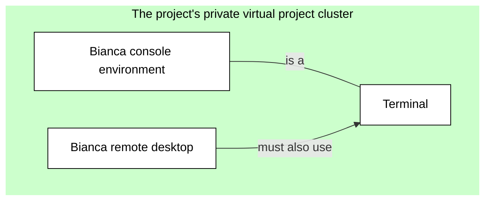
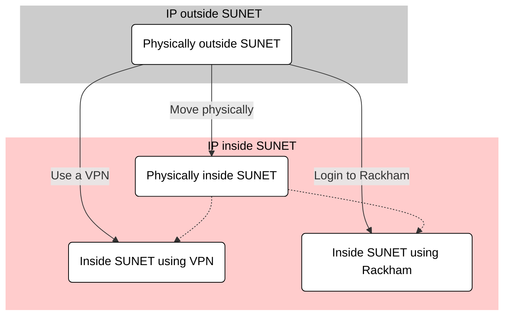
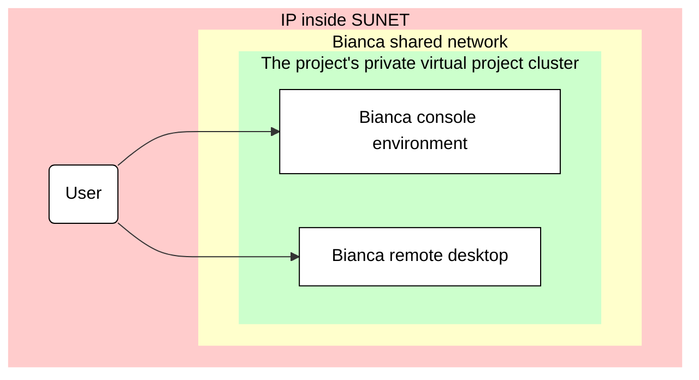
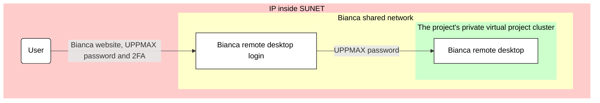
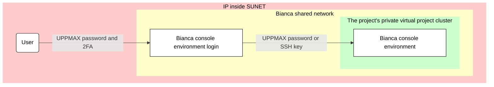
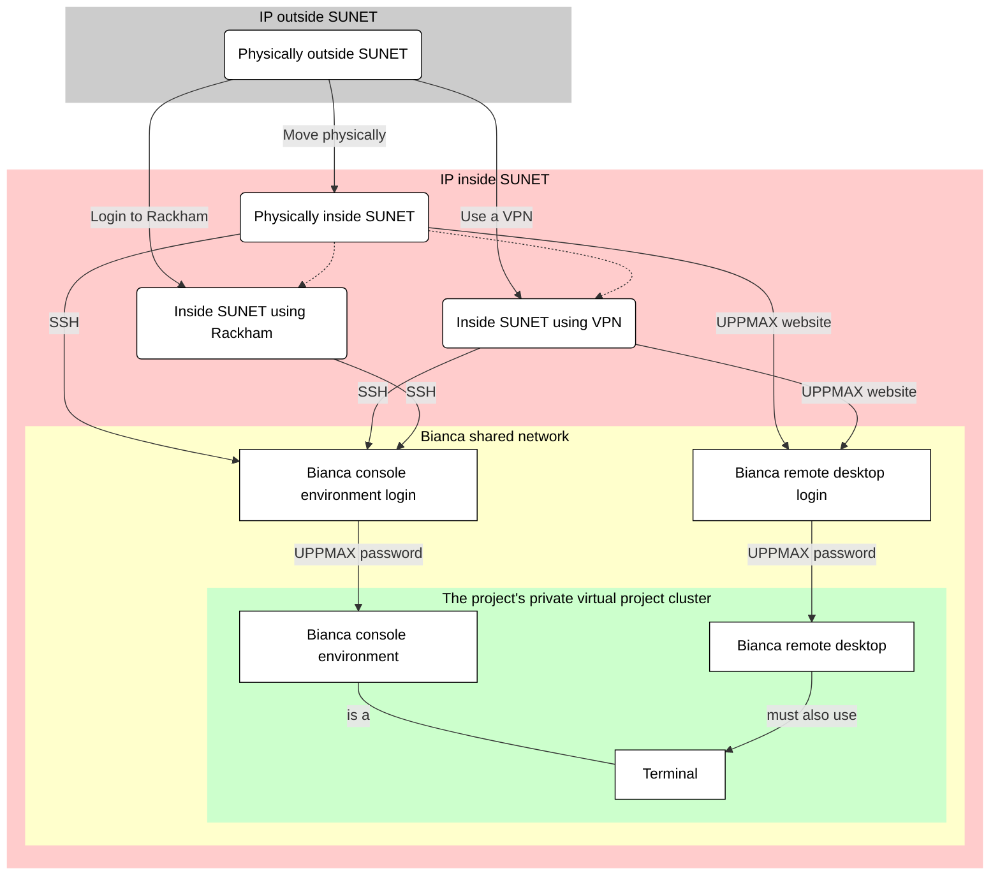

# Log in to Bianca

!!! info "[Go to the Bianca portal](../cluster_guides/bianca_portal.md)"

    At [the Bianca portal](../cluster_guides/bianca_portal.md) one can 
    learn about using Bianca, for example:

    - NAISS-SENS and rules regarding sensitive data
    - How to do data transfer
    - How to make Bianca do a calculation
    - How to develop code on Bianca


> The two Bianca environments to work on Bianca. 
> At the left is a remote desktop environment.
> At the the right is the console environment.

Here it is described how to login to Bianca:

- [Bianca's design](#biancas-design): 
  helps understand why the procedure described here is needed.
- [Prerequisites](#prerequisites-for-using-bianca) describes what is needed before one can login to Bianca
- [The two Bianca environments](#the-two-bianca-environments) shows the two ways to use Bianca
- [Get within the university networks](#get-within-the-university-networks) shows how *to be allowed to* access Bianca
- [Get inside the Bianca environment](#get-inside-the-bianca-environment) show how to get inside the Bianca environments:
    - [Login to the Bianca remote desktop environment](#login-to-the-bianca-remote-desktop-environment)
    - [Login to the Bianca console environment](#login-to-the-Bianca-console-environment)

After logging in, one can visit [the Bianca portal](../cluster_guides/bianca_portal.md)
to learn how to use Bianca

## Bianca's design

Bianca is an HPC cluster for sensitive data and is designed to:

- make accidental data leaks difficult
- make correct data management as easy as possible
- emulate the HPC cluster environment that SNIC users were familiar with
- provide a maximum amount of resources
- satisfy regulations

???- info "The Bianca architecture"

    

    > Bianca's architecture.
    > Red shows the university networks.
    > Blue shows the whole cluster, with hundreds of nodes.
    > Green shows virtual project clusters.
    > Yellow shows where file transfer occurs.

Bianca's architecture reflects that 
she is an HPC cluster for sensitive data:
the whole Bianca cluster has hundreds 
of virtual project clusters, 
each of which is isolated from each other and the Internet.
File transfer is only possible through the the so-called 'wharf', 
which is a special file area that is visible from the Internet.

!!! info "Bianca has no internet"

    - You *can* log in, but with extra steps
    - You *can* transfer files, but with extra steps
    - We recommend using the remote desktop login, see [here](here.md)

As Bianca is an HPC cluster that should be as easy to 
use as possible, there are two ways to interact with Bianca:
one more visual, the other a command-line environment.
Both environments are shown below.

As Bianca has sensitive data, there are constraints on how to
access Bianca.

One such constraint in accessing Bianca, 
is that one has to be within the university
networks, as described at [get within the university networks](#get-within-the-university-networks).

Another such constraint, is that data can be
transferred to or from a virtual project cluster through the so-called 'wharf', 
which is a special file area that is visible from the Internet.
File transfer is described in more detail [here](../cluster_guides/transfer_bianca.md).

## Prerequisites for using Bianca

To be allowed to use Bianca, one needs all of these:

- [An active research project](#an-active-research-project)
- [An UPPMAX account](#an-uppmax-account)
- [An UPPMAX password](#an-uppmax-password)

These prerequisites are discussed in detail below.

### An active research project

One [prerequisite for using Bianca](#prerequisites-for-using-bianca)
is that you need to be a member of an active SNIC SENS 
or SIMPLER research project (these are called `sens[number]` or `simp[number]`, 
where `[number]` represent a number, for example `sens123456` or `simp123456`). 

If you do not have a project membership, 
you can request membership to an existing project in SUPR 
or read the SENS project application page to learn how to create a project.

???- question "Forgot your Bianca projects?"

    One easy way to see your Bianca projects is to use the
    Bianca remote desktop login screen at <https://bianca.uppmax.uu.se/>.

    

[SUPR](https://supr.naiss.se/) (the 'Swedish User and Project Repository')
is the website that allows one to request access to Bianca
and to get an overview of the requested resources.

???- question "How does the SUPR website look like?"

    

    > First SUPR page

    

    > SUPR 2FA login. Use the SUPR 2FA (i.e. **not** UPPMAX)

After logging in, the [SUPR](https://supr.naiss.se/) 
website will show all projects you are a member of,
under the 'Projects' tab.

???- question "How does the 'Projects' tab of the SUPR website look like?"

    

    > Example overview of SUPR projects

To see if a project has access to Bianca, click on the
project and scroll to the 'Resources' section. In the 'Compute' subsection,
there is a table. Under 'Resource' it should state 'Bianca @ UPPMAX'.

???- question "How does the 'Resources' page of an example project look like?"

    

    > The 'Resources' page of an example project.

Note that the 'Accounts' tab can be useful to verify your username.

???- question "How does the 'Accounts' tab help me find my username?"

    

    > An example of a SUPR 'Accounts' tab. 
    > The example user has username `richel-sens2023598`,
    > which means his/her UPPMAX username is `richel`

### An UPPMAX account

Another [prerequisite for using Bianca](#prerequisites-for-using-bianca)

Additionally, you must have a personal UPPMAX user account. 
This is separate from your SUPR account. 
See the user account application page if you do not have one. 

Once you are set up for login, 
this should also be reflected in SUPR through
 one or several additional account(s) 
at UPPMAX for the specific project(s) you are a member of.

### An UPPMAX password

Another [prerequisite for using Bianca](#prerequisites-for-using-bianca)

Also note that you need to know your UPPMAX password. 
If you change it, it may take up to an hour before changes are reflected in bianca.

For advice on handling sensitive personal data correctly on Bianca, see our FAQ page.

## The two Bianca environments

Bianca, like most HPC clusters, uses Linux.
To use Bianca, there are two environments:

???- question "How does the Bianca remote desktop look like?"

    One can pick multiple remote desktop environments,
    such as GNOME and XFCE (and KDE, don't pick KDE!).

    

    > The Bianca XFCE remote desktop environment

    

    > A more populated Bianca XFCE remote desktop

- A remote desktop environment, also called 'graphical environment', 
  'GUI environment', 'ThinLinc environment'

???- question "How does the Bianca console environment look like?"

    

    > The Bianca console environment

- A console environment, also called 'terminal environment' or 'terminal'

The remote desktop environment is considered the easier place to start for most
new users, as it has most similarities with what a new user is familiar with.
However, one must always use a terminal to some extent.




> The two Bianca environments and their relation to a terminal.

## Get within the university networks

Bianca has sensitive data. 
To protect this data, 
Bianca is accessible from all Swedish university networks.
To be precise, to connect to Bianca one needs to so from a
[SUNET](https://www.sunet.se/) Internet Protocol ('IP') address.

Due to this, the first step to access Bianca
is to get an IP that is inside SUNET first. 
There are these ways to do this:

- Physically move inside SUNET
- Use a VPN (a 'virtual private network')
- Use an HPC cluster within SUNET

Each of these three ways are described below.



### Physically move inside SUNET

One must be inside SUNET to access Bianca directly.
All Swedish university buildings are within SUNET.
Hence, working from a University building 
is a non-technical solution to get direct access to Bianca.

### Use a virtual private network

One must be inside SUNET to access Bianca directly.

A virtual private network (VPN) allows one to access Bianca indirectly:
your computer connects to the VPN within SUNET, where that VPN
accesses Bianca.

To be able to use a VPN to get inside of SUNET:

 * For Uppsala University: [go to this page](https://mp.uu.se/en/web/info/stod/it-telefoni/anvandarguider/network/vpn-service)
 * For other Swedish universities, search their websites to get the required VPN credentials.

???- tip "Video"

    This video shows how to use an installed VPN,
    after which the UPPMAX Bianca login website is used to
    access the Bianca remote desktop environment: 
    [YouTube](https://youtu.be/Ni9nyCf7me8), 
    [download (.mp4)](https://richelbilderbeek.nl/login_bianca_vpn.mp4)

### Use an HPC cluster within SUNET

One must be inside SUNET to access Bianca directly.

An HPC cluster within SUNET (for example, Rackham)
allows one to access Bianca indirectly:
your computer connects to the HPC cluster within SUNET, 
after which one accesses Bianca.

When using this method, one can only use the
Bianca console environment.

## Get inside the Bianca environment

When inside SUNET, one can access the Bianca environments.

- For a remote desktop environment, 
  go to [login to the Bianca remote desktop environment](#login-to-the-bianca-remote-desktop-environment)
- For a console environment, 
  go to [login to the Bianca console environment](#login-to-the-Bianca-console-environment)

Below, the ways to access these Bianca environments 
are discussed



### Login to the Bianca remote desktop environment

As Bianca is an HPC cluster for sensitive data,
one needs to be within SUNET to be able to access her.

Bianca does not support any so-called X-forwarding (unlike Rackham), 
so instead UPPMAX maintains a website that uses
ThinLinc to get a full remote desktop environment.
All you should need is a rather modern browser on any platform:
we have tested on Chrome and Firefox :-)

???- question "How does it look like to try to access a remote desktop from outside of SUNET?"

    

    > When accessing the Bianca UPPMAX login website from outside of SUNET,
    > nothing will appear in your browser.

When inside SUNET, one can access a remote desktop environment
using a website:

  1. In your web browser, go to [https://bianca.uppmax.uu.se](https://bianca.uppmax.uu.se)

  2. Fill in the first dialog. 
     Do use the `UPPMAX` [2-factor authentication](https://www.uppmax.uu.se/support/user-guides/setting-up-two-factor-authentication/) (i.e. not SUPR!)

???- question "How do I setup 2-factor authentication?"

    See the guide at [2-factor authentication](https://www.uppmax.uu.se/support/user-guides/setting-up-two-factor-authentication/)
    to setup an UPPMAX 2-factor authentication method.

    You really need to use the UPPMAX 2-factor authentication,
    i.e not the SUPR one, to login to Bianca.

    

    > Screenshot of a two-factor authentication app.
    > Use the 2-factor authentication called 'UPPMAX'
    > to access Bianca

???- question "How does that web page look like?"

    

    > The first page of [https://bianca.uppmax.uu.se](https://bianca.uppmax.uu.se)

  3. Fill in the second dialog, using your regular password (i.e. no need for two-factor authentication)

???- question "How does that web page look like?"

    

    > The second Bianca remote desktop login dialog. 
    > Note that it uses ThinLinc to establish this connection

  4. When picking a remote desktop flavor, pick GNOME or XFCE, avoid picking KDE

!!! warning "Avoid choosing KDE"

    Avoid choosing the KDE desktop, as it gives problems when running interactive sessions.

    Instead, we recommend GNOME or XFCE.
     
  5. Enjoy! You are in!

???- question "How does the remote desktop look like?"

    

    > The Bianca remote desktop

???- tip "Video: using VPN and access the remote desktop"

    This video shows how to use an installed VPN,
    after which the UPPMAX Bianca login website is used to
    access the Bianca remote desktop environment: 
    [YouTube](https://youtu.be/Ni9nyCf7me8), 
    [download (.mp4)](https://richelbilderbeek.nl/login_bianca_vpn.mp4)

Under the hidden tab in the left edge of the screen, 
you can find a clipboard, 
icons of some special keys
and the disconnect button:

- the clipboard is needed to be able to copy-paste text to/from Bianca.
- the icons of some special keys are needed for some users, 
  as not all keyboard keys reach Bianca as expected.
- the disconnect button disconnects your session

???- question "What is the difference between 'disconnect session' and 'end session'?"

    'disconnect session' will save the current state of your session.
    When you connect again, you will get the remote desktop back 
    in exactly in the same place you left the system.
    For example: if you were editing a file before disconnecting, 
    your prompt will be in the same place you left it. 

    'end session' will not save the current state of your session.
    Instead, you will start with a clean slate at the next login.

Bianca has a automatically disconnect after 30 minutes of inactivity.
In the future it is possible that we implement some kind 
of "automatic log out from active graphical session". 



### Login to the Bianca console environment

When inside SUNET, one can access a Bianca console environment
using a terminal and the Secure Shell Protocol (SSH).

You can use your favorite terminal to login (see <https://uppmax.github.io/uppmax_intro/login2.html#terminals> for an overview of many)
to the Bianca command-line environment. 
You can also have multiple log-ins active at once.

There are multiple ways to set this up:

- [Using an SSH password](#login-to-the-bianca-console-environment-using-an-ssh-password).
- [Using SSH keys](#login-to-the-Bianca-console-environment-using-ssh-keys)

Using an SSH password is considered easiest,
where using an SSH key is considered more elegant.

In a Bianca console environment:

- Text display is limited to 50kBit/s.
  This means that if you create a lot of text output,
  you will have to wait some time before you get your prompt back.
- Cut, copy and paste work as usual.
  Be careful to not copy-paste sensitive data! 



### Login to the Bianca console environment using an SSH password

When inside SUNET, one can access a Bianca console environment
using SSH with an SSH password.

This is considered the easier one to setup,
but one will have to type a password twice to login.
To get rid of one password and setup SHH keys, 
see [here](#login-to-the-Bianca-console-environment-using-ssh-keys).


  1. From a terminal, use `ssh` to log in:

```bash
ssh [user]-[project name]@bianca.uppmax.uu.se
```

For example:

```bash
ssh sven-sens2023598@bianca.uppmax.uu.se
```

???- question "Why no `-A`?"

    On Bianca, one can use `-A`:
   
    ```
    ssh -A username@bianca.uppmax.uu.se
    ```

    this option is only useful when 
    [using SSH keys](#login-to-the-Bianca-console-environment-using-ssh-keys)
    to access Bianca.
    As we here use passwords (i.e. no SSH keys) 
    to access Bianca, `-A` is unused
    and hence we simplify this documentation by omitting it.

???- question "Why no `-X`?"

    On Rackham, one can use `-X`:
   
    ```
    ssh -X username@rackham.uppmax.uu.se
    ```

    However, on Bianca, this so-called X-forwarding is disabled.
    Hence, we do not teach it :-)


 2. Type your UPPMAX password, 
    directly followed by the UPPMAX 2-factor authentication number,
    for example `verysecret678123`, then press enter.
    In this case, the password is `verysecret` and `678123`
    is the 2FA number.

After authenticated using the UPPMAX password and 2FA, 
you are logged in on Bianca's shared network,
on a so-called 'jumphost'. 

However, you will still need to login to your own
private virtual project cluster. 
As you are already properly authenticated (i.e. using an UPPMAX password
and UPPMAX 2FA), you don't need 2FA anymore.

???- question "What is a virtual project cluster?"

    As Bianca holds sensitive data, by regulations,
    each Bianca project must be isolated from each other
    and are not allowed to, for example, share the same memory.

    One way to achieve this, would be to build one HPC cluster 
    per project. While this would guarantee isolated project environments,
    this would be quite impractical.

    Instead, we create isolated project environments by using software,
    that creates so-called virtual clusters, as if they would be
    physical clusters. Like physical clusters, a virtual cluster 
    has a guaranteed isolated project environment.

When you login to Bianca's shared network,
you will get a message of your project's login node status.
It can be `up and running` or `down`.
If it is `down`, the virtual cluster is started,
which may take some minutes.

 3. Type your UPPMAX password,
    for example `verysecret`

 4. Enjoy! You are in! Or, to be precise, 
    you are on the login node of your own virtual project cluster.
    By default, this node has one core,
    hence if you need more memory or more CPU power, 
    you submit a job (interactive or batch), 
    and an idle node will be moved into your project cluster.


???- tip "Video: how to use a terminal and SSH to access the Bianca console environment"

    This video shows how to use a terminal and SSH to access 
    the Bianca console environment: [YouTube](https://youtu.be/upBozh2BI5c), 
    [download (.ogv)](https://richelbilderbeek.nl/login_bianca_inside_sunet.ogv)

### Login to the Bianca console environment using SSH keys

When inside SUNET, one can access a Bianca console environment
using SSH and SSH keys.

This is considered a bit harder to setup,
but one only needs to type one password to login to Bianca.
If you don't mind typing your UPPMAX password twice,
an easier setup is [here](#login-to-the-bianca-console-environment-using-an-ssh-password).

  1. From a terminal, use `ssh` to log in:

```bash
ssh -A [user]-[project name]@bianca.uppmax.uu.se
```

For example:

```bash
ssh -A sven-sens2023598@bianca.uppmax.uu.se
```

???- question "Why no `-X`?"

    On Rackham, one can use `-X`:
   
    ```
    ssh -AX username@rackham.uppmax.uu.se
    ```

    However, on Bianca, this so-called X-forwarding is disabled.
    Hence, we do not teach it :-)

 2. Type your UPPMAX password, 
    directly followed by the UPPMAX 2-factor authentication number,
    for example `verysecret678123`, then press enter.
    In this case, the password is `verysecret` and `678123`
    is the 2FA number.

 3. Enjoy! You are in!

???- question "Why does one need two passwords?"

    The first password is needed to get into the shared Bianca environment.
    This password contains both an UPPMAX password and an UPPMAX 2FA number.

    The second password is needed to go to the login node 
    of a project's virtual cluster.

    ```mermaid
    flowchart TD

        %% Give a white background, instead of a transparent one
        classDef node fill:#fff,color:#000,stroke:#000
        classDef focus_node fill:#fff,color:#000,stroke:#000,stroke-width:4px

        subgraph sub_bianca_shared_env[Bianca shared network]
          bianca_shared_console[Bianca console environment login]
          bianca_shared_remote_desktop[Bianca remote desktop login] 
          subgraph sub_bianca_private_env[The project's private virtual project cluster]
            bianca_private_console[Bianca console environment]
            bianca_private_remote_desktop[Bianca remote desktop] 
            bianca_private_terminal[Terminal] 
          end
        end

        %% Shared subgraph color scheme
        %% style sub_outside fill:#ccc,color:#000,stroke:#ccc
        %% style sub_inside fill:#fcc,color:#000,stroke:#fcc
        style sub_bianca_shared_env fill:#ffc,color:#000,stroke:#ffc
        style sub_bianca_private_env fill:#cfc,color:#000,stroke:#cfc

        %% Shared Bianca
        bianca_shared_console --> |UPPMAX password|bianca_private_console
        bianca_shared_remote_desktop-->|UPPMAX password|bianca_private_remote_desktop

        %% Private Bianca
        bianca_private_console---|is a|bianca_private_terminal
        bianca_private_remote_desktop-->|must also use|bianca_private_terminal
    ```

	
## Extra material

### Overview


