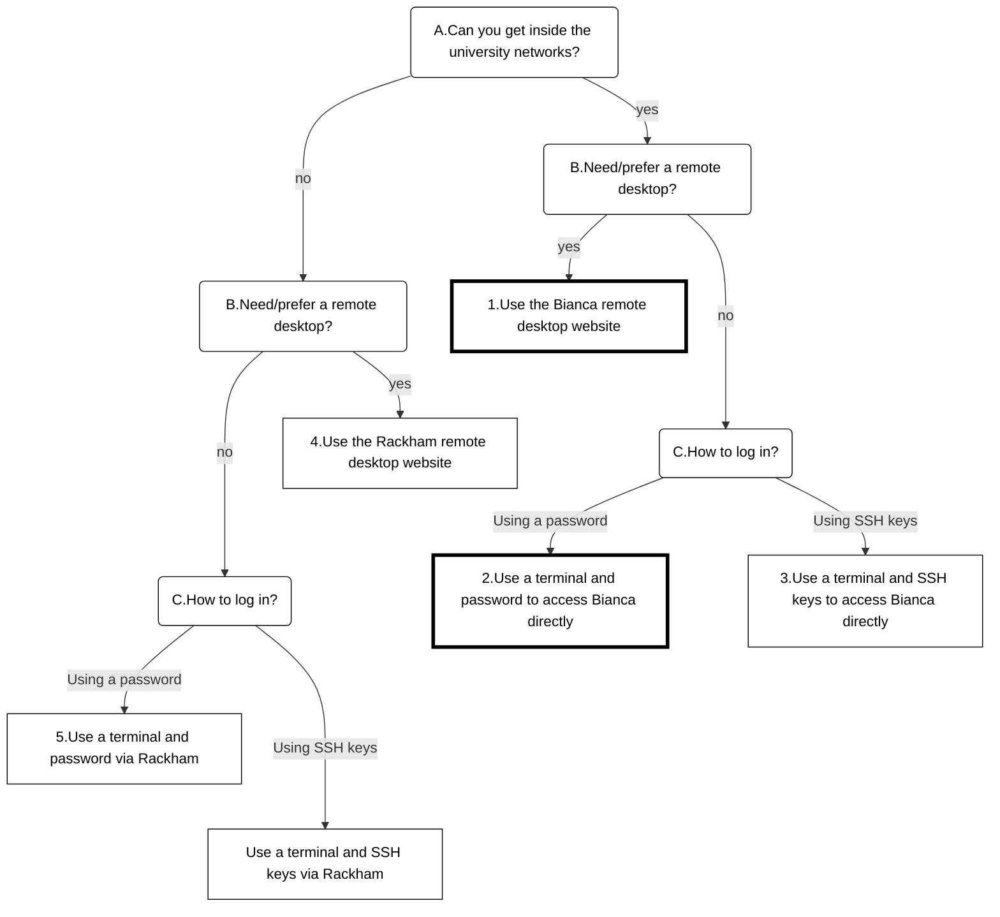

---
tags:
  - login
  - log in
  - Bianca
---

# Log in to Bianca

> The two Bianca environments to work on Bianca.
> At the left is a remote desktop environment.
> At the the right is the console environment.

There are multiple UPPMAX clusters one can [log in to](../getting_started/login.md).
Here it is described how to log in to [Bianca](../cluster_guides/bianca.md):

## Which way to log in to Bianca

After you've fulfilled all [prerequisites for using Bianca](bianca_usage_prerequisites.md),
there are many ways to log in to Bianca.

Here is the decision tree, with more detailed explanation below it:

> Decision tree on how to log in to Bianca.
> The nodes with a thicker outline are the ones used in courses.

Question A, 'Can you get inside the university networks?' is commonly answered
'yes' for anyone with an email address at a university in Sweden.
The [UPPMAX documentation on how to get inside the university networks](get_inside_sunet.md)
should allow anyone to do so.

Question B, 'Need/prefer a remote desktop?' is about if you prefer a
visual/graphical environment to work with Bianca, which will be similar to
what most of us are used to. A 'yes' is more suitable for new users,
although it is considered a more clunky (it responds slower on user input)
and clumsy (copy-pasting to it needs multiple mouse clicks) way to work.
A 'no' is more suitable for users comfortable with a terminal and works
smoothly.

???- question "How does the Bianca remote desktop look like?"

    One can pick multiple remote desktop environments,
    such as GNOME and XFCE (and KDE, don't pick KDE!).

    

    > The Bianca XFCE remote desktop environment

    

    > A more populated Bianca XFCE remote desktop

- A remote desktop environment, also called 'graphical environment',
  'GUI environment', '[ThinLinc](../software/thinlinc.md) environment'

???- question "How does the Bianca console environment look like?"

    

    > The Bianca console environment

- A console environment, also called 'terminal environment' or '[terminal](../software/terminal.md)'

Question C, 'How to log in?' is about how you prefer to login.
The option 'Using a password' is more suitable for new users,
as it is easy to setup and understand. However, one does need to type
his/her password every time one logs in. 'Using SSH keys' is harder
to setup, yet more convenient.

???- question "Will a local ThinLinc client work too?"

    No.

    One really can only access the Bianca remote desktop environment
    via the website.

Here are the ways to log in to Bianca:

- [1.Use the Bianca remote desktop website](login_bianca_remote_desktop_website.md)
- [2.Use a terminal and password to access Bianca directly](login_bianca_console_password.md)
- [3.Use a terminal and SSH keys to access Bianca directly](login_bianca_console_ssh_key.md)
- (Workaround if you are outside of SUNET) [4.Use a terminal and password via Rackham](login_bianca_console_password_no_sunet.md)
  to log in to Bianca's console environment
- (Workaround if you are outside of SUNET) [5.Use a terminal and SSH keys via Rackham](login_bianca_console_ssh_key_no_sunet.md)
  to log in to Bianca's console environment
- (Workaround if you are outside of SUNET) [6.Use the Rackham remote desktop website](login_bianca_remote_desktop_website_no_sunet.md)
  to log in to Bianca's remote desktop environment

After login, you will be on a [login node](../cluster_guides/login_node.md).

!!! note "How to behave on a login node"

    On a login node, one can and should do simple things only:
    it is a resource shared with all other users on that node.

    If you need to do more intense calculations,
    [use the Slurm job scheduler](../cluster_guides/slurm_on_rackham.md).

    If you need to do more intense calculations interactively,
    [use an interactive session](../cluster_guides/start_interactive_session_on_rackham.md).
