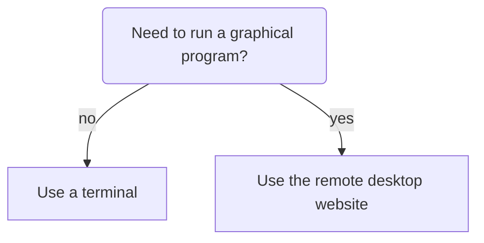
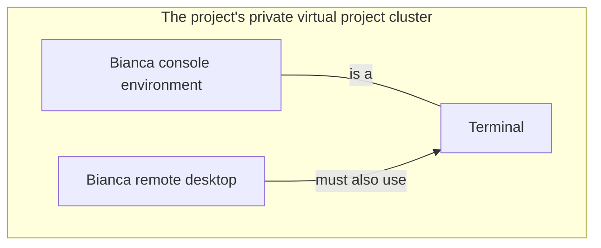
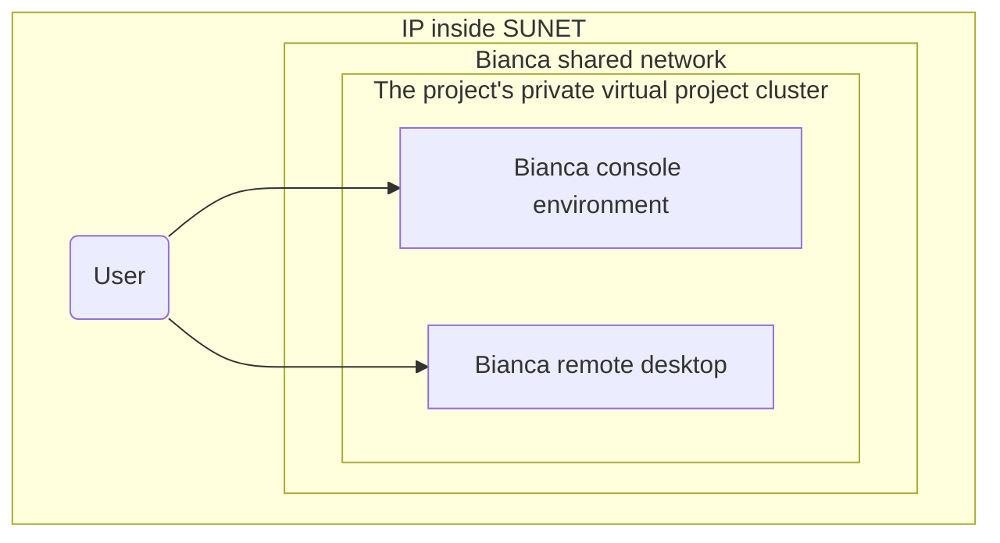
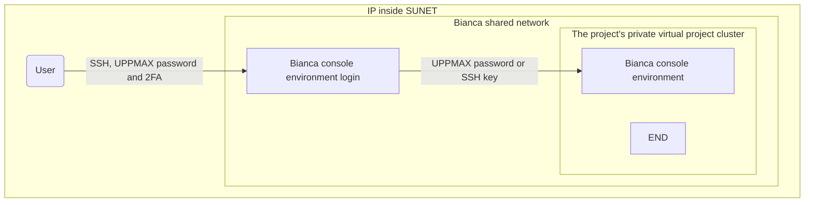
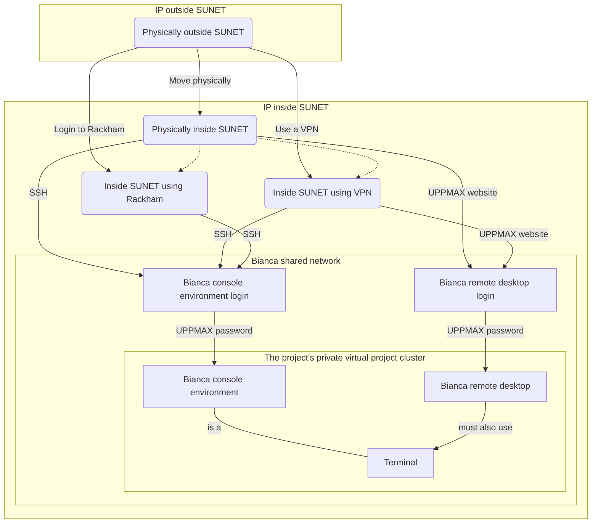

# Log in to Bianca

> The two Bianca environments to work on Bianca.
> At the left is a remote desktop environment.
> At the the right is the console environment.

Here it is described how to log in to [Bianca](../cluster_guides/bianca.md):

- [Bianca's design](../cluster_guides/biancas_design.md):
  helps understand why the procedure described here is needed.
- [Prerequisites](#bianca-usage-prerequisites) describes what is needed before one can access Bianca
- [The two Bianca environments](#the-two-bianca-environments) shows the two ways to access Bianca
- [Get within the university networks](#get-within-the-university-networks) shows how *to be allowed to* access Bianca
- [Get inside the Bianca environment](#get-inside-the-bianca-environment) show how access the two Bianca environments:
    - [Login to the Bianca remote desktop environment](#login-to-the-bianca-remote-desktop-environment)
    - [Login to the Bianca console environment](#login-to-the-bianca-console-environment)

## Login

There are multiple ways to login:

Login                |Description
---------------------|----------------------------------------------
Website              |Remote desktop, no installation needed, slow
Terminal             |Console environment, recommended

## Bianca usage prerequisites

To be allowed to use Bianca, one needs all of these:

- [ ] An active research project
- [ ] An UPPMAX account
- [ ] An UPPMAX password

These are discussed in more detail [here](bianca_usage_prerequisites.md).

## The two Bianca environments

Bianca, like most HPC clusters, uses Linux.
To use Bianca, there are two environments:

???- question "How does the Bianca remote desktop look like?"

    One can pick multiple remote desktop environments,
    such as GNOME and XFCE (and KDE, don't pick KDE!).

    

    > The Bianca XFCE remote desktop environment

    

    > A more populated Bianca XFCE remote desktop

- A remote desktop environment, also called 'graphical environment',
  'GUI environment', '[ThinLinc](../software/thinlinc.md) environment'

???- question "How does the Bianca console environment look like?"

    

    > The Bianca console environment

- A console environment, also called 'terminal environment' or 'terminal'

The [remote desktop environment](../software/thinlinc.md) is considered the easier place to start for most
new users, as it has most similarities with what a new user is familiar with.
However, one must always use a terminal to some extent.

> The two Bianca environments and their relation to a terminal.

## Get within the university networks

Bianca has sensitive data.
To protect this data,
Bianca is accessible from all Swedish university networks.
To be precise, to connect to Bianca one needs to so from a
[SUNET](https://www.sunet.se/) Internet Protocol ('IP') address.

Due to this, the first step to access Bianca
is to get an IP that is inside SUNET first.

See the 'get inside the university networks' page [here](../getting_started/get_inside_sunet.md)

## Get inside the Bianca environment

> The two Bianca environments to work on Bianca.
> At the left is a remote desktop environment.
> At the the right is the console environment.

???- question "Want a video?"

    - [Login to the Bianca remote desktop and Bianca console environment, physically inside SUNET](https://youtu.be/upBozh2BI5c?si=NXUHKyA1tNeZFeSR)
    - [Login to the Bianca remote desktop and Bianca console environment, outside of SUNET, use VPN](https://youtu.be/Ni9nyCf7me8?si=pL3Xna7XbV3G1QFi)
    - [Install VPN client, then login to the Bianca remote desktop using that VPN client](https://youtu.be/AIJKbJeu0MI?si=9ES3ZECykwc8tT28)
    - [Login to the Bianca remote desktop and Bianca console environment, outside of SUNET, no VPN](https://youtu.be/W-PMTyNcbYI?si=mT4h4utxH3owygAH)

When inside SUNET, one can access the Bianca environments.

- For a remote desktop environment,
  go to [login to the Bianca remote desktop environment](#login-to-the-bianca-remote-desktop-environment)
- For a console environment,
  go to [login to the Bianca console environment](#login-to-the-bianca-console-environment)

Below, the ways to access these Bianca environments
are discussed

### Login to the Bianca remote desktop environment

> The Bianca remote desktop environment

One can only [access Bianca remote desktop environment via a website](login_bianca_remote_desktop_website.md).

???- question "Will a local ThinLinc client work too?"

    No.

    One really can only [access Bianca remote desktop environment via a website](login_bianca_remote_desktop_website.md).

### Login to the Bianca console environment

> The Bianca console environment

When inside SUNET, one can access a Bianca console environment
using a terminal and the Secure Shell Protocol (SSH).

???- question "Forgot how to get within SUNET?"

    See the 'get inside the university networks' page [here](../getting_started/get_inside_sunet.md)

You can use your favorite terminal to login (see <https://uppmax.github.io/uppmax_intro/login2.html#terminals> for an overview of many)
to the Bianca command-line environment.
You can also have multiple log-ins active at once.

There are multiple ways to set this up:

- [Login to the Bianca console environment with a password](login_bianca_console_password.md).
- [Login to the Bianca console environment with an SSH key](login_bianca_console_ssh_key.md).

Using an SSH password is considered easiest,
where using an SSH key is considered more elegant.

In a Bianca console environment:

- Text display is limited to 50kBit/s.
  This means that if you create a lot of text output,
  you will have to wait some time before you get your prompt back.
- Cut, copy and paste work as usual.
  Be careful to not copy-paste sensitive data!

## Overview of all steps possible/needed to access Bianca

This is an overview of all steps possible/needed to access Bianca.
It is all graphs on this pages combined.

