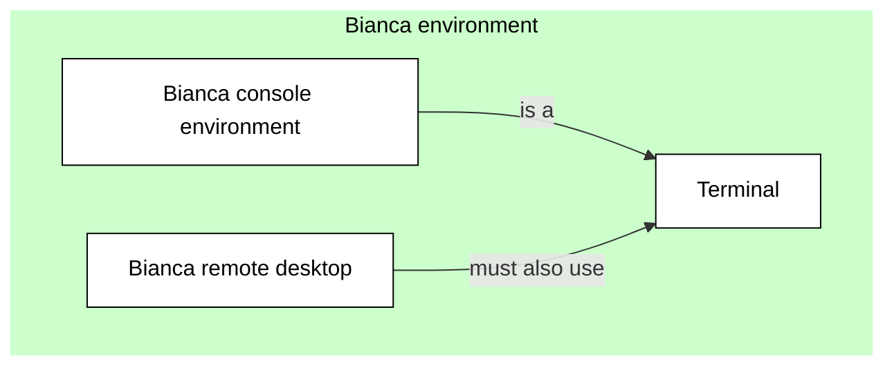

# Log in to Bianca

Here it is described how to login to Bianca:

- [Bianca's design](#Bianca's-design): 
  helps understand why the procedure described here is needed.
- [Prerequisites for using Bianca](#Prerequisites-for-using-Bianca)
- Get within the university network
- Login to Bianca remote desktop environment
- Login to Bianca console environment

## Bianca's design

Bianca was designed
- to make accidental data leaks difficult
- to make correct data management as easy as possible
- to emulate the HPC cluster environment that SNIC users were familiar with
- to provide a maximum amount of resources
- to satisfy regulations.

!!! info "Bianca has no internet"

    - Still you can log in, but it is done in two steps!
    - We recommend the ThinLink web portal, to enable graphics

## Prerequisites for using Bianca

In order to access Bianca you need to be a member of an active SNIC SENS 
or SIMPLER research project (these are called sensNNNNN or simpNNNNN, 
where N represent a digit). 
SUPR will tell you if you are a member 
and the account page should list the account on the 
resource bianca (this can also be useful to verify your username). 
If you do not have a project membership, 
you can request membership to an existing project in SUPR 
or read the SENS project application page to learn how to create a project.

Additionally, you must have a personal UPPMAX user account. 
This is separate from your SUPR account. 
See the user account application page if you do not have one. 

Once you are set up for login, 
this should also be reflected in SUPR through
 one or several additional account(s) 
at UPPMAX for the specific project(s) you are a member of.

Also note that you need to know your UPPMAX password. 
If you change it, it may take up to an hour before changes are reflected in bianca.

For advice on handling sensitive personal data correctly on Bianca, see our FAQ page.

## Log in to Bianca with ThinLinc

- Bianca offers graphical login
    - You need to be on SUNET or use VPN
    - On web:
        - [https://bianca.uppmax.uu.se](https://bianca.uppmax.uu.se)
        - requires [2-factor authentication](https://www.uppmax.uu.se/support/user-guides/setting-up-two-factor-authentication/)

### The log in steps
1. When you log in to [https://bianca.uppmax.uu.se](https://bianca.uppmax.uu.se), your SSH or ThinLinc client first meets the blue Bianca login node.
    - user name: `<username>-<projid>@bianca.uppmax.uu.se`
        - like: `myname-sens2016999@bianca.uppmax.uu.se`
    - password: your password, directly followed by the 6-digit 2-factor
        - like: verysecret678123
2. After checking your [2-factor authentication] this server looks for your virtual project cluster.
3. If it's present, then you are transferred to a login prompt on your cluster's login node. If not, then the virtual cluster is started.
    - you are prompted to give your username and password again, this time without projid and 2nd-factor:
         - username: <myname>
         - password: verysecret
4. Inside each virtual project cluster, by default there is just a one-core login node. When you need more memory or more CPU power, you submit a job (interactive or batch), and an idle node will be moved into your project cluster.


 


!!! info

    Check out or Bianca Portal for info about:
    - NAISS-SENS
    - Sensitive data
    - The Bianca solution
    - Tranfer of data
    
    

    
### Bianca has no Internet
... but we have “solutions”


- Bianca is only accessible from within Sunet (i.e. from university networks).
- Use VPN outside Sunet. [Link to VPN for UU](https://mp.uu.se/web/info/stod/it-telefoni/anvandarguider/network/vpn-service)
  - You can get VPN credentials from all Swedish universities.

<br>

- The whole Bianca cluster (blue) contains hundreds of virtual project clusters (green), each of which is isolated from each other and the Internet.
- Data can be transferred to or from a virtual project cluster through the Wharf, which is a special file area that is visible from the Internet.


## Text from https://www.uppmax.uu.se/support/user-guides/bianca-user-guide/

```
1. Set up TWO factor authentication

Follow the instructions in Setting up two factor authentication.

Please note that you need to set up two factor authentication for UPPMAX and not for SUPR! If you have multiple two factor codes registered the correct is labeled UPPMAX (as seen below highlighted in green).

2. Login

Bianca is accessible from all SUNET IP addresses, i.e. all Swedish university networks. It is generally NOT accessible from other networks. Use your university's VPN if needed.

The login procedure requires you to pass two separate authentication mechanisms (automatically connected together). The first one logs you into the general Bianca login node (which we call the jumphost). This is the step that requires two factor authentication. You will then be automatically redirected to your project's private login node, where you will get a new password prompt (unless you set up ssh-keys).

The user name you will use in the first step is your ordinary UPPMAX user name, followed by the project ID of the project you want to work on. One of the security measures on Bianca is that all projects are kept separate on their own virtual clusters, so you must tell Bianca which project's cluster you want to connect to.
Primary login (text login)

You can use any ssh-program in all normal platforms (Windows, Mac, Linux). You can have multiple log-ins active at once.

$ ssh -A <username>-<projid>@bianca.uppmax.uu.se
Ex.
$ ssh -A myname-sens2016999@bianca.uppmax.uu.se

As password you use your normal UPPMAX password directly followed by the six digits from the second factor application from step 1.

E.g. if your password is "VerySecret" and the second factor code is 123 456 you would type VerySecret123456 as the password in this step.

If the password is correct you will get a message of your projects login node status. It can be "up and running" or "down". If it is down it will automatically spin up, but this takes a few minutes. Then you will be automatically redirected to login at your project's private login node. To be able to login there you will have to give your UPPMAX password once again, but without the two factor authentication code this time. If your password is "VerySecret" you would type in VerySecret as password in this step. To skip this password in the future, you can use ssh-keys.

If the passwords have been entered correctly, you should now be connected and you will see the computer name at the start of the command line which looks something like this:

[myuser@sens2016999-bianca ~]$

This text login is limited to 50kBit/s, so if you create a lot of text output you will have to wait some time before you get your prompt back. The system supports all cut and paste mechanisms your client computer support, but of course you are not supposed to transfer any real data in or out through this mechanism — only commands and stuff like that.

Graphical login

Bianca does not support any X-forwarding, so to use graphical applications you need to have a full graphical desktop login. Bianca uses "Thinlinc" (in webaccess mode only) with XFCE as desktop environment for this. All you should need is a rather modern browser on any platform; we have tested on Chrome and Firefox.

Just browse to: https://bianca.uppmax.uu.se

The same principle with login name and password as with text logins: first step with user-project as username and password with password followed by second factor 6 digit number, and then second step to the login node for your specific project with normal username (and here you really have to type that – in text mode that is done automatically) and normal UPPMAX password (without second factor). The redirection to the correct project login node works automatically. If the login node is sleeping you will be informed what to do.

When you are logged into your graphical environment, the resizing and even fullscreen mode (in your browser) should work as expected.

Under the hidden tab in the left edge of the screen you can find a clipboard, some keys (where the keyboard versions often interfere with your local system) and the "disconnect" button. It is important to understand the difference of "disconnect session" and "end session". When you disconnect a session you will get back exactly in the same place you left the system; if you for example edit a file, your prompt will be in the same place you left it at the next login. If you use "logout" (end session) in the XFCE menus, the system will try to close all your windows and files and end the processes related to the login.

Bianca has a autodisconnect after 30 minutes of inactivity, and in the future it is possible that we implement some kind of "automatic log out from active graphical session". 

```

## Text from [Intro to Bianca](https://github.com/UPPMAX/bianca_workshop/blob/main/docs/login_bianca.md)

# Log in to Bianca


!!! info "Objectives" 

    - Observe that there are two ways to interact with Bianca
    - Observe that there are multiple ways to get inside SUNET
    - Log in to a terminal in the Bianca remote desktop
    - Log in to the Bianca console environment

???- info "Notes for teachers"

    Teaching goals:

    - The learners demonstrate to have logged in to the Bianca remote desktop environment 
      using the UPPMAX Bianca login website
    - The learners demonstrate to have started a terminal in the Bianca remote desktop environment
    - The learners demonstrate to have logged in to the Bianca console environment 

    Schedule (45 minutes):

    - 5 minutes: summarize page, start exercise
    - 30 minutes: let learners do exercise
    - 10 minutes: feedback

## Overview

Bianca is an HPC cluster for sensitive data.

???- tip "What is an HPC cluster for sensitive data?"

    What an HPC cluster for sensitive data is, is described 
    in general terms [here](overview.md).

As Bianca is an HPC cluster that should be as easy to 
use as possible, there are two ways to interact with Bianca:
one more visual, the other a command-line environment.
Both environments are shown below.

In either environment, one must use the terminal, to, for example,
start a job. As Bianca uses the Linux operating system,
the terminal uses Linux.

???- tip "Using the Linux terminal"

    Using the Linux terminal and learning the essential Linux commands 
    is part of this course and is described [here](linux.md).

As Bianca has sensitive data, there are constraints on how to
access Bianca. These constraints can be solved in multiple ways.
These procedures are shown below.

## The two Bianca environments and the terminal

Bianca, like most HPC clusters, uses Linux.
To use Bianca, there are two environments:


- A remote desktop environment, also called 'graphical environment', 
  'GUI environment', 'ThinLinc environment'. It looks like the picture above.


- A console environment, also called 'terminal environment' or 'terminal'
  It looks like the picture above.

The remote desktop environment is considered the easier place to start for most
new users, as it has most similarities with what a new user is familiar with.
However, one must always use a terminal to some extent.

???- tip "Using the Linux terminal"

    Using the Linux terminal and learning the essential Linux commands 
    is part of this course and is described [here](linux.md).




## Get inside SUNET

Bianca has sensitive data. 
To protect this data from leaking,
Bianca can only be access from within the
Swedish university network.
This network is called [SUNET](https://www.sunet.se/).

One cannot access Bianca outside of SUNET.
Hence, one must get inside SUNET first. 
There are these ways to do this:

- Physically move inside SUNET
- Use a virtual private network
- Use an HPC cluster within SUNET

Each of these three ways are described below.


### Physically move inside SUNET

One must be inside SUNET to access Bianca directly.
All Swedish university buildings are within SUNET.
Hence, working from a University building 
is a non-technical solution to get direct access to Bianca.

### Use a virtual private network

One must be inside SUNET to access Bianca directly.

A virtual private network (VPN) allows one to access Bianca indirectly:
your computer connects to the VPN within SUNET, where that VPN
accesses Bianca.

To be able to use a VPN to get inside of SUNET:

 * For Uppsala University: [go to this page](https://mp.uu.se/en/web/info/stod/it-telefoni/anvandarguider/network/vpn-service)
 * For other Swedish universities, search their websites to get a VPN setup

???- tip "Video"

    This video shows how to use an installed VPN,
    after which the UPPMAX Bianca login website is used to
    access the Bianca remote desktop environment: [YouTube](https://youtu.be/Ni9nyCf7me8), [download (.mp4)](https://richelbilderbeek.nl/login_bianca_vpn.mp4)

### Use an HPC cluster within SUNET

One must be inside SUNET to access Bianca directly.

An HPC cluster within SUNET (for example, Rackham)
allows one to access Bianca indirectly:
your computer connects to the HPC cluster within SUNET, 
after which one accesses Bianca.

When using this method, one can only use the
Bianca console environment.

## Get inside the Bianca environment

When inside SUNET, one can access the Bianca environments.

For a remote desktop environment, one can use:

- the UPPMAX Bianca login website at
  [http://bianca.uppmax.uu.se/](http://bianca.uppmax.uu.se/)
- a locally installed ThinLinc server

Note that the UPPMAX Bianca login website uses ThinLinc too,
which can give rise to confusion.

For a console environment, one can use:

- SSH, for a terminal environment

Below, the ways to access these Bianca environments 
are discussed


### Use the UPPMAX Bianca login website

When inside SUNET, one can access a remote desktop environment
using a website:

  1. In your web browser, go to [https://bianca.uppmax.uu.se](https://bianca.uppmax.uu.se)

  2. Fill in the first dialog. Do use the `UPPMAX` [2-factor authentication](https://www.uppmax.uu.se/support/user-guides/setting-up-two-factor-authentication/) (i.e. not SUPR!)

     


  3. Fill in the second dialog, using your regular password (i.e. no need for two-factor authentication)

     

     > The second Bianca remote desktop login dialog. 
     > Note that it uses ThinLinc to establish this connection
     
!!! warning

    - Avoid choosing the KDE desktop if you want graphics to work smoothly also in interactive sessions on the compute nodes, see below.
    - GNOME and XFCE has been proven better on this.
     
  5. Enjoy! You are in!

     

     > The Bianca remote desktop

???- tip "Video: using VPN"

    This video shows how to use an installed VPN,
    after which the UPPMAX Bianca login website is used to
    access the Bianca remote desktop environment: [YouTube](https://youtu.be/Ni9nyCf7me8), [download (.mp4)](https://richelbilderbeek.nl/login_bianca_vpn.mp4)

???- tip "Video: from within SUNET"

    This video shows how to use a terminal and SSH to access 
    the Bianca console environment: [YouTube](https://youtu.be/upBozh2BI5c), 
    [download (.ogv)](https://richelbilderbeek.nl/login_bianca_inside_sunet.ogv)


> When accessing the Bianca UPPMAX login website from outside of SUNET,
> nothing will appear in your browser.

### Use a locally installed ThinLinc server

This is beyond the scope of this course.

### Use SSH

When inside SUNET, one can access a console environment
using a terminal and the Secure Shell Protocol (SSH).

You can use your favorite terminal to login (see <https://uppmax.github.io/uppmax_intro/login2.html#terminals> for an overview of many)
to the Bianca command-line environment.

  1. From a terminal, use `ssh` to log in:

```bash
ssh [user]-[project name]@bianca.uppmax.uu.se
```

For example:

```bash
ssh richel-sens2023598@bianca.uppmax.uu.se
```

???- tip "Note for teachers: no `-X`"

    On Rackham, we do teach the learners to use `-X`:
   
    ```
    ssh -X username@rackham.uppmax.uu.se
    ```

    However, on Bianca, this so-called X-forwarding is disabled.
    Hence, we do not teach it :-)


 2. Type your UPPMAX password, 
    directly followed by the UPPMAX 2-factor authentication number,
    for example `verysecret678123`, then press enter

 3. Type your UPPMAX password,
    for example `verysecret`

 4. Enjoy! You are in!


???- tip "Video"

    This video shows how to use a terminal and SSH to access 
    the Bianca console environment: [YouTube](https://youtu.be/upBozh2BI5c), 
    [download (.ogv)](https://richelbilderbeek.nl/login_bianca_inside_sunet.ogv)


## Exercises


???- question "1. Your colleague visits [http://bianca.uppmax.uu.se/](http://bianca.uppmax.uu.se/) and sees nothing appear on the website (see also image above). What is likely the problem?"

    He/she is not inside of SUNET. 
    Show him/her the section above on how to get into SUNET.

???- question "2. Exercise: login into the Bianca remote desktop"

    The goal of this exercise is: (1) troubleshooting, to make sure one can access
    this environment (2) see how it looks like, this may help one decide to
    use this environment yes of no.

    Note that you have to be within SUNET.

???- question "3. Exercise: start a terminal in the Bianca remote desktop environment"

    The goal of this exercise is that one makes him/herself slightly
    familiar within the remote desktop environment. When one knows where
    it is, this exercise takes literally one mouse click.

???- question "4. Exercise: login into the Bianca console environment"

    The goal of this exercise is: (1) troubleshooting, to make sure one can access
    this environment (2) see how it looks like, this may help one decide to
    use this environment yes of no.

    Do this after having logged in to the Bianca remote desktop,
    as most troubleshooting occurs in that exercise.

???- question "5. Your colleague finds out that one can run scripts with calculations directly on the login node. This saves him/her much time waiting for a calculation to start. Is this OK and why?"

    For that colleague, there seems to be no problem. 
    However, for everyone else this is a problem,
    as the login node is a *shared* node.

    The colleague will be asked to *schedule* his/her jobs instead.
    This is usually done by an email from the UPPMAX staff.

    Requesting a calculation to run is part of this course 
    and is described [here](slurm_intro.md).
    This is done by using the SLURM scheduler.

???- question "6. You are developing code on Bianca. You write the code line-by-line and schedule a test run after each addition. However, after each new line, it takes a couple of minutes before you know your code worked yes/no. How could you develop your code quicker?"

    This is the typical use-case to use an interactive node.
    One could also consider to develop code on a local computer 
    instead (which uses nonsensitive/simulated/fake testing data)
    and upload the final code instead.

    Requesting an interactive node is part of this course 
    and is described on this page.

## Conclusions

 * Bianca makes it hard to leak data
 * Login differs from where you are and what you need

## Extra material

### The relation between Bianca and the Internet


> The relation between Bianca and the Internet

### The ways to access Bianca's environments


