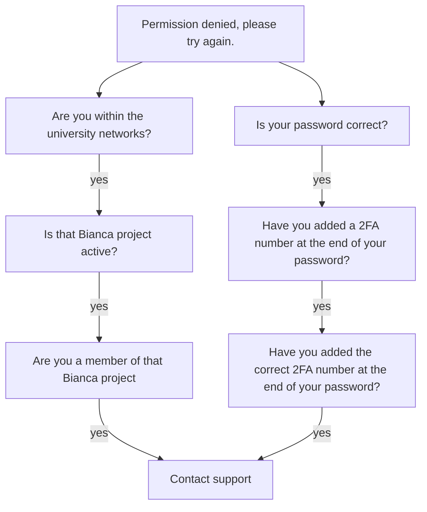

---
tags:
  - login
  - log in
  - Bianca
  - console
  - terminal
  - password
---

# Login to the Bianca console environment with a password

There are multiple ways to [log in to Bianca](login_bianca.md).

This page describes how to [log in to Bianca](login_bianca.md)
using a [terminal](../software/terminal.md) and a password:

- [Procedure](#procedure): describes the procedure
- [Troubleshooting](#troubleshooting): describes how to fix errors

## Procedure

???- tip "Video: how to use a terminal and SSH to access the Bianca console environment"

    This video shows how to use a terminal and SSH to access
    the Bianca console environment: [YouTube](https://youtu.be/7mKDxnXqi_M)

### 1. Get inside the university networks

Get inside the university networks.

???- question "Forgot how to get within the university networks?"

    See the 'get inside the university networks' page [here](../getting_started/get_inside_sunet.md)

### 2. Use `ssh` to log in

From a [terminal](../software/terminal.md), use [`ssh`](../software/ssh.md) to log in:

```bash
ssh [user]-[project name]@bianca.uppmax.uu.se
```

For example:

```bash
ssh sven-sens2023598@bianca.uppmax.uu.se
```

???- question "How does this look like (when inside of SUNET)?"

    ```bash
    ssh sven-sens2023598@bianca.uppmax.uu.se
    ```

    After which a password will be asked. Go to the next step.

???- question "How does it look like when outside of SUNET?"

    ```bash
    $ ssh sven-sens2023598@bianca.uppmax.uu.se
    ```

    After which there is only waiting...

???- question "Why no `-A`?"

    On Bianca, one can use `-A`:

    ```bash
    ssh -A username@bianca.uppmax.uu.se
    ```

    this option is only useful when you want to
    [log in to Bianca via the console using an SSH key](login_bianca_console_ssh_key.md).
    As we here use passwords (i.e. no SSH keys)
    to access Bianca, `-A` is unused
    and hence we simplify this documentation by omitting it.

???- question "Why no `-X`?"

    On Rackham, one can use `-X`:

    ```bash
    ssh -X username@rackham.uppmax.uu.se
    ```

    However, on Bianca, this so-called
    [X forwarding](../software/ssh_x_forwarding.md) is disabled.
    Hence, we do not teach it :-)

### 3. Type your UPPMAX password with 2FA

Type your UPPMAX password,
directly followed by the UPPMAX 2-factor authentication number,
for example `verysecret678123`, then press enter.
In this case, the password is `verysecret` and `678123`
is the 2FA number.

???- question "How does this look like?"

    ```bash
    sven@sven-N141CU:~/GitHubs/UPPMAX-documentation/docs/getting_started$ ssh sven-sens2023598@bianca.uppmax.uu.se
    sven-sens2023598@bianca.uppmax.uu.se's password: 
    ```

   After which you'll asked for another password. Go to the next step.


After authenticated using the UPPMAX password and 2FA,
you are logged in on Bianca's shared network,
on a so-called 'jumphost'.

However, you will still need to login to your own
private virtual project cluster.
As you are already properly authenticated (i.e. using an UPPMAX password
and UPPMAX 2FA), you don't need 2FA anymore.

???- question "What is a virtual project cluster?"

    As Bianca holds sensitive data, by regulations,
    each Bianca project must be isolated from each other
    and are not allowed to, for example, share the same memory.

    One way to achieve this, would be to build one HPC cluster
    per project. While this would guarantee isolated project environments,
    this would be quite impractical.

    Instead, we create isolated project environments by using software,
    that creates so-called virtual clusters, as if they would be
    physical clusters. Like physical clusters, a virtual cluster
    has a guaranteed isolated project environment.

When you login to Bianca's shared network,
you will get a message of your project's login node status.
It can be `up and running` or `down`.
If it is `down`, the virtual cluster is started,
which may take some minutes.

### 4. Type your UPPMAX password

Type your UPPMAX password,
for example `verysecret`

???- question "How does this look like?"

    ```bash
    Last login: Thu Sep 19 08:54:12 2024 from vpnpool188-186.anst.uu.se
    Notice(s) for upcoming maintenance on bianca:

      Lost e-mail support tickets, working again
      http://status.uppmax.uu.se/2024-09-19/lost-tickets/

    ****************************************************************************
    * Login node up and running. Redirecting now!                              *
    * Notice! No second factor if you use password.                            *
    * If you use ssh keys, you can get rid of this (second) prompt.            *
    ****************************************************************************

    sven@sens2023598-bianca.uppmax.uu.se's password: 
    ```

### 5. You are in

Enjoy! You are in! Or, to be precise,
you are on the [login node](../cluster_guides/login_node.md) of your own virtual project cluster.

???- question "How does this look like?"

    ```bash
     _   _ ____  ____  __  __    _    __  __
    | | | |  _ \|  _ \|  \/  |  / \   \ \/ /   | System:    sens2023598-bianca
    | | | | |_) | |_) | |\/| | / _ \   \  /    | User:      sven
    | |_| |  __/|  __/| |  | |/ ___ \  /  \    | 
     \___/|_|   |_|   |_|  |_/_/   \_\/_/\_\   | 

    ###############################################################################

            User Guides: http://www.uppmax.uu.se/support/user-guides
            FAQ: http://www.uppmax.uu.se/support/faq

            Write to support@uppmax.uu.se, if you have questions or comments.
    ````

!!! note "How to behave on a login node"

    On a login node, one can and should do simple things only:
    it is a resource shared with all other users on that node.

    If you need to do more intense calculations,
    [use the Slurm job scheduler](../cluster_guides/slurm_on_rackham.md).

    If you need to do more intense calculations interactively,
    [use an interactive session](../cluster_guides/start_interactive_node_on_rackham.md).

By default, this node has one core,
hence if you need more memory or more CPU power,
you submit a job (interactive or batch),
and an idle node will be moved into your project cluster.

## Troubleshooting

Here are some common errors and their solutions:

### Permission denied, please try again

```bash
Permission denied, please try again.
```

Here are the questions we will ask to solve your problem:



???- question "How do I know my password is correct?"

    You don't.

    It could be a typo: you don't see your password when you type (this is a
    security measure), so a typo is likely to occur. Also check if 'Caps Lock'
    is off.

    It could be that you've forgotten your password. That can happen to all of
    us. You can then reset your password at <https://suprintegration.uppmax.uu.se/getpasswd>

???- question "What do you mean 'Have you added a 2FA number at the end of your password?'?"

    When you type your password, this needs to be followed by a two-factor authentication
    number.

    For example, if your password is `verysecret` and `314159` is the 2FA number,
    you should type `verysecret314159`

???- question "What is the correct 2FA number?"

    The UPPMAX one, titled `[username]@UPPMAX`, for example `sven@UPPMAX`.

    When using UPPMAX, one needs to create other 2FAs too, such as for SUPR
    or the Uppsala VPN. Don't use those numbers to login to Bianca.

???- question "How do I know if I am within the university networks?"

    If you login via `eduroam` you are within the university networks.

    When unsure, go to the Bianca remote desktop website at
    [https://bianca.uppmax.uu.se](https://bianca.uppmax.uu.se):
    if this page does not load, you are outside of the university networks.

    See [How to get inside of the university networks](../getting_started/get_inside_sunet.md)
    if you outside of the university networks.

???- question "How do I know if the Bianca project is active?"

    A quick way to confirm your Bianca project is active:
    go to <https://bianca.uppmax.uu.se>
    and type your username. If the project is displayed, it is active.

    To confirm your project is active or inactive, use the SUPR NAISS website.
    See [the UPPMAX documentation on projects](../getting_started/project.md)
    how to see if your project is active?

???- question "How do I know if I am a member of the Bianca project?"

    A quick way to confirm you are a member of the Bianca project:
    go to <https://bianca.uppmax.uu.se>
    and type your username. If the project is displayed,
    you are a member of the Bianca project.

    To confirm your project is active or inactive, use the SUPR NAISS website.
    See [the UPPMAX documentation on projects](../getting_started/project.md)
    how to see which projects you are a member of.

See [the UPPMAX page on contacting support](../support.md)
on how to contact us.
