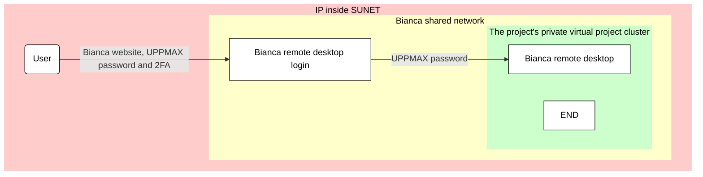

# Login to the Bianca remote desktop environment via a ThinLinc client

There are multiple ways to [log in to Bianca](login_bianca.md).

This page describes how to [log in to Bianca](login_bianca.md)
using a remote desktop that is accessible via a
local [ThinLinc](../software/thinlinc.md) client.

## Procedure

### 1. Install ThinLinc

Install ThinLinc. For help, see [the UPPMAX page on ThinLinc](../software/thinlinc.md).

### 2. Get inside SUNET

As Bianca is an HPC cluster for sensitive data,
one needs to be within SUNET to be able to access her.

???- question "Forgot how to get within SUNET?"

    See the 'get inside the university networks' page [here](../getting_started/get_inside_sunet.md)

### 3. Start ThinLinc

???- warning "To UPPMAX staff"

    Here, I (Richel) cannot get it to work. Below 

In the ThinLinc login dialog, set:

- the server name to `bianca-gui.uppmax.uu.se`
- your username to `[username]-[project_id]`, e.g. `sven-sens123456`

???- question "How does that look like?"

    

    > The ThinLinc login dialog

???- question "Why not use `https://www.bianca-gui.uppmax.uu.se`?"

    Because that does not work :-)

???- question "Why not use `bianca.uppmax.uu.se`?"

    Because that does not work :-)

### 3. Connecting

You can connect with ThinLinc to get a graphical desktop session on a login node.
These are subject to the same limitations normal login sessions
are (memory and run time limits, don't do anything that might disturb other users).

In addition to the normal limitations, login node connections may have
short (10-15) minute idle timeouts meaning your session may disappear if you leave it.

### Making the connection

After downloading and installing, you can launch the ThinLinc client,
and should see a form where you can enter your username and
password (and possibly a server name). If you only see the simple form:

you can click Advanced to be able to set the server name to connect to.
Provided you have set it up earlier, you can also use key based authentication.

## Two factor authentication

The ThinLinc client connects over SSH which means
it may be required to present a code from two factor authentication.
The ThinLinc client does not know to ask for this
so you will need to use the grace time feature,
similar to file transfers with SFTP/rsync.
To do this, first you have to connect with regular SSH
and present the required code.
Once you have logged in over SSH you can safely exit again.
The login server will remember that you just logged in for a few minutes
and not ask for two factor authentication again,
so make sure you do not wait too long to connect with the ThinLinc client.

## 6. You are in

Enjoy! You are in! You are on a Bianca login node!

!!! note "How to behave on a login node"

    On a login node, one can and should do simple things only:
    it is a resource shared with all other users on that node.

    If you need to do more intense calculations,
    [use the Slurm job scheduler](../cluster_guides/slurm_on_bianca.md).

    If you need to do more intense calculations interactively,
    [use an interactive node](../cluster_guides/start_interactive_node_on_bianca.md).

???- question "How does the remote desktop look like?"

    

    > The Bianca remote desktop

???- tip "Video: using VPN and access the remote desktop"

    This video shows how to use an installed VPN,
    after which the UPPMAX Bianca login website is used to
    access the Bianca remote desktop environment:
    [YouTube](https://youtu.be/Ni9nyCf7me8),
    [download (.mp4)](https://richelbilderbeek.nl/login_bianca_vpn.mp4)

Under the hidden tab in the left edge of the screen,
you can find a clipboard,
icons of some special keys
and the disconnect button:

- the clipboard is needed to be able to copy-paste text to/from Bianca.
- the icons of some special keys are needed for some users,
  as not all keyboard keys reach Bianca as expected.
- the disconnect button disconnects your session

???- question "What is the difference between 'disconnect session' and 'end session'?"

    'disconnect session' will save the current state of your session.
    When you connect again, you will get the remote desktop back
    in exactly in the same place you left the system.
    For example: if you were editing a file before disconnecting,
    your prompt will be in the same place you left it.

    'end session' will not save the current state of your session.
    Instead, you will start with a clean slate at the next login.

Bianca has a automatically disconnect after 30 minutes of inactivity.
In the future it is possible that we implement some kind
of "automatic log out from active graphical session".

