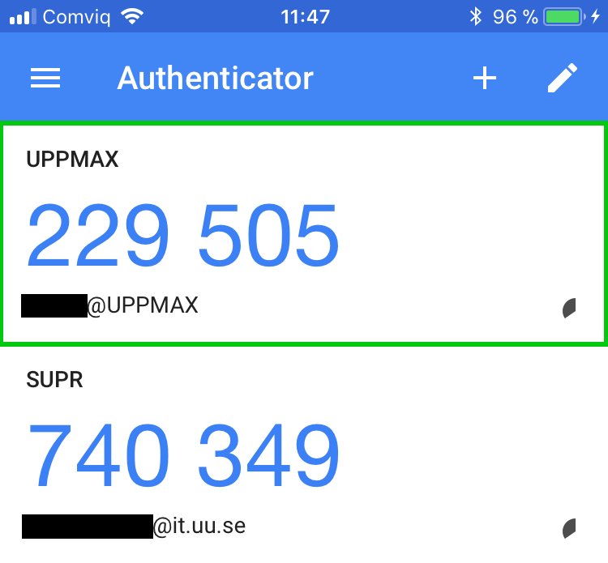
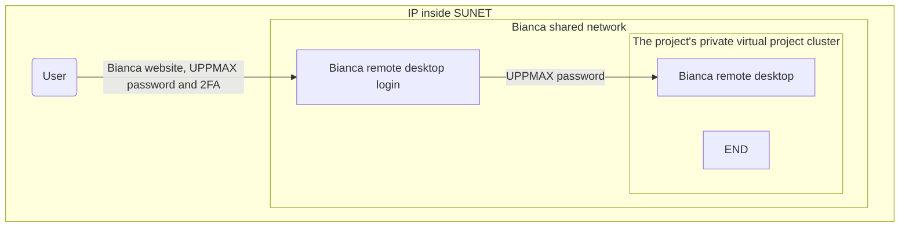

---
tags:
  - login
  - log in
  - Bianca
  - remote desktop
  - website
  - URL
---

# Log in to the Bianca remote desktop environment website

> The Bianca remote desktop environment

There are multiple ways to [log in to Bianca](login_bianca.md).

This page describes how to [log in to Bianca](login_bianca.md)
using a remote desktop that is accessible from a webbrowser.

## Procedure

???- question "Prefer a video?"

    See this page explained in
    [a YouTube video here](https://youtu.be/UpNI5OUlIo8)

### 1. Get inside SUNET

As Bianca is an HPC cluster for sensitive data,
one needs to be within SUNET to be able to access her.

???- question "Forgot how to get within SUNET?"

    See the 'get inside the university networks' page [here](../getting_started/get_inside_sunet.md)

Bianca does not support any so-called
[X forwarding](../software/ssh_x_forwarding.md) (unlike Rackham),
so instead UPPMAX maintains a website that uses
[ThinLinc](../software/thinlinc.md) to get a full remote desktop environment.
All you should need is a rather modern browser on any platform.

???- question "How does it look like to try to access a remote desktop from outside of SUNET?"

    

    > When accessing the Bianca UPPMAX login website from outside of SUNET,
    > nothing will appear in your browser.

    You can see it in action [in this video](https://youtu.be/W-PMTyNcbYI?si=9oQP29a7OLo3mVrt&t=160) you can
    see how this looks like when outside of SUNET.

    It looks quite dull, as nothing happens until these is a timeout.

???- question "Will a local ThinLinc client work too?"

    No.

    One really can only access Bianca remote desktop environment via a website

When inside SUNET, one can access a remote desktop environment using a website:

### 2. Go to [https://bianca.uppmax.uu.se](https://bianca.uppmax.uu.se)

[When inside SUNET](../getting_started/get_inside_sunet.md),
in your web browser, go to [https://bianca.uppmax.uu.se](https://bianca.uppmax.uu.se).

???- question "How does it look like when outside of SUNET?"

    

    > When accessing the Bianca UPPMAX login website from outside of SUNET,
    > nothing will appear in your browser.

    You can see it in action [in this video](https://youtu.be/W-PMTyNcbYI?si=9oQP29a7OLo3mVrt&t=160) you can
    see how this looks like when outside of SUNET.

    It looks quite dull, as nothing happens until these is a timeout.

### 3. Fill in the first dialog

Fill in the first dialog.

Do use the `UPPMAX` [2-factor authentication](https://www.uu.se/en/centre/uppmax/get-started/2-factor) (i.e. not SUPR!)

???- question "How do I setup 2-factor authentication?"

    See the guide at [2-factor authentication](https://www.uu.se/en/centre/uppmax/get-started/2-factor)
    to setup an UPPMAX 2-factor authentication method.

    You really need to use the UPPMAX 2-factor authentication,
    i.e not the SUPR one, to login to Bianca.

    

    > Screenshot of a two-factor authentication app.
    > Use the 2-factor authentication called 'UPPMAX'
    > to access Bianca

???- question "How does that web page look like?"

    

    > The first page of [https://bianca.uppmax.uu.se](https://bianca.uppmax.uu.se)

Sometimes a webpage will be shown that asks you to wait.
Simply do that :-)

???- question "How does that web page look like?"

    

    > No Thinlinc Web Access active
    > The login node for your project cluster is probably asleep. Boot initiated. The startup can take from 2 to 8 minutes.
    >
    > This page will attempt to automatically reload. If nothing happens even after multiple minutes, you can do so manually. It is a bit more controlled in text mode.
    >
    > When this takes long, your original second factor code might expire. In that scenario, you'll be redirected to the first login page again.

    This is the webpage that is shown when a login node needs to be created.

### 4. Fill in the second dialog, using your regular password

Fill in the second dialog, using your regular password (i.e. no need for two-factor authentication).

???- question "How does that web page look like?"

    

    > The second Bianca remote desktop login dialog.
    > Note that it uses [ThinLinc](../software/thinlinc.md) to establish this connection

### 5. Picking a remote desktop flavor, but not KDE

When picking a remote desktop flavor, pick GNOME or XFCE, avoid picking KDE.

???- question "How does that look like?"

    

    > Here you are told you will need to pick a remote desktop flavor

    

    > Here you are asked to pick a remote desktop flavor,
    > with Xfce as the default.
    > Pick any, except KDE.

!!! warning "Avoid choosing KDE"

    Avoid choosing the KDE desktop, as it gives problems when running interactive sessions.

    Instead, we recommend GNOME or XFCE.

### 6. You are in

Enjoy! You are in: you are now on a Bianca [login node](../cluster_guides/login_node.md).

???- question "How do I copy-paste text?"

    The Bianca remote desktop environment via a website
    uses [ThinLinc](..se/software/thinlinc).

    At [the ThinLinc page](..se/software/thinlinc) you can find
    how to work with its interface.

!!! note "How to behave on a login node"

    On a login node, one can and should do simple things only:
    it is a resource shared with all other users on that node.

    If you need to do more intense calculations,
    [use the Slurm job scheduler](../cluster_guides/slurm_on_rackham.md).

    If you need to do more intense calculations interactively,
    [use an interactive node](../cluster_guides/start_interactive_node_on_rackham.md).

???- question "What is the difference between 'disconnect session' and 'end session'?"

    'disconnect session' will save the current state of your session.
    When you connect again, you will get the remote desktop back
    in exactly in the same place you left the system.
    For example: if you were editing a file before disconnecting,
    your prompt will be in the same place you left it.

    'end session' will not save the current state of your session.
    Instead, you will start with a clean slate at the next login.

Bianca has a automatically disconnect after 30 minutes of inactivity.
In the future it is possible that we implement some kind
of "automatic log out from active graphical session".

## Troubleshooting

### Access denied

???- question "How does that look like?"

    

[Contact support](../support.md).

### Authentication failed

???- question "How does that look like?"

    

[Contact support](../support.md).
