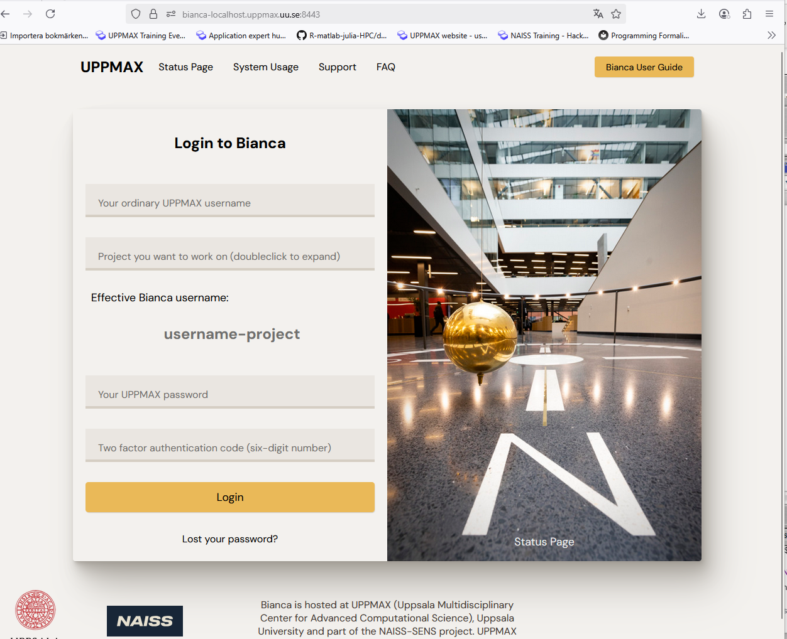

---
tags:
  - login
  - log in
  - Bianca
  - remote desktop
  - website
  - URL
  - out
  - outside
  - SUNET
  - university networks
search:
  boost: 1
---

# Log in to the Bianca remote desktop environment website from outside of the Swedish university networks

If you cannot use VPN this may be the solution for you.

!!! bug

    This procedure is not currently working, unfortunately

!!! danger

    - Do not log in "normally" with ThinLinc (web or client) to Pelle or other cluster and from there log in to Bianca.
    - This will let all sensitive data land on the Pelle uncrypted as an intermediate step.
    - Pelle (and other clusters) is not a secure system and could be spied on.

## Procedure

From the terminal, connect to Pelle or other SUNET server with ``ssh`` and forward local connection from your computer to Bianca web interface.

Example Pelle:

```bash
ssh -L 8443:bianca:443 sven@pelle.uppmax.uu.se
```

Example Tetralith (NSC):

```bash
ssh -L 8443:bianca.uppmax.uu.se:443 sven@tetralith.liu.nsc.se
```

- In your browser, enter the following web address [https://bianca-localhost.uppmax.uu.se](https://bianca-localhost.uppmax.uu.se)
    - Do not forget ``https://``
- You may need to add ``:8443`` so: [https://bianca-localhost.uppmax.uu.se:8443](https://bianca-localhost.uppmax.uu.se:8443)


