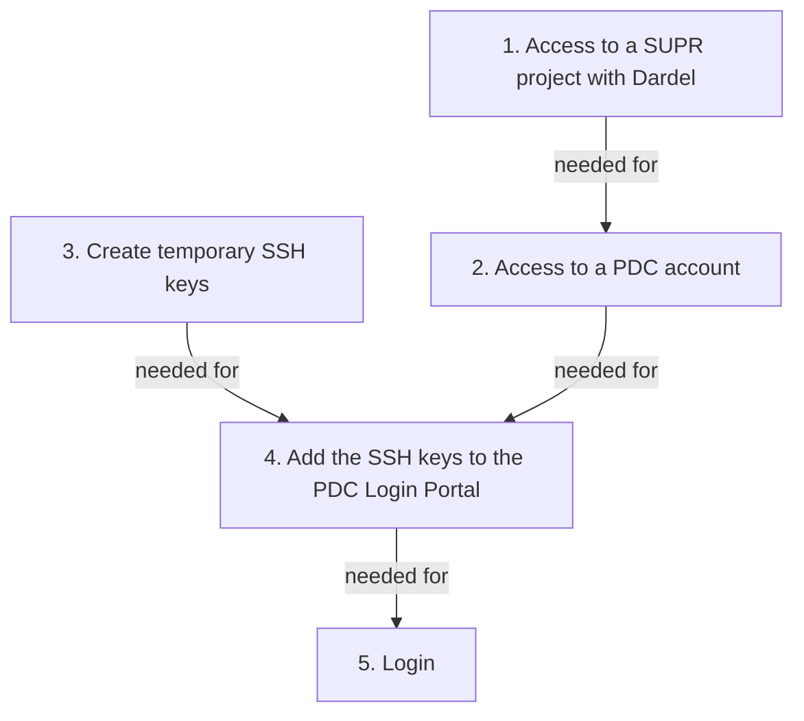

# Log in to Dardel

Here it is described how to login to Dardel.

## How do I do this?

First, we are here to help.
Please [contact support](../support.md) if you run into problems
when trying the guide below.

Note that step 1 requires some hours of waiting
and step 2 requires an overnight wait.



> Overview of the migration process.
> Note that step 1 requires some hours of waiting
> and step 2 requires an overnight wait.

### 1. Get access to a SUPR project with Dardel

First step is to get get access to a SUPR project with Dardel.
This is described at [PDC's page on getting access to Dardel](https://www.pdc.kth.se/support/documents/getting_access/get_access.html).
You will get an email when you are added to a project,
this can take some hours.

???- question "How do I know I have access to a Dardel project?"

    Login to [https://supr.naiss.se/](https://supr.naiss.se/).
    If there is a PDC project,
    you may have access to a project with Dardel.

    

    > Example user that has access to a PDC project

    If you may a PDC project that does not use Dardel,
    click on the project to go the the project overview.

    

    > Example PDC project overview

    From there, scroll down to 'Resources'.
    If you see 'Dardel' among the compute resources, 
    you have confirmed you have access to a Dardel project.

    

    > Resources from an example PDC project

### 2. Get a PDC account via SUPR

Get a PDC account via SUPR.
This is described at [the PDC page on getting access](https://www.pdc.kth.se/support/documents/getting_access/get_access.html#supr-account).
You will get a PDC account overnight.

???- question "How do I know I have a PDC account?"

    Login to [https://supr.naiss.se/](https://supr.naiss.se/).
    and click on 'Accounts' in the main menu bar at the left.

    If you see 'Dardel' among the resources, and status 'Enabled'
    in the same row, you have a PDC account!

    

    > Example of a user having an account at PDC's Dardel HPC cluster

### 3. Create SSH key pair

Create SSH key and add it to the PDC Login Portal.

- Create the password less SSH key in a Linux terminal (e.g. from Rackham):


```bash
module load darsync
```


```bash
darsync sshkey
```

### 4. Add the public key to the PDC Login Portal

When creating the SSH key pair, `darsync` will already
display the public key.

If, however, you missed it,
you can view the public SSH key again; in a terminal logged into Rackham:

```
cat ~/id_ed25519_pdc.pub
```

???- question "How does that look like?"

    The text will look similar to this:

    ```
    ssh-ed25519 AAAA69Nz1C1lZkI1NdE5ABAAIA7RHe4jVBRTEvHVbEYxV8lnOQl22N+4QcUK+rDv1gPS user@rackham2.uppmax.uu.se
    ```

Open the [PDC Login Portal](https://loginportal.pdc.kth.se/).

Follow our [step-by-step instructions on how to add SSH keys](../cluster_guides/dardel_ssh_key_create_and_upload.md).

### 5. Login


- the [PDC documentation on 'Login to Dardel'](https://www.pdc.kth.se/support/documents/basics/quickstartdardel.html#how-to-log-in)

On a terminal, do:

```
ssh -X [username]@dardel.pdc.kth.se
```

where `[username]` is your PDC username, for example `ssh -X sven@dardel.pdc.kth.se`.

???- question "Why the `-X`?"

    The `-X` is for so-called [X forwarding](../software/ssh_x_forwarding.md). 
    It allows you to view graphical things, 
    such as viewing plots or running graphical programs

