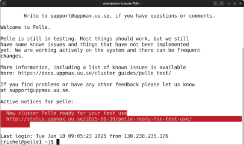
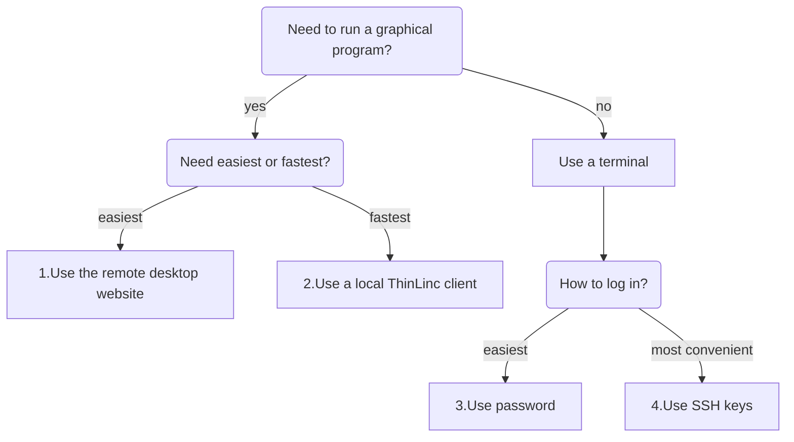

---
tags:
  - login
  - log in
  - Pelle
---

# Log in to Pelle

There are multiple UPPMAX clusters one can [log in to](../getting_started/login.md).
Here we describe how to log in to [Pelle](../cluster_guides/pelle.md).

- [Prerequisites](pelle_usage_prerequisites.md) describes what is needed before one can access Pelle
- [Which way to login?](#which-way-to-login)
    - [Website](login_pelle_remote_desktop_website.md)
    - [Terminal](login_pelle_console_password.md)
    - [Local ThinLinc client](login_pelle_remote_desktop_local_thinlinc_client.md)

## Which way to login?

There are multiple ways to log in to [Pelle](../cluster_guides/pelle.md):

Login                                                                         |Description                                   |Screenshot
------------------------------------------------------------------------------|----------------------------------------------|---------------------------------
[Website](login_pelle_remote_desktop_website.md)                              |Does not work yet. Remote desktop, no installation needed, slow  |Under construction
[Terminal](login_pelle_console_password.md)                                   |Console environment, recommended              |
[Local ThinLinc client](login_pelle_remote_desktop_local_thinlinc_client.md)  |Remote desktop, recommended, need installation|

Here is a decision tree, to determine which way to log in:

The procedures can be found at:

- [1.Login to the Pelle remote desktop environment using the website](login_pelle_remote_desktop_website.md)
- [2.Login to the Pelle remote desktop environment using a local ThinLinc client](login_pelle_remote_desktop_local_thinlinc_client.md)
- [3.Login to the Pelle console environment with a password](login_pelle_console_password.md).
- [4.Login to the Pelle console environment with an SSH key](login_pelle_console_ssh_key.md)

After login, you will be on a [login node](../cluster_guides/login_node.md).

!!! note "How to behave on a login node"

    On a login node, one can and should do simple things only:
    it is a resource shared with all other users on that node.

    If you need to do more intense calculations,
    [use the Slurm job scheduler](../cluster_guides/slurm_on_pelle.md).

    If you need to do more intense calculations interactively,
    [use an interactive session](../cluster_guides/start_interactive_session_on_pelle.md).
