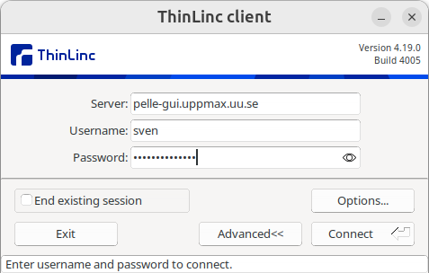
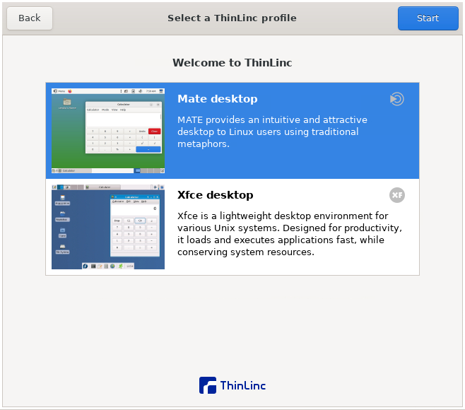

---
tags:
  - login
  - log in
  - Pelle
  - remote desktop
  - local
  - ThinLinc
  - ThinLinc client
  - program
  - tool
---

# Log in to Pelle's remote desktop environment using a local ThinLinc client

There are multiple ways to [log in to Pelle](login_pelle.md).
This page described how to log in to its remote desktop environment
via a local [ThinLinc](../software/thinlinc.md) client.

## Procedure

???- question "Prefer a video?"

    TODO

### 1. Install ThinLinc

Install ThinLinc. For help, see [the UPPMAX page on ThinLinc](../software/thinlinc.md).

### 2. Start ThinLinc

In the ThinLinc login dialog,

- set the 'Server' name to `pelle-gui.uppmax.uu.se`
- set the 'Username' to your UPPMAX username, e.g. `sven`
- set the 'Password' to your UPPMAX password

???- question "How does that look like?"

    

    > The ThinLinc login dialog

???- question "Why not use `https://www.pelle-gui.uppmax.uu.se`?"

    Because that does not work :-)

### 3. (first time only) Connect to Pelle

If you are warned about a key, click on 'Continue'
if the key matches the one in the dialog below:

### 4. Fill in your 2FA TOTP

When asked for a TOTP ('Time-based one-time password'),
get it from the `UPPMAX` [2-factor authentication](get_uppmax_2fa.md) (i.e. not SUPR!)

???- question "How does that look like?"

    

    > Pelle asking for a TOTP

???- question "How do I setup 2-factor authentication?"

    See the guide at [2-factor authentication](get_uppmax_2fa.md)
    to setup an UPPMAX 2-factor authentication method.

    You really need to use the UPPMAX 2-factor authentication,
    i.e not the SUPR one, to login to Pelle.

    

    > Screenshot of a two-factor authentication app.
    > Use the 2-factor authentication called 'UPPMAX'
    > to access Pelle

### 5. Forward the ThinLinc Welcome dialog

On the ThinLinc 'Welcome' dialog, click 'Forward'

???- question "How does that look like?"

    

### 6. Select a ThinLinc profile

On the ThinLinc 'Select profile' dialog, select a profile:

Profile|Description
-------|--------------
MATE   |Fancier
XFCE   |Simpler

???- question "How does that look like?"

    

    > Here you are asked to pick a remote desktop flavor,
    > with MATE as the default.
    > Pick any.

### 7. You are in

You are in! Well done!

After login, you will be on a [login node](../cluster_guides/login_node.md).

!!! note "How to behave on a login node"

    On a login node, one can and should do simple things only:
    it is a resource shared with all other users on that node.

    If you need to do more intense calculations,
    [use the Slurm job scheduler](../cluster_guides/slurm_on_pelle.md).

    If you need to do more intense calculations interactively,
    [use an interactive session](../cluster_guides/start_interactive_session_on_pelle.md).

???- question "How does that look like?"

    

## Usage

For tips on how to work with this environment,
see [the UPPMAX ThinLinc page](../software/thinlinc.md).
