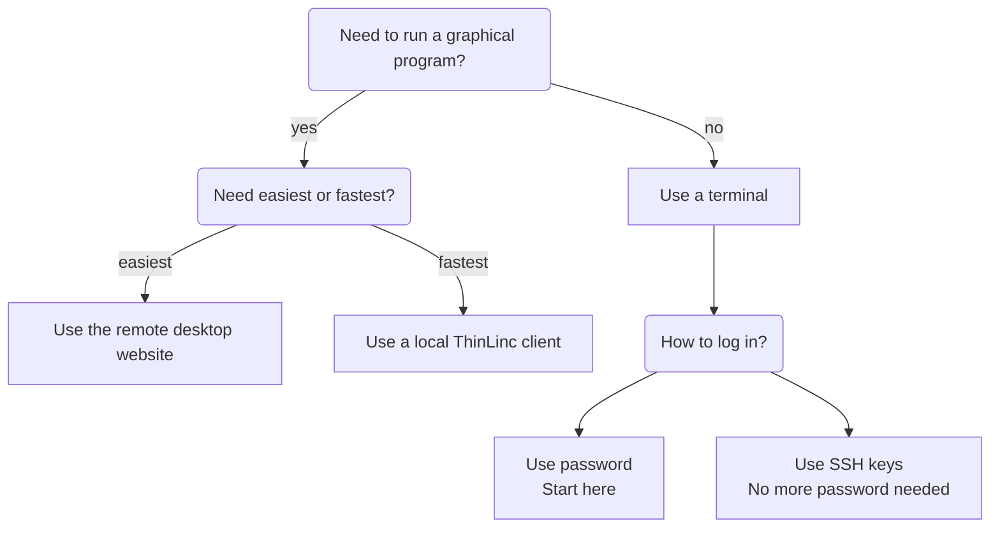

---
tags:
  - login
  - log in
  - Rackham
---

# Log in to Rackham

Here we describe how to log in to [Rackham](../cluster_guides/rackham.md).

- [Prerequisites](rackham_usage_prerequisites.md) describes what is needed before one can access Rackham
- [Which way to login?](#which-way-to-login)
    - [Website](login_rackham_remote_desktop_website.md)
    - [Terminal](login_rackham_console_password.md)
    - [Local ThinLinc client](login_rackham_remote_desktop_local_thinlinc_client.md)

## Which way to login?

There are multiple ways to log in to [Rackham](../cluster_guides/rackham.md):

Login                |Description                                   |Screenshot
---------------------|----------------------------------------------|---------------------------------
[Website](login_rackham_remote_desktop_website.md)              |Remote desktop, no installation needed, slow  |
[Terminal](login_rackham_console_password.md)             |Console environment, recommended              |
[Local ThinLinc client](login_rackham_remote_desktop_local_thinlinc_client.md)|Remote desktop, recommended, need installation|

Here is a decision tree, to determine which way to log in:

The procedures can be found at:

- [Login to the Rackham remote desktop environment using the website](login_rackham_remote_desktop_website.md)
- [Login to the Rackham console environment with a password](login_rackham_console_password.md).
  If you want to get rid of using a password every time, see [login to the Rackham console environment with an SSH key](login_rackham_console_ssh_key.md)
- [Login to the Rackham remote desktop environment using a local ThinLinc client](login_rackham_remote_desktop_local_thinlinc_client.md)

After login, you will be on a login node.

!!! note "How to behave on a login node"

    On a login node, one can and should do simple things only:
    it is a resource shared with all other users on that node.

    If you need to do more intense calculations,
    [use the Slurm job scheduler](../cluster_guides/slurm_on_rackham.md).

    If you need to do more intense calculations interactively,
    [use an interactive node](../cluster_guides/start_interactive_node_on_rackham.md).

