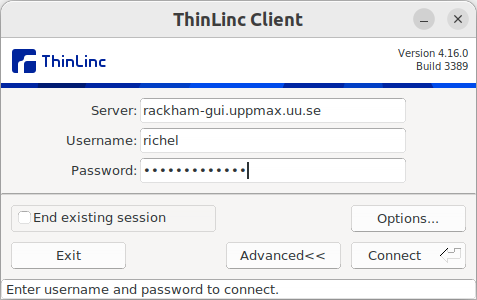
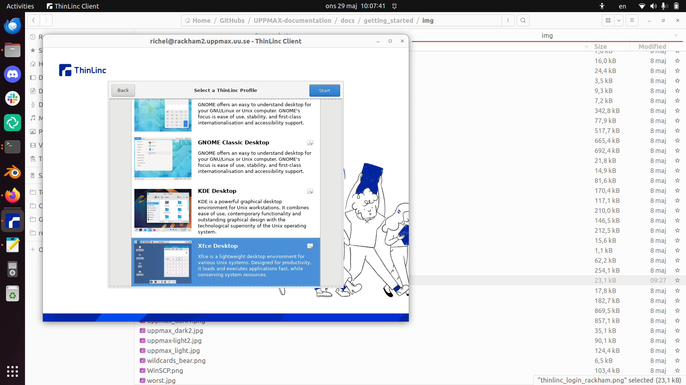

# Log in to Rackham's remote desktop environment using a local ThinLinc client

There are multiple ways to [log in to Rackham](login_rackham.md).
This page described how to log in to its remote desktop environment
via a local ThinLinc client.

## Procedure

### 1. Install ThinLinc

Install ThinLinc. For help, see [the UPPMAX page on ThinLinc](../software/thinlinc.md).

### 2. Start ThinLinc

In the ThinLinc login dialog, set the server name to `rackham-gui.uppmax.uu.se`.

???- question "How does that look like?"

    

    > The ThinLinc login dialog

???- question "Why not use `https://www.rackham-gui.uppmax.uu.se`?"

    Because that does not work :-)

### 3. Forward the ThinLinc Welcome dialog

On the ThinLinc 'Welcome' dialog, click 'Forward'

???- question "How does that look like?"

    

### 4. Select a ThinLinc profile

On the ThinLinc 'Select profile' dialog, select a profile:

Profile|Recommendation
-------|--------------
GNOME  |Recommended
KDE    |Avoid
XFCE   |Recommended

!!! warning "Avoid choosing KDE"

    Avoid choosing the KDE desktop, as it gives problems 
    when running interactive sessions.

    Instead, we recommend GNOME or XFCE.

???- question "How does that look like?"

    

    > Here you are asked to pick a remote desktop flavor,
    > with Xfce as the default.
    > Pick any, except KDE.

### 5. You are in

You are in! Well done!

???- question "How does that look like?"

    

## Usage

For tips on how to work with this environment,
see [the UPPMAX ThinLinc page](../software/thinlinc.md).
